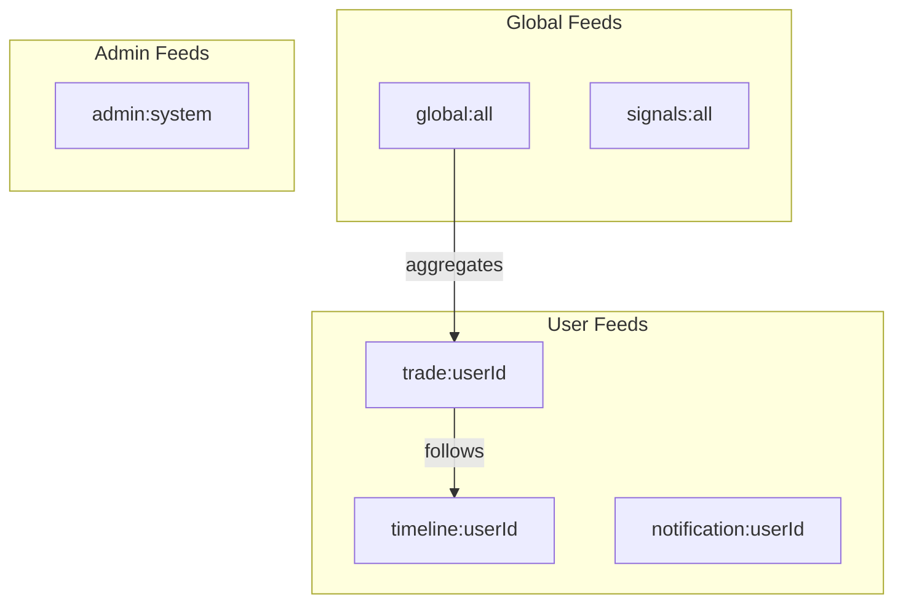

# GetStream API Integration

This document covers the GetStream integration for activity feeds, notifications, and social features in Alertsify.

---

## Overview

**GetStream** powers all activity feed and notification features in Alertsify, providing scalable infrastructure for:

- Trade activity feeds
- User timelines
- Real-time notifications
- Follow/unfollow relationships
- Global activity feed

### Configuration

| Property | Value |
|----------|-------|
| **API Version** | v1 |
| **SDK** | `getstream` |
| **Real-time** | WebSocket enabled |

```typescript
import { connect } from 'getstream';

const client = connect(
  process.env.GETSTREAM_API_KEY!,
  process.env.GETSTREAM_API_SECRET!,
  process.env.GETSTREAM_APP_ID!
);
```

---

## Feed Architecture

Alertsify uses multiple feed groups for different purposes:



### Feed Groups

| Feed Group | Purpose | Followers |
|------------|---------|-----------|
| `trade` | User's trade activities | Subscribers |
| `timeline` | User's personal feed | Self only |
| `notification` | Push notifications | Self only |
| `global` | Platform-wide feed | All users |
| `signals` | Trading signals | Premium users |
| `position` | Position updates | Self only |
| `admin` | System notifications | Admins |

---

## Activity Types

All activities have a `type` field indicating the action:

### Trade Activities

| Type | Description | Data |
|------|-------------|------|
| `bto` | Buy to Open | symbol, quantity, price |
| `stc` | Sell to Close | symbol, quantity, price, pnl |
| `order_filled` | Order filled | orderId, filledQty, avgPrice |
| `order_cancelled` | Order cancelled | orderId, reason |

### Social Activities

| Type | Description | Data |
|------|-------------|------|
| `follow` | User followed trader | traderId, traderName |
| `unfollow` | User unfollowed | traderId |
| `copy_trade` | Trade was copied | originalTradeId, traderId |

### System Activities

| Type | Description | Data |
|------|-------------|------|
| `achievement` | Earned achievement | achievementId, name |
| `leaderboard_update` | Rank changed | oldRank, newRank |
| `subscription_change` | Plan changed | plan, action |

---

## Core Operations

### User Management

#### Create/Update User

```typescript
async function createOrUpdateUser(user: User): Promise<void> {
  await client.user(user.id).getOrCreate({
    name: user.name,
    username: user.username,
    avatar: user.avatarUrl,
    bio: user.bio,
  });
}
```

#### Generate User Token

For client-side feed access:

```typescript
function generateUserToken(userId: string): string {
  return client.createUserToken(userId);
}
```

---

### Publishing Activities

#### Publish Trade Activity

<details>
<summary>📝 Full Implementation</summary>

```typescript
// lib/integrations/getstream.service.ts
interface TradeActivity {
  tradeId: string;
  userId: string;
  type: 'bto' | 'stc';
  symbol: string;
  underlying: string;
  optionType: 'call' | 'put';
  strike: number;
  expiration: string;
  quantity: number;
  price: number;
  pnl?: number;
}

export const getstreamService = {
  async publishTradeActivity(activity: TradeActivity): Promise<void> {
    const feed = client.feed('trade', activity.userId);

    await feed.addActivity({
      actor: activity.userId,
      verb: activity.type,
      object: `trade:${activity.tradeId}`,
      
      // Custom data
      trade_id: activity.tradeId,
      symbol: activity.symbol,
      underlying: activity.underlying,
      option_type: activity.optionType,
      strike: activity.strike,
      expiration: activity.expiration,
      quantity: activity.quantity,
      price: activity.price,
      pnl: activity.pnl,
      
      // For aggregation
      foreign_id: `trade:${activity.tradeId}`,
      time: new Date().toISOString(),
    });

    // Also publish to global feed
    const globalFeed = client.feed('global', 'all');
    await globalFeed.addActivity({
      actor: activity.userId,
      verb: activity.type,
      object: `trade:${activity.tradeId}`,
      trade_id: activity.tradeId,
      symbol: activity.symbol,
      foreign_id: `trade:${activity.tradeId}`,
      time: new Date().toISOString(),
    });
  },
};
```

</details>

---

### Following/Unfollowing

#### Subscribe to Trader

```typescript
async function followTrader(
  subscriberId: string, 
  traderId: string
): Promise<void> {
  // User's timeline follows trader's trade feed
  const timeline = client.feed('timeline', subscriberId);
  await timeline.follow('trade', traderId);

  // Publish follow activity
  const tradeFeed = client.feed('trade', subscriberId);
  await tradeFeed.addActivity({
    actor: subscriberId,
    verb: 'follow',
    object: `user:${traderId}`,
    trader_id: traderId,
  });
}
```

#### Unsubscribe from Trader

```typescript
async function unfollowTrader(
  subscriberId: string, 
  traderId: string
): Promise<void> {
  const timeline = client.feed('timeline', subscriberId);
  await timeline.unfollow('trade', traderId);
}
```

---

### Reading Feeds

#### Get User Timeline

```typescript
interface FeedOptions {
  limit?: number;
  offset?: number;
  id_lt?: string;  // For pagination
}

async function getTimeline(
  userId: string, 
  options: FeedOptions = {}
): Promise<Activity[]> {
  const timeline = client.feed('timeline', userId);
  
  const response = await timeline.get({
    limit: options.limit ?? 25,
    offset: options.offset ?? 0,
    id_lt: options.id_lt,
    enrich: true,  // Include user data
  });

  return response.results;
}
```

#### Get User Notifications

```typescript
async function getNotifications(
  userId: string,
  options: FeedOptions = {}
): Promise<NotificationGroup[]> {
  const notifications = client.feed('notification', userId);
  
  const response = await notifications.get({
    limit: options.limit ?? 20,
    mark_seen: true,  // Mark as seen
  });

  return response.results;
}
```

---

### Notifications

#### Send Notification

```typescript
async function sendNotification(params: {
  userId: string;
  type: string;
  message: string;
  data?: Record<string, unknown>;
}): Promise<void> {
  const feed = client.feed('notification', params.userId);
  
  await feed.addActivity({
    actor: 'system',
    verb: params.type,
    object: `notification:${nanoid()}`,
    message: params.message,
    ...params.data,
  });
}
```

#### Mark Notifications as Read

```typescript
async function markNotificationsRead(
  userId: string, 
  activityIds: string[]
): Promise<void> {
  const feed = client.feed('notification', userId);
  await feed.get({ mark_read: activityIds });
}
```

---

## Activity Schema

### BTO Activity

```typescript
{
  id: "abc123",
  actor: "user:123",
  verb: "bto",
  object: "trade:456",
  time: "2025-02-04T10:30:00Z",
  
  // Custom fields
  trade_id: "456",
  symbol: "AAPL  250221C00200000",
  underlying: "AAPL",
  option_type: "call",
  strike: 200,
  expiration: "2025-02-21",
  quantity: 5,
  price: 3.50,
  
  // Enriched user data
  actor_data: {
    id: "123",
    name: "John Trader",
    username: "johntrader",
    avatar: "https://..."
  }
}
```

### STC Activity

```typescript
{
  id: "def456",
  actor: "user:123",
  verb: "stc",
  object: "trade:789",
  time: "2025-02-04T14:30:00Z",
  
  // Custom fields
  trade_id: "789",
  parent_trade_id: "456",
  symbol: "AAPL  250221C00200000",
  underlying: "AAPL",
  option_type: "call",
  strike: 200,
  expiration: "2025-02-21",
  quantity: 5,
  entry_price: 3.50,
  exit_price: 5.25,
  pnl: 875,           // Profit/loss in dollars
  pnl_percent: 50,    // Percentage gain
  
  // Enriched user data
  actor_data: {
    id: "123",
    name: "John Trader",
    username: "johntrader"
  }
}
```

---

## Client-Side Integration

### React Hook

<details>
<summary>📝 useFeed Hook</summary>

```typescript
// hooks/use-feed.ts
'use client';

import { useEffect, useState } from 'react';
import { connect, StreamFeed } from 'getstream';

interface UseFeedOptions {
  feedGroup: string;
  feedId: string;
  token: string;
}

export function useFeed({ feedGroup, feedId, token }: UseFeedOptions) {
  const [activities, setActivities] = useState<Activity[]>([]);
  const [loading, setLoading] = useState(true);
  const [error, setError] = useState<Error | null>(null);

  useEffect(() => {
    const client = connect(
      process.env.NEXT_PUBLIC_GETSTREAM_KEY!,
      token,
      process.env.NEXT_PUBLIC_GETSTREAM_APP_ID!
    );

    const feed = client.feed(feedGroup, feedId);

    // Initial fetch
    const fetchActivities = async () => {
      try {
        const response = await feed.get({ limit: 25, enrich: true });
        setActivities(response.results);
      } catch (err) {
        setError(err as Error);
      } finally {
        setLoading(false);
      }
    };

    fetchActivities();

    // Real-time subscription
    const subscription = feed.subscribe((data) => {
      if (data.new?.length > 0) {
        setActivities((prev) => [...data.new, ...prev]);
      }
    });

    return () => {
      subscription.unsubscribe();
    };
  }, [feedGroup, feedId, token]);

  return { activities, loading, error };
}
```

</details>

---

## Rate Limits

| Operation | Limit |
|-----------|-------|
| **Read feeds** | 1000/min |
| **Write activities** | 500/min |
| **Follow/Unfollow** | 100/min |

---

## Best Practices

### ✅ Do

| Practice | Reason |
|----------|--------|
| Use `foreign_id` for deduplication | Prevents duplicate activities |
| Enrich on read, not write | Keeps data fresh |
| Use WebSocket for real-time | Better UX than polling |
| Batch writes when possible | Reduces API calls |

### ❌ Don't

| Anti-Pattern | Reason |
|--------------|--------|
| Store large payloads | Activities have size limits |
| Poll frequently | Use WebSocket instead |
| Follow too many feeds | Performance impact |

---

## Next Steps

- [Discord Webhooks](/api/discord) — Notification integration
- [Copy Trading Flow](/flows/copy-trading) — How activities trigger copy trades
- [Notifications Flow](/flows/notifications) — Multi-channel notifications
