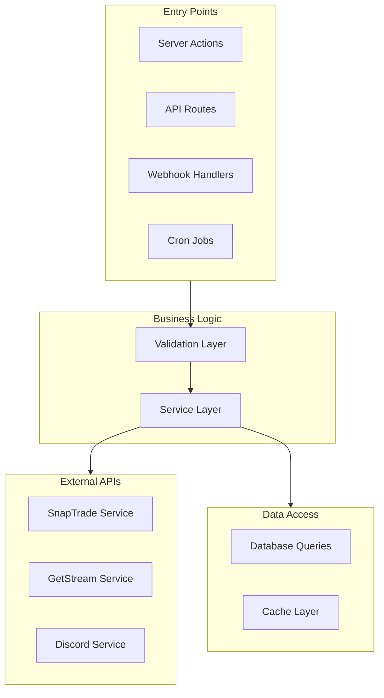

# Backend Architecture

This document covers the backend architecture, including Server Actions, services, and how data flows through the system.

## Understanding the Backend

The backend is where all the "real work" happens—validating user input, executing trades, syncing with brokerages, and persisting data. Let's understand the key concepts.

### What Makes a Good Backend?

**1. Predictable** — Given the same input, you always get the same output. No surprises.

**2. Secure** — Users can only access their own data. All input is validated before processing.

**3. Resilient** — If something fails (network timeout, database hiccup), the system recovers gracefully.

**4. Observable** — When something goes wrong, logs tell you exactly what happened and why.

---

## Overview

The Alertsify backend follows a **layered architecture** with clear separation of concerns. All business logic is organized into discrete layers that communicate through well-defined interfaces.

**Why This Structure?**

Imagine you need to change how orders are validated. With this architecture:
- You know exactly where to look (`Validators`)
- Changes are isolated—the rest of the system doesn't care how validation works
- Testing is easy—just test the validator, not the whole flow



---

## Server Actions

Server Actions are the primary entry point for client-to-server communication. They provide type-safe RPC-style function calls.

### What Are Server Actions?

Think of Server Actions as **functions that run on the server but can be called like regular functions from the client**. You write:

```tsx
const result = await placeOrder(orderData);
```

And behind the scenes, Next.js:
1. Serializes `orderData` to JSON
2. Sends an HTTP POST to the server
3. Runs the server action function
4. Returns the result to the client

**Why Not Just Use API Routes?**

| Feature | Server Actions | API Routes |
|---------|---------------|------------|
| Type Safety | ✅ Full TypeScript inference | ⚠️ Manual types needed |
| Boilerplate | ✅ Minimal | ❌ Need fetch, error handling |
| Progressive Enhancement | ✅ Works without JS | ❌ Requires JavaScript |
| Code Location | ✅ Colocated with UI | ❌ Separate `api/` folder |

### Location & Naming

All server actions are in `lib/actions/`:

```
lib/actions/
├── trading.actions.ts        # Trade execution
├── account.actions.ts        # Account management
├── copy-trading.actions.ts   # Copy trading
├── notification.actions.ts   # Notifications
└── user.actions.ts           # User profile
```

### Action Structure Pattern

Every server action follows this pattern. Let's break down what each step does and **why** it's necessary:

**Step 1: Authentication** — Who is making this request? If there's no valid session, reject immediately. This prevents unauthorized access.

**Step 2: Validation** — Is the input valid? Using Zod schemas, we check types, formats, and constraints. Never trust user input.

**Step 3: Authorization** — Is this user allowed to do this? Even authenticated users can't do everything. A subscriber can't access admin features.

**Step 4: Execution** — Delegate to the service layer. The action doesn't contain business logic—it's just a thin wrapper.

```typescript
'use server';

export async function actionName(params: InputType): Promise<ActionResult<OutputType>> {
  // 1. Authentication
  const session = await auth();
  if (!session?.user) {
    return { ok: false, error: 'Unauthorized' };
  }

  // 2. Validation
  const validated = schema.safeParse(params);
  if (!validated.success) {
    return { ok: false, error: validated.error.message };
  }

  // 3. Authorization (if needed)
  const canPerform = await checkPermission(session.user.id, 'action');
  if (!canPerform) {
    return { ok: false, error: 'Permission denied' };
  }

  // 4. Execute business logic
  try {
    const result = await service.doSomething(validated.data);
    return { ok: true, data: result };
  } catch (error) {
    console.error('[actionName] Error:', error);
    return { ok: false, error: 'Operation failed' };
  }
}
```

### Result Type

All actions return a consistent result type:

<details>
<summary>📝 ActionResult Type Definition</summary>

```typescript
// types/actions.ts
type ActionResult<T> = 
  | { ok: true; data: T }
  | { ok: false; error: string };

// Usage
const result = await placeOptionOrder(params);

if (result.ok) {
  console.log('Order placed:', result.data);
} else {
  console.error('Error:', result.error);
}
```

</details>

---

## Service Layer

Services contain the core business logic. They orchestrate operations between external APIs, database, and cache.

### Why a Separate Service Layer?

**The Problem:** If we put business logic in Server Actions, it becomes hard to:
- Reuse logic across different entry points (API routes, webhooks, cron jobs)
- Test logic without mocking HTTP requests
- Understand what the application "does" vs how it's triggered

**The Solution:** Services are pure business logic. They don't know about HTTP, sessions, or React. They just:
1. Take validated input
2. Do the work (API calls, database operations)
3. Return results

### Service Benefits

| Benefit | Explanation |
|---------|-------------|
| **Reusability** | `tradingService.placeOrder()` can be called from Server Actions, API routes, or cron jobs |
| **Testability** | Mock the database and test business logic in isolation |
| **Clarity** | Services document what the application does, not how it's called |
| **Composability** | Services can call other services to compose complex operations |

### Location & Organization

```
lib/services/
├── trading.service.ts        # Trade execution logic
├── copy-trading.service.ts   # Copy trading logic
├── sync.service.ts           # Broker sync logic
├── notification.service.ts   # Notification dispatch
└── leaderboard.service.ts    # Rankings & scores
```

### Service Pattern

Services are organized as objects with methods:

<details>
<summary>📝 Service Pattern Example</summary>

```typescript
// lib/services/trading.service.ts
import { db } from '@/lib/db';
import { snaptradeService } from '@/lib/integrations/snaptrade.service';
import { parentTrades, trades } from '@/lib/db/schema';

interface PlaceBTOParams {
  userId: string;
  account: BrokerageAccount;
  order: ValidatedOrder;
}

export const tradingService = {
  /**
   * Places a Buy-to-Open order
   * 
   * @param params - Order parameters
   * @returns Created trade record
   * @throws TradingError if order fails
   */
  async placeBTOOrder({ userId, account, order }: PlaceBTOParams) {
    // 1. Build option symbol
    const symbol = buildOptionSymbol(order);

    // 2. Place order with broker
    const brokerResult = await snaptradeService.placeOrder({
      userId,
      userSecret: account.userSecret,
      accountId: account.brokerAccountId,
      symbol,
      action: 'BUY',
      quantity: order.quantity,
      price: order.limitPrice,
    });

    if (!brokerResult.success) {
      throw new TradingError(brokerResult.error, 'Unable to place order');
    }

    // 3. Create database records
    const [parentTrade] = await db.insert(parentTrades).values({
      userId,
      symbol,
      ticker: order.underlying,
      strikePrice: order.strike.toString(),
      expirationDate: order.expiration,
      status: 'open',
    }).returning();

    const [trade] = await db.insert(trades).values({
      userId,
      parentTradeId: parentTrade.id,
      brokerOrderId: brokerResult.orderId,
      action: 'buy',
      quantity: order.quantity,
      status: 'pending',
    }).returning();

    // 4. Trigger async operations (non-blocking)
    this.dispatchPostTradeActions(trade.id, userId);

    return trade;
  },

  /**
   * Async post-trade operations
   */
  dispatchPostTradeActions(tradeId: string, traderId: string) {
    // These run in background, don't await
    copyTradingService.dispatchCopyTrade(tradeId, traderId)
      .catch(err => console.error('[CopyTrade] Error:', err));
    
    notificationService.notifyTradeCreated(tradeId)
      .catch(err => console.error('[Notification] Error:', err));
  },
};
```

</details>

---

## Integration Layer

External API integrations are wrapped in service classes that handle authentication, error handling, and response transformation.

### SnapTrade Integration

The SnapTrade service wraps all brokerage API calls:

```
lib/integrations/snaptrade.service.ts
```

Key methods:

| Method | Purpose |
|--------|---------|
| `registerUser()` | Create SnapTrade user |
| `getConnectionUrl()` | Get broker OAuth URL |
| `getAccounts()` | List connected accounts |
| `getHoldings()` | Get current positions |
| `placeOrder()` | Submit trade order |
| `cancelOrder()` | Cancel pending order |

<details>
<summary>📝 SnapTrade Service Structure</summary>

```typescript
// lib/integrations/snaptrade.service.ts
import Snaptrade from 'snaptrade-typescript-sdk';

const client = new Snaptrade({
  consumerId: process.env.SNAPTRADE_CLIENT_ID!,
  consumerSecret: process.env.SNAPTRADE_CONSUMER_SECRET!,
});

export const snaptradeService = {
  async placeOrder(params: PlaceOrderParams): Promise<OrderResult> {
    try {
      const response = await client.trading.placeForceOrder({
        userId: params.userId,
        userSecret: params.userSecret,
        accountId: params.accountId,
        action: params.action,
        order_type: params.orderType,
        units: params.quantity,
        price: params.price,
        universal_symbol_id: params.symbol,
      });

      return {
        success: true,
        orderId: response.data.brokerage_order_id,
        status: response.data.status,
      };
    } catch (error) {
      const message = this.parseError(error);
      return { success: false, error: message };
    }
  },

  parseError(error: unknown): string {
    // Extract user-friendly error message
    if (error?.response?.data?.detail) {
      return error.response.data.detail;
    }
    return 'An unexpected error occurred';
  },
};
```

</details>

### GetStream Integration

Activity feeds for social features:

| Method | Purpose |
|--------|---------|
| `publishTradeActivity()` | Post trade to feeds |
| `getTimeline()` | Get user's timeline |
| `follow()` / `unfollow()` | Manage subscriptions |
| `getNotifications()` | Get user notifications |

### Discord Integration

Webhook-based notifications:

| Method | Purpose |
|--------|---------|
| `sendTradeAlert()` | BTO/STC alerts |
| `sendSystemNotification()` | Platform updates |
| `sendErrorAlert()` | Admin error alerts |

---

## API Routes

For external integrations (webhooks, OAuth callbacks), we use Next.js API routes:

```
app/api/
├── brokers/
│   ├── connect/route.ts      # OAuth callback
│   └── accounts/route.ts     # Account endpoints
│
├── webhooks/
│   ├── snaptrade/route.ts    # SnapTrade events
│   ├── whop/route.ts         # Payment events
│   └── discord/route.ts      # Discord events
│
└── cron/
    ├── sync-orders/route.ts  # Order sync job
    └── update-prices/route.ts # Price updates
```

### Webhook Handler Pattern

<details>
<summary>📝 Webhook Handler Example</summary>

```typescript
// app/api/webhooks/snaptrade/route.ts
import { NextRequest, NextResponse } from 'next/server';
import { verifySignature } from '@/lib/utils/crypto';
import { handleSnaptradeEvent } from '@/lib/services/webhook.service';

export async function POST(request: NextRequest) {
  // 1. Verify webhook signature
  const signature = request.headers.get('x-snaptrade-signature');
  const body = await request.text();
  
  if (!verifySignature(body, signature)) {
    return NextResponse.json({ error: 'Invalid signature' }, { status: 401 });
  }

  // 2. Parse event
  const event = JSON.parse(body);

  // 3. Handle event
  try {
    await handleSnaptradeEvent(event);
    return NextResponse.json({ received: true });
  } catch (error) {
    console.error('[Webhook] Error:', error);
    return NextResponse.json({ error: 'Processing failed' }, { status: 500 });
  }
}
```

</details>

---

## Validation Layer

All inputs are validated using Zod schemas before processing:

```
lib/validations/
├── trading.ts          # Trade order schemas
├── account.ts          # Account schemas
├── copy-trading.ts     # Subscription schemas
└── common.ts           # Shared schemas
```

<details>
<summary>📝 Validation Schema Example</summary>

```typescript
// lib/validations/trading.ts
import { z } from 'zod';

export const placeOrderSchema = z.object({
  underlying: z.string().min(1).max(5).toUpperCase(),
  optionType: z.enum(['call', 'put']),
  strike: z.number().positive(),
  expiration: z.string().regex(/^\d{4}-\d{2}-\d{2}$/),
  quantity: z.number().int().min(1).max(100),
  orderType: z.enum(['Market', 'Limit']),
  limitPrice: z.number().positive().optional(),
}).refine(
  (data) => data.orderType === 'Market' || data.limitPrice !== undefined,
  { message: 'Limit price required for limit orders' }
);

export type PlaceOrderInput = z.infer<typeof placeOrderSchema>;
```

</details>

---

## Error Handling

### Custom Error Classes

<details>
<summary>📝 Error Classes</summary>

```typescript
// lib/utils/errors.ts
export class AppError extends Error {
  constructor(
    public code: string,
    public userMessage: string,
    public statusCode: number = 500
  ) {
    super(userMessage);
    this.name = 'AppError';
  }
}

export class TradingError extends AppError {
  constructor(code: string, userMessage: string) {
    super(code, userMessage, 400);
    this.name = 'TradingError';
  }
}

export class AuthorizationError extends AppError {
  constructor(message = 'Permission denied') {
    super('UNAUTHORIZED', message, 403);
    this.name = 'AuthorizationError';
  }
}
```

</details>

### Error Handling Strategy

| Layer | Error Handling |
|-------|----------------|
| **Action** | Catch and return user-friendly message |
| **Service** | Throw typed errors |
| **Integration** | Transform API errors |
| **Database** | Transaction rollback |

---

## Transaction Management

For operations requiring atomicity:

<details>
<summary>📝 Transaction Example</summary>

```typescript
// Using Drizzle transactions
await db.transaction(async (tx) => {
  // All operations in same transaction
  const [parentTrade] = await tx.insert(parentTrades).values({...}).returning();
  const [trade] = await tx.insert(trades).values({...}).returning();
  
  // If any fails, entire transaction rolls back
  await tx.update(accounts).set({ lastTrade: new Date() });
});
```

</details>

---

## Background Jobs

### Cron Jobs via Vercel

```typescript
// app/api/cron/sync-orders/route.ts
import { NextResponse } from 'next/server';

export async function GET(request: Request) {
  // Verify cron secret
  const authHeader = request.headers.get('authorization');
  if (authHeader !== `Bearer ${process.env.CRON_SECRET}`) {
    return NextResponse.json({ error: 'Unauthorized' }, { status: 401 });
  }

  // Execute sync
  await syncService.syncAllPendingOrders();
  
  return NextResponse.json({ success: true });
}

// Configure in vercel.json
// { "crons": [{ "path": "/api/cron/sync-orders", "schedule": "*/5 * * * *" }] }
```

---

## Next Steps

- [State Management](/architecture/state-management) — Zustand stores
- [Caching Strategy](/architecture/caching) — Redis caching patterns
- [API Reference](/api/internal-routes) — Complete API documentation
