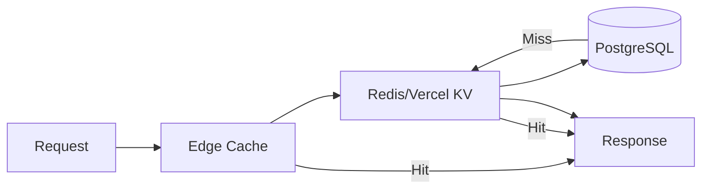

# Caching Strategy

This document covers how caching is implemented in Alertsify, including Redis caching patterns, invalidation strategies, and performance optimizations.

## Why Caching Matters for a Trading Platform

A trading platform without caching would be painfully slow. Every page load would hit the database, every API call would compute results from scratch. Here's why we invest heavily in caching:

### The Problems Caching Solves

**1. Database Load** — PostgreSQL can handle a lot, but not millions of identical queries. When 1,000 users load the leaderboard, we want one database query, not 1,000.

**2. Response Time** — A cached response returns in 1-5ms. A database query takes 50-200ms. For real-time trading, this difference is noticeable.

**3. Cost** — Database queries cost money (CPU, I/O). Cache hits are nearly free.

**4. Availability** — If the database goes down briefly, cached data can keep the app running.

### The Tradeoff: Freshness vs Speed

Caching introduces a fundamental tradeoff:
- **Fresh data** → Always query the database (slow)
- **Fast response** → Use cached data (might be stale)

Our strategy: **Cache aggressively, invalidate precisely**. Most data can be slightly stale. When freshness matters (like after placing an order), we invalidate.

---

## Overview

Alertsify uses a multi-layer caching strategy to optimize performance:



| Layer | TTL | Use Case | Tradeoff |
|-------|-----|----------|----------|
| **Edge Cache** | 0-60s | Static assets, ISR pages | Very fast, but hard to invalidate |
| **Redis** | 1min - 24h | API responses, computed data | Fast, easy to invalidate |
| **Database** | Permanent | Source of truth | Slowest, but always accurate |

### How Requests Flow Through Cache Layers

1. **Edge Cache** (Vercel's CDN) — Closest to the user. If cached, response is instant.
2. **Redis** (Vercel KV) — If not in edge cache, check Redis. Still very fast.
3. **Database** (PostgreSQL) — Only hit if both caches miss. Result is cached for next time.

**The Goal:** Most requests never reach the database. The database is reserved for writes and cache misses.

---

## Redis/Vercel KV Setup

We use **Vercel KV** (Redis) for server-side caching:

<details>
<summary>📝 Cache Client Setup</summary>

```typescript
// lib/cache/index.ts
import { kv } from '@vercel/kv';

export const cache = {
  /**
   * Get a cached value
   */
  async get<T>(key: string): Promise<T | null> {
    try {
      return await kv.get<T>(key);
    } catch (error) {
      console.error('[Cache] Get error:', key, error);
      return null;
    }
  },

  /**
   * Set a cached value with optional TTL
   */
  async set<T>(key: string, value: T, ttlSeconds?: number): Promise<void> {
    try {
      if (ttlSeconds) {
        await kv.set(key, value, { ex: ttlSeconds });
      } else {
        await kv.set(key, value);
      }
    } catch (error) {
      console.error('[Cache] Set error:', key, error);
    }
  },

  /**
   * Delete a cached value
   */
  async delete(key: string): Promise<void> {
    try {
      await kv.del(key);
    } catch (error) {
      console.error('[Cache] Delete error:', key, error);
    }
  },

  /**
   * Delete multiple keys by pattern
   */
  async deletePattern(pattern: string): Promise<void> {
    try {
      const keys = await kv.keys(pattern);
      if (keys.length > 0) {
        await kv.del(...keys);
      }
    } catch (error) {
      console.error('[Cache] Delete pattern error:', pattern, error);
    }
  },
};
```

</details>

---

## Cache Key Management

### Why Key Naming Matters

Cache keys are like file paths. Good naming makes it easy to:
- **Find** — What key holds user 123's positions?
- **Invalidate** — Delete all cache entries for user 123
- **Debug** — Understand what's cached by looking at keys

Bad key naming leads to:
- Cache collisions (two different things under the same key)
- Orphaned entries (can't find keys to delete)
- Confusion (what does `cache_xyz_123` mean?)

### Key Naming Convention

We use a structured key format for consistency:

```
{namespace}:{entity}:{identifier}:{variant}
```

**Breaking It Down:**

| Part | Purpose | Example |
|------|---------|----------|
| `namespace` | Groups related keys | `user`, `leaderboard`, `snaptrade` |
| `entity` | What's being cached | `profile`, `positions`, `accounts` |
| `identifier` | Who/what it belongs to | User ID, date, account ID |
| `variant` | Optional sub-type | `open`, `closed`, `daily` |

Examples:
- `user:profile:123` — User profile data
- `user:positions:123:open` — User's open positions
- `leaderboard:daily:2024-01-15` — Daily leaderboard
- `snaptrade:accounts:123` — User's brokerage accounts

<details>
<summary>📝 Cache Keys Module</summary>

```typescript
// lib/cache/keys.ts
export const cacheKeys = {
  // User-related
  userProfile: (userId: string) => `user:profile:${userId}`,
  userPositions: (userId: string, status?: string) => 
    `user:positions:${userId}${status ? `:${status}` : ''}`,
  userSettings: (userId: string) => `user:settings:${userId}`,

  // Trading
  tradeDetails: (tradeId: string) => `trade:${tradeId}`,
  
  // Leaderboard
  leaderboard: (period: string, date?: string) => 
    `leaderboard:${period}${date ? `:${date}` : ''}`,
  
  // SnapTrade
  snaptradeAccounts: (userId: string) => `snaptrade:accounts:${userId}`,
  snaptradeHoldings: (accountId: string) => `snaptrade:holdings:${accountId}`,
  
  // Rate limiting
  rateLimit: (userId: string, action: string) => `ratelimit:${action}:${userId}`,

  // Patterns for bulk deletion
  patterns: {
    userAll: (userId: string) => `user:*:${userId}*`,
    snaptradeUser: (userId: string) => `snaptrade:*:${userId}*`,
  },
};
```

</details>

---

## Caching Patterns

### Pattern 1: Cache-Aside (Lazy Loading)

Most common pattern — check cache, fetch if miss, then cache:

<details>
<summary>📝 Cache-Aside Example</summary>

```typescript
// lib/services/leaderboard.service.ts
import { cache, cacheKeys } from '@/lib/cache';
import { db } from '@/lib/db';

const LEADERBOARD_TTL = 300; // 5 minutes

export const leaderboardService = {
  async getDailyLeaderboard() {
    const cacheKey = cacheKeys.leaderboard('daily');
    
    // 1. Check cache
    const cached = await cache.get<LeaderboardEntry[]>(cacheKey);
    if (cached) {
      return cached;
    }
    
    // 2. Fetch from database
    const leaderboard = await db.query.leaderboardView.findMany({
      orderBy: (t, { desc }) => [desc(t.dailyPnL)],
      limit: 100,
    });
    
    // 3. Cache result
    await cache.set(cacheKey, leaderboard, LEADERBOARD_TTL);
    
    return leaderboard;
  },
};
```

</details>

### Pattern 2: Write-Through

Update cache when data changes:

<details>
<summary>📝 Write-Through Example</summary>

```typescript
// lib/services/user.service.ts
export const userService = {
  async updateProfile(userId: string, updates: ProfileUpdate) {
    // 1. Update database
    const [user] = await db
      .update(users)
      .set(updates)
      .where(eq(users.id, userId))
      .returning();
    
    // 2. Update cache immediately
    await cache.set(
      cacheKeys.userProfile(userId),
      user,
      3600 // 1 hour
    );
    
    return user;
  },
};
```

</details>

### Pattern 3: Cache Invalidation

Delete cache when data becomes stale:

<details>
<summary>📝 Cache Invalidation Example</summary>

```typescript
// lib/services/trading.service.ts
export const tradingService = {
  async placeBTOOrder(params: PlaceBTOParams) {
    // ... place order logic ...
    
    // Invalidate related caches
    await Promise.all([
      cache.delete(cacheKeys.userPositions(params.userId)),
      cache.delete(cacheKeys.userPositions(params.userId, 'open')),
      cache.deletePattern(cacheKeys.patterns.userAll(params.userId)),
    ]);
    
    return trade;
  },
};
```

</details>

---

## TTL Guidelines

| Data Type | TTL | Reason |
|-----------|-----|--------|
| **Leaderboards** | 5 min | Updated frequently, but slight delay OK |
| **User Profile** | 1 hour | Changes infrequently |
| **Holdings** | 1 min | Prices change, need freshness |
| **SnapTrade Tokens** | 23 hours | Tokens expire in 24h |
| **Rate Limits** | 1 min | Short-lived by design |
| **Static Config** | 24 hours | Rarely changes |

---

## Rate Limiting with Redis

<details>
<summary>📝 Rate Limiting Implementation</summary>

```typescript
// lib/cache/rate-limit.ts
import { cache, cacheKeys } from '@/lib/cache';

interface RateLimitResult {
  allowed: boolean;
  remaining: number;
  resetAt: Date;
}

export async function checkRateLimit(
  userId: string,
  action: string,
  limit: number,
  windowSeconds: number
): Promise<RateLimitResult> {
  const key = cacheKeys.rateLimit(userId, action);
  
  // Get current count
  const current = await cache.get<number>(key) ?? 0;
  
  if (current >= limit) {
    // Get TTL to know when limit resets
    const ttl = await kv.ttl(key);
    return {
      allowed: false,
      remaining: 0,
      resetAt: new Date(Date.now() + ttl * 1000),
    };
  }
  
  // Increment counter
  await kv.incr(key);
  
  // Set expiry on first request
  if (current === 0) {
    await kv.expire(key, windowSeconds);
  }
  
  return {
    allowed: true,
    remaining: limit - current - 1,
    resetAt: new Date(Date.now() + windowSeconds * 1000),
  };
}

// Usage in server action
export async function placeOptionOrder(params: PlaceOrderParams) {
  const rateLimit = await checkRateLimit(userId, 'place_order', 10, 60);
  
  if (!rateLimit.allowed) {
    return { 
      ok: false, 
      error: `Rate limit exceeded. Try again at ${rateLimit.resetAt.toISOString()}` 
    };
  }
  
  // ... proceed with order
}
```

</details>

---

## Stale-While-Revalidate

Return stale data immediately while fetching fresh data:

<details>
<summary>📝 SWR Pattern</summary>

```typescript
// lib/cache/swr.ts
interface SWROptions {
  staleTime: number;  // How long before considered stale
  maxAge: number;     // How long before completely invalid
}

export async function getWithSWR<T>(
  key: string,
  fetcher: () => Promise<T>,
  options: SWROptions
): Promise<T> {
  const cached = await kv.get<{ data: T; timestamp: number }>(key);
  
  if (cached) {
    const age = Date.now() - cached.timestamp;
    
    if (age < options.staleTime * 1000) {
      // Fresh data
      return cached.data;
    }
    
    if (age < options.maxAge * 1000) {
      // Stale but usable - return immediately and revalidate
      revalidateInBackground(key, fetcher, options);
      return cached.data;
    }
  }
  
  // No cache or expired - fetch fresh
  const data = await fetcher();
  await kv.set(key, { data, timestamp: Date.now() }, { ex: options.maxAge });
  return data;
}

async function revalidateInBackground<T>(
  key: string,
  fetcher: () => Promise<T>,
  options: SWROptions
) {
  try {
    const data = await fetcher();
    await kv.set(key, { data, timestamp: Date.now() }, { ex: options.maxAge });
  } catch (error) {
    console.error('[SWR] Revalidation failed:', key, error);
  }
}
```

</details>

---

## Cache Warming

Pre-populate cache for frequently accessed data:

<details>
<summary>📝 Cache Warming Example</summary>

```typescript
// app/api/cron/warm-cache/route.ts
import { NextResponse } from 'next/server';
import { leaderboardService } from '@/lib/services/leaderboard.service';

export async function GET(request: Request) {
  // Verify cron secret
  const auth = request.headers.get('authorization');
  if (auth !== `Bearer ${process.env.CRON_SECRET}`) {
    return NextResponse.json({ error: 'Unauthorized' }, { status: 401 });
  }

  // Warm frequently accessed caches
  await Promise.all([
    leaderboardService.getDailyLeaderboard(),   // Will cache result
    leaderboardService.getWeeklyLeaderboard(),
    leaderboardService.getMonthlyLeaderboard(),
  ]);

  return NextResponse.json({ success: true, warmed: ['leaderboards'] });
}
```

Configure in `vercel.json`:
```json
{
  "crons": [{
    "path": "/api/cron/warm-cache",
    "schedule": "*/5 * * * *"
  }]
}
```

</details>

---

## Monitoring & Debugging

### Cache Hit Ratio

<details>
<summary>📝 Instrumented Cache</summary>

```typescript
// lib/cache/instrumented.ts
import { cache } from './index';

let hits = 0;
let misses = 0;

export const instrumentedCache = {
  async get<T>(key: string): Promise<T | null> {
    const result = await cache.get<T>(key);
    
    if (result !== null) {
      hits++;
      console.log(`[Cache HIT] ${key}`);
    } else {
      misses++;
      console.log(`[Cache MISS] ${key}`);
    }
    
    return result;
  },

  getStats() {
    const total = hits + misses;
    return {
      hits,
      misses,
      total,
      hitRatio: total > 0 ? (hits / total * 100).toFixed(2) + '%' : '0%',
    };
  },

  resetStats() {
    hits = 0;
    misses = 0;
  },
};
```

</details>

---

## Best Practices

### ✅ Do

| Practice | Reason |
|----------|--------|
| Use consistent key naming | Easier to debug and invalidate |
| Set appropriate TTLs | Balance freshness vs performance |
| Handle cache failures gracefully | Cache is optimization, not requirement |
| Invalidate on writes | Prevent stale data |

### ❌ Don't

| Anti-Pattern | Reason |
|--------------|--------|
| Cache user-specific data without user ID | Security issue |
| Use very long TTLs for volatile data | Stale data problems |
| Cache sensitive data (tokens, passwords) | Security risk |
| Ignore cache errors | Silent failures hurt debugging |

---

## Next Steps

- [Backend Architecture](/architecture/backend) — Server-side patterns
- [API Reference](/api/internal-routes) — API documentation
