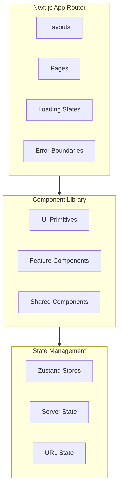

# Frontend Architecture

This document covers the frontend architecture, including component patterns, routing, and UI conventions used in Alertsify.

## Understanding the Frontend Philosophy

The frontend is what users see and interact with. Every millisecond of delay, every confusing button, every loading spinner affects the user experience. Our frontend architecture is designed to be:

### Design Goals

**1. Fast First Render** — Users see content immediately, not a blank screen. Server Components render HTML on the server so the browser doesn't wait for JavaScript to load.

**2. Responsive Interactions** — When you click a button, something happens instantly. Optimistic updates show results before the server confirms.

**3. Maintainable Components** — Components are small, focused, and reusable. You can understand a component by reading it, without needing context from 10 other files.

**4. Type Safety** — TypeScript catches errors at compile time, not at runtime when users are affected.

---

## Overview

The Alertsify frontend is built with **Next.js 14 App Router** and **React 18**, following a component-based architecture with clear separation between server and client components.

**Why Next.js App Router?**

- **Server Components by default** — Less JavaScript sent to browsers, faster page loads
- **Nested layouts** — Shared UI stays mounted during navigation
- **Streaming** — Show content as it's ready, don't wait for everything
- **Colocation** — Components, styles, and tests live together



---

## Component Architecture

### Understanding Component Categories

Not all components are created equal. We organize them by their purpose and scope:

**UI Primitives** — The building blocks. Buttons, inputs, cards, modals. These are design-agnostic and can be used anywhere. Think of them as LEGO bricks.

**Feature Components** — Domain-specific components that know about trading, analytics, or copy trading. They compose UI primitives into meaningful features.

**Shared Components** — Reusable across features but more complex than primitives. Headers, sidebars, error boundaries.

**Layout Components** — Define page structure. Where does the sidebar go? What's in the header? Layouts stay mounted during navigation, preserving state.

### Component Categories

| Category | Location | Purpose | Server/Client | Example |
|----------|----------|---------|---------------|----------|
| **UI Primitives** | `components/ui/` | Base components (Button, Input, etc.) | Client | `<Button variant="primary" />` |
| **Feature Components** | `components/dashboard/`, `components/trading/` | Domain-specific | Mixed | `<PositionsTable />` |
| **Shared Components** | `components/shared/` | Reusable across features | Mixed | `<ErrorBoundary />` |
| **Layout Components** | `app/*/layout.tsx` | Page layouts | Server | `<DashboardLayout />` |

### Component Hierarchy

The hierarchy shows parent-child relationships. Notice how **Server Components wrap Client Components**, not the other way around. This is intentional:

- The `Page` fetches data on the server (fast, direct database access)
- Data is passed to Client Components as props
- Client Components handle interactivity (clicks, forms, real-time updates)

This pattern gives us the best of both worlds: fast data fetching AND responsive interactions.

```
Page (Server Component)
└── Layout (Server Component)
    └── Header (Server Component)
    │   └── UserMenu (Client Component)
    │
    └── Sidebar (Server Component)
    │   └── NavLinks (Client Component)
    │
    └── Content (Server Component)
        └── PositionsTable (Client Component)
            └── PositionRow (Client Component)
```

**Why This Structure?**

- **Header/Sidebar are Server Components** — They rarely change, so render once on the server
- **UserMenu is Client** — Needs dropdown interaction and logout button
- **PositionsTable is Client** — Needs sorting, filtering, and real-time updates

---

## Server vs Client Components

This is the most important concept in Next.js 14. Understanding when to use each type makes your app fast AND interactive.

### The Key Insight

**Server Components** are like templates—they produce HTML once and send it to the browser. Zero JavaScript overhead.

**Client Components** are like apps—they ship JavaScript to the browser and can be interactive.

**The Rule:** Start with Server Components. Only add `'use client'` when you need interactivity.

### Server Components (Default)

Server components are rendered on the server and send HTML to the client.

**Use for:**
- Data fetching (direct database access, no API calls needed)
- Accessing backend resources (file system, environment variables)
- Keeping sensitive data on server (API keys, tokens)
- Large dependencies (heavy libraries stay on server)

<details>
<summary>📝 Server Component Example</summary>

```tsx
// app/(dashboard)/positions/page.tsx
// No 'use client' — this is a Server Component

import { getPositions } from '@/lib/db/queries/positions';
import { PositionsTable } from '@/components/dashboard/positions-table';

export default async function PositionsPage() {
  // Data fetching happens on the server
  const positions = await getPositions();
  
  return (
    <div className="p-6">
      <h1 className="text-2xl font-bold mb-4">Open Positions</h1>
      {/* Pass data to client component */}
      <PositionsTable initialPositions={positions} />
    </div>
  );
}
```

</details>

### Client Components

Client components are interactive and run in the browser.

**Use for:**
- Event handlers (onClick, onChange)
- useState, useEffect, custom hooks
- Browser APIs
- Real-time updates

<details>
<summary>📝 Client Component Example</summary>

```tsx
// components/dashboard/positions-table.tsx
'use client';

import { useState } from 'react';
import { usePositionsStore } from '@/lib/stores/positions-store';

interface Props {
  initialPositions: Position[];
}

export function PositionsTable({ initialPositions }: Props) {
  const [sortColumn, setSortColumn] = useState('createdAt');
  const { positions, updatePosition } = usePositionsStore();
  
  // Use initial data, but allow for real-time updates
  const displayPositions = positions.length > 0 ? positions : initialPositions;
  
  return (
    <table>
      <thead>
        <tr>
          <th onClick={() => setSortColumn('symbol')}>Symbol</th>
          <th onClick={() => setSortColumn('pnl')}>P&L</th>
        </tr>
      </thead>
      <tbody>
        {displayPositions.map(position => (
          <PositionRow key={position.id} position={position} />
        ))}
      </tbody>
    </table>
  );
}
```

</details>

---

## Routing Structure

### Route Groups

Route groups organize code without affecting URLs:

```
app/
├── (auth)/                    # Auth route group
│   ├── login/page.tsx        # → /login
│   ├── signup/page.tsx       # → /signup
│   └── layout.tsx            # Shared auth layout
│
├── (dashboard)/               # Dashboard route group
│   ├── dashboard/page.tsx    # → /dashboard
│   ├── positions/page.tsx    # → /positions
│   ├── traders/
│   │   ├── page.tsx          # → /traders
│   │   └── [traderId]/       # Dynamic route
│   │       └── page.tsx      # → /traders/123
│   └── layout.tsx            # Dashboard layout with sidebar
│
└── layout.tsx                 # Root layout
```

### Dynamic Routes

```tsx
// app/(dashboard)/traders/[traderId]/page.tsx
interface Props {
  params: { traderId: string };
}

export default async function TraderPage({ params }: Props) {
  const trader = await getTrader(params.traderId);
  
  return <TraderProfile trader={trader} />;
}
```

---

## Layout Patterns

### Root Layout

The root layout wraps the entire application:

<details>
<summary>📝 Root Layout Example</summary>

```tsx
// app/layout.tsx
import { Inter } from 'next/font/google';
import { Providers } from '@/components/providers';
import { Toaster } from '@/components/ui/toaster';
import './globals.css';

const inter = Inter({ subsets: ['latin'] });

export default function RootLayout({
  children,
}: {
  children: React.ReactNode;
}) {
  return (
    <html lang="en" suppressHydrationWarning>
      <body className={inter.className}>
        <Providers>
          {children}
          <Toaster />
        </Providers>
      </body>
    </html>
  );
}
```

</details>

### Dashboard Layout

The dashboard layout includes navigation:

<details>
<summary>📝 Dashboard Layout Example</summary>

```tsx
// app/(dashboard)/layout.tsx
import { redirect } from 'next/navigation';
import { auth } from '@/lib/auth';
import { Sidebar } from '@/components/dashboard/sidebar';
import { Header } from '@/components/dashboard/header';

export default async function DashboardLayout({
  children,
}: {
  children: React.ReactNode;
}) {
  const session = await auth();
  
  if (!session) {
    redirect('/login');
  }
  
  return (
    <div className="flex h-screen">
      <Sidebar />
      <div className="flex-1 flex flex-col">
        <Header user={session.user} />
        <main className="flex-1 overflow-auto p-6">
          {children}
        </main>
      </div>
    </div>
  );
}
```

</details>

---

## Loading & Error States

### Loading States

Use `loading.tsx` for automatic loading UI:

```tsx
// app/(dashboard)/positions/loading.tsx
import { Skeleton } from '@/components/ui/skeleton';

export default function Loading() {
  return (
    <div className="p-6 space-y-4">
      <Skeleton className="h-8 w-48" />
      <Skeleton className="h-64 w-full" />
    </div>
  );
}
```

### Error Boundaries

Use `error.tsx` for error handling:

```tsx
// app/(dashboard)/positions/error.tsx
'use client';

export default function Error({
  error,
  reset,
}: {
  error: Error;
  reset: () => void;
}) {
  return (
    <div className="p-6 text-center">
      <h2 className="text-xl font-bold text-red-600">Something went wrong</h2>
      <p className="text-gray-600 mt-2">{error.message}</p>
      <button 
        onClick={reset}
        className="mt-4 px-4 py-2 bg-blue-600 text-white rounded"
      >
        Try again
      </button>
    </div>
  );
}
```

---

## UI Component Patterns

### Compound Components

For complex UI with multiple parts:

<details>
<summary>📝 Compound Component Example</summary>

```tsx
// components/ui/card.tsx
const Card = React.forwardRef<HTMLDivElement, CardProps>(
  ({ className, ...props }, ref) => (
    <div ref={ref} className={cn("rounded-lg border bg-card", className)} {...props} />
  )
);

const CardHeader = ({ className, ...props }: HTMLAttributes<HTMLDivElement>) => (
  <div className={cn("flex flex-col space-y-1.5 p-6", className)} {...props} />
);

const CardTitle = ({ className, ...props }: HTMLAttributes<HTMLHeadingElement>) => (
  <h3 className={cn("text-2xl font-semibold", className)} {...props} />
);

const CardContent = ({ className, ...props }: HTMLAttributes<HTMLDivElement>) => (
  <div className={cn("p-6 pt-0", className)} {...props} />
);

// Usage
<Card>
  <CardHeader>
    <CardTitle>Position Details</CardTitle>
  </CardHeader>
  <CardContent>
    {/* Content */}
  </CardContent>
</Card>
```

</details>

### Render Props Pattern

For flexible, reusable logic:

<details>
<summary>📝 Render Props Example</summary>

```tsx
// components/shared/data-loader.tsx
interface DataLoaderProps<T> {
  fetcher: () => Promise<T>;
  children: (data: T) => React.ReactNode;
  fallback?: React.ReactNode;
}

export function DataLoader<T>({ fetcher, children, fallback }: DataLoaderProps<T>) {
  const [data, setData] = useState<T | null>(null);
  const [loading, setLoading] = useState(true);
  
  useEffect(() => {
    fetcher().then(setData).finally(() => setLoading(false));
  }, []);
  
  if (loading) return fallback || <Spinner />;
  if (!data) return null;
  
  return <>{children(data)}</>;
}

// Usage
<DataLoader fetcher={getPositions}>
  {(positions) => <PositionsTable positions={positions} />}
</DataLoader>
```

</details>

---

## Styling Conventions

### Tailwind CSS

We use Tailwind for all styling with consistent patterns:

```tsx
// ✅ Good - utility classes
<button className="bg-blue-600 hover:bg-blue-700 text-white px-4 py-2 rounded-lg">
  Submit
</button>

// ✅ Good - extracting to component
<Button variant="primary" size="md">Submit</Button>
```

### CSS Variables for Theming

```css
/* app/globals.css */
:root {
  --background: 0 0% 100%;
  --foreground: 222.2 84% 4.9%;
  --primary: 222.2 47.4% 11.2%;
  --primary-foreground: 210 40% 98%;
  /* ... */
}

.dark {
  --background: 222.2 84% 4.9%;
  --foreground: 210 40% 98%;
  /* ... */
}
```

---

## Form Handling

### React Hook Form + Zod

<details>
<summary>📝 Form Example</summary>

```tsx
'use client';

import { useForm } from 'react-hook-form';
import { zodResolver } from '@hookform/resolvers/zod';
import { z } from 'zod';
import { placeOptionOrder } from '@/lib/actions/trading.actions';

const orderSchema = z.object({
  underlying: z.string().min(1, 'Required'),
  strike: z.number().positive(),
  quantity: z.number().int().positive(),
  limitPrice: z.number().positive().optional(),
});

type OrderForm = z.infer<typeof orderSchema>;

export function OrderForm() {
  const form = useForm<OrderForm>({
    resolver: zodResolver(orderSchema),
  });

  const onSubmit = async (data: OrderForm) => {
    const result = await placeOptionOrder(data);
    if (!result.ok) {
      toast.error(result.error);
    }
  };

  return (
    <form onSubmit={form.handleSubmit(onSubmit)}>
      {/* Form fields */}
    </form>
  );
}
```

</details>

---

## Next Steps

- [State Management](/architecture/state-management) — Zustand stores and patterns
- [Backend Architecture](/architecture/backend) — Server actions and services
