# Architecture Overview

This document provides a comprehensive overview of Alertsify's system architecture, design principles, and how components interact to deliver a seamless trading experience.

## Understanding Our Architecture Philosophy

Before diving into the technical details, let's understand **why** we made certain architectural decisions. Every choice stems from a core question: *What does a trading platform need to be successful?*

### The Challenges We're Solving

**1. Speed is Critical** — In trading, milliseconds matter. When a user clicks "Place Order," they expect instant feedback. Slow UIs lead to missed opportunities and frustrated users.

**2. Reliability Over Features** — A trading platform that's down during market hours is worse than one with fewer features. Users must trust that their orders will execute correctly.

**3. Data Consistency** — If a user buys 10 contracts and sells 5, the system must always show 5 remaining. Inconsistent data in trading leads to catastrophic mistakes.

**4. Real-time Updates** — Markets move fast. Users need to see live prices, order status changes, and P&L updates without refreshing the page.

**5. Developer Velocity** — We're a small team building a complex platform. The architecture must make it easy to add features without breaking existing ones.

---

## Executive Summary

Alertsify is built on a **serverless-first, edge-optimized architecture** using Next.js 14's App Router. The platform prioritizes:

| Principle | Implementation | Why It Matters |
|-----------|----------------|----------------|
| **Developer Experience** | Type-safe APIs, clear conventions, minimal boilerplate | Fewer bugs, faster development, easier onboarding |
| **Performance** | Edge rendering, aggressive caching, optimistic updates | Sub-100ms responses, responsive UI even on slow networks |
| **Reliability** | Database triggers for consistency, idempotent operations | Data is never in an invalid state, operations can be safely retried |
| **Scalability** | Stateless functions, external services for heavy lifting | Handles traffic spikes without provisioning servers |

### What These Principles Mean in Practice

- **Developer Experience** → A new developer can understand how to add a feature by looking at one similar feature. No tribal knowledge required.
- **Performance** → The UI updates instantly when you click a button, then confirms with the server. Users never stare at loading spinners.
- **Reliability** → If the app crashes mid-order, the database trigger ensures the position count is still correct.
- **Scalability** → Whether 10 users or 10,000 are trading simultaneously, response times stay consistent.

---

## System Architecture

Now let's see how all the pieces fit together. Think of this diagram as a map—it shows how a request travels from the user's browser all the way to the database and back.

The following diagram shows how all components interact:

```mermaid
flowchart TB
    subgraph Users["👥 Users"]
        Web[Web Browser]
        Mobile[Mobile PWA]
    end

    subgraph Vercel["☁️ Vercel Edge Network"]
        Middleware[Auth Middleware]
        subgraph NextApp["Next.js 14 Application"]
            RSC[React Server Components]
            RCC[React Client Components]
            API[API Route Handlers]
            SA[Server Actions]
        end
    end

    subgraph Services["🔧 Business Logic Layer"]
        TradingSvc[Trading Service]
        CopySvc[Copy Trading Service]
        SyncSvc[Sync Service]
        NotifySvc[Notification Service]
        FeedSvc[Feed Service]
    end

    subgraph Data["💾 Data Layer"]
        Supabase[(Supabase PostgreSQL)]
        Redis[(Vercel KV / Redis)]
        subgraph DBInternal["Database Internals"]
            Triggers[Triggers]
            Views[Views]
            Functions[Functions]
        end
    end

    subgraph External["🌐 External Services"]
        SnapTrade[SnapTrade API]
        GetStream[GetStream Feeds]
        Discord[Discord Webhooks]
        Whop[Whop Subscriptions]
    end

    Web --> Middleware
    Mobile --> Middleware
    Middleware --> NextApp
    
    RSC --> SA
    RCC --> SA
    API --> Services
    SA --> Services
    
    Services --> Data
    Services --> External
    
    Supabase --> DBInternal
```



---

## Architectural Layers

### Why Layers Matter

Imagine you're building a house. You don't put the roof directly on the foundation—you need walls in between. Software layers work the same way:

1. **Each layer has one job** — The UI layer renders components. The service layer handles business logic. Neither should do the other's job.

2. **Dependencies flow downward** — The UI can call services, but services can't call UI. This prevents circular dependencies that make code unmaintainable.

3. **Layers are replaceable** — Want to switch from Zustand to Redux? Only the Store layer changes. The rest of the app doesn't care.

4. **Testing is easier** — You can test a service in isolation by mocking the data layer. No need to spin up a full app.

The codebase follows a strict **layered architecture** where each layer has specific responsibilities. Dependencies only flow downward — never upward.

### Layer Diagram

```
┌─────────────────────────────────────────────────────────────┐
│  🎨 UI Layer                                                │
│  React components, pages, layouts                           │
│  📁 app/, components/                                       │
├─────────────────────────────────────────────────────────────┤
│  🪝 Hook Layer                                              │
│  Custom React hooks, data fetching, state subscriptions     │
│  📁 hooks/                                                  │
├─────────────────────────────────────────────────────────────┤
│  📦 Store Layer                                             │
│  Zustand stores for client-side state                       │
│  📁 lib/stores/                                             │
├─────────────────────────────────────────────────────────────┤
│  ⚡ Action Layer                                            │
│  Server Actions — entry points for mutations                │
│  📁 lib/actions/                                            │
├─────────────────────────────────────────────────────────────┤
│  🔧 Service Layer                                           │
│  Business logic, orchestration, external API integrations   │
│  📁 lib/services/, lib/integrations/                        │
├─────────────────────────────────────────────────────────────┤
│  💾 Data Layer                                              │
│  Database queries, ORM models, caching                      │
│  📁 lib/db/, lib/cache/                                     │
└─────────────────────────────────────────────────────────────┘
```

### Layer Responsibilities

| Layer | Responsibility | May Import From | Example |
|-------|----------------|-----------------|----------|
| **UI** | Render components, handle user interactions | Hook, Store, Action | `<PositionsTable />` displays positions |
| **Hook** | Encapsulate logic, manage side effects | Store, Action | `usePositionsSync()` polls for updates |
| **Store** | Manage client-side state | Action | `positionsStore` holds local state |
| **Action** | Validate input, orchestrate operations | Service, Data | `placeOrder()` validates and calls service |
| **Service** | Business logic, external API calls | Data, Integrations | `tradingService.executeTrade()` |
| **Data** | Database queries, caching | Nothing (bottom layer) | `getPositions()` fetches from PostgreSQL |

### How a Request Flows Through Layers

Let's trace what happens when a user clicks "Place Order":

1. **UI Layer** → User clicks button, `onClick` handler fires
2. **Hook Layer** → `useOrderMutation()` is invoked, shows loading state
3. **Action Layer** → `placeOptionOrder()` validates input, checks auth
4. **Service Layer** → `tradingService.executeOrder()` calls SnapTrade API
5. **Data Layer** → Order record is saved to PostgreSQL
6. **Response flows back up** → Success/error returns to UI

This flow is predictable. Every feature follows the same pattern, making the codebase easy to navigate.

---

## Design Principles

These are the rules we follow when building features. They're not just guidelines—they're the reason the codebase stays maintainable as it grows.

### 1. Server-First Rendering

Every page defaults to **React Server Components (RSC)**. Client-side JavaScript is only added when interactivity is required.

:::tip When to Use Client Components
- Form inputs and validation
- Real-time updates (WebSocket/polling)
- Browser APIs (localStorage, geolocation)
- Interactive charts and visualizations
:::

<details>
<summary>📝 Decision Tree: Server vs Client Component</summary>

```
Is the component interactive?
├── No → Use Server Component
└── Yes → Does it need browser APIs?
    ├── Yes → Use Client Component
    └── No → Can state be lifted to URL/server?
        ├── Yes → Use Server Component with form actions
        └── No → Use Client Component
```

</details>

---

### 2. Server Actions for Mutations

All data mutations flow through **Next.js Server Actions** — type-safe functions that run on the server but can be called like regular functions from the client.

**Benefits over API Routes:**
- Automatic request/response handling
- Built-in TypeScript inference
- No manual fetch setup
- Progressive enhancement (works without JS)

**Convention:** All server actions live in `lib/actions/*.actions.ts`

<details>
<summary>📝 Server Action Pattern</summary>

```typescript
// lib/actions/trading.actions.ts
'use server';

import { auth } from '@/lib/auth';
import { tradingService } from '@/lib/services/trading.service';

export async function placeOptionOrder(params: PlaceOrderParams) {
  // 1. Authentication
  const session = await auth();
  if (!session?.user) {
    return { ok: false, error: 'Unauthorized' };
  }

  // 2. Validation
  const validated = orderSchema.safeParse(params);
  if (!validated.success) {
    return { ok: false, error: validated.error.message };
  }

  // 3. Delegate to service
  try {
    const result = await tradingService.placeOrder(validated.data);
    return { ok: true, data: result };
  } catch (error) {
    return { ok: false, error: 'Failed to place order' };
  }
}
```

</details>

---

### 3. Optimistic Updates

For responsive UX, the UI updates **immediately** on user action, then confirms with the server.


---

### 4. Database as Source of Truth

Complex business logic runs in **PostgreSQL triggers**, not application code. This ensures consistency even if the app crashes mid-operation.

**What runs in triggers:**
- Position count/quantity aggregations
- P&L calculations on trade updates
- Status transitions (open → closed)
- Audit logging

**Benefits:**
- Atomic operations (no partial updates)
- Works regardless of which code path writes data
- Easier to audit and debug

---

## Request Lifecycle

Here's the complete flow when a user places a trade:


---

## Technology Decisions

| Decision | Choice | Rationale |
|----------|--------|-----------|
| **Framework** | Next.js 14 | App Router, Server Actions, Edge runtime |
| **Database** | Supabase (PostgreSQL) | Managed, realtime subscriptions, RLS |
| **ORM** | Drizzle | Type-safe, lightweight, great DX |
| **State** | Zustand | Simple, no boilerplate, performant |
| **Styling** | Tailwind + Shadcn | Utility-first, accessible components |
| **Auth** | NextAuth.js | Flexible, well-maintained |
| **Brokerage** | SnapTrade | Multi-broker aggregation |
| **Feeds** | GetStream | Scalable activity feeds |
| **Cache** | Vercel KV | Edge-compatible, low latency |

---

## Scalability Considerations

| Concern | Solution |
|---------|----------|
| **High traffic** | Vercel Edge Functions, auto-scaling |
| **Database load** | Connection pooling, read replicas |
| **API rate limits** | Request queuing, exponential backoff |
| **Cache stampede** | Stale-while-revalidate pattern |
| **Large datasets** | Pagination, cursor-based queries |

---

## Security Architecture


---

## Next Steps

Dive deeper into specific architectural areas:

- [Frontend Architecture](/architecture/frontend) — Component patterns and UI architecture
- [Backend Architecture](/architecture/backend) — Server actions and services
- [State Management](/architecture/state-management) — Zustand stores and patterns
- [Caching Strategy](/architecture/caching) — Redis caching and invalidation
