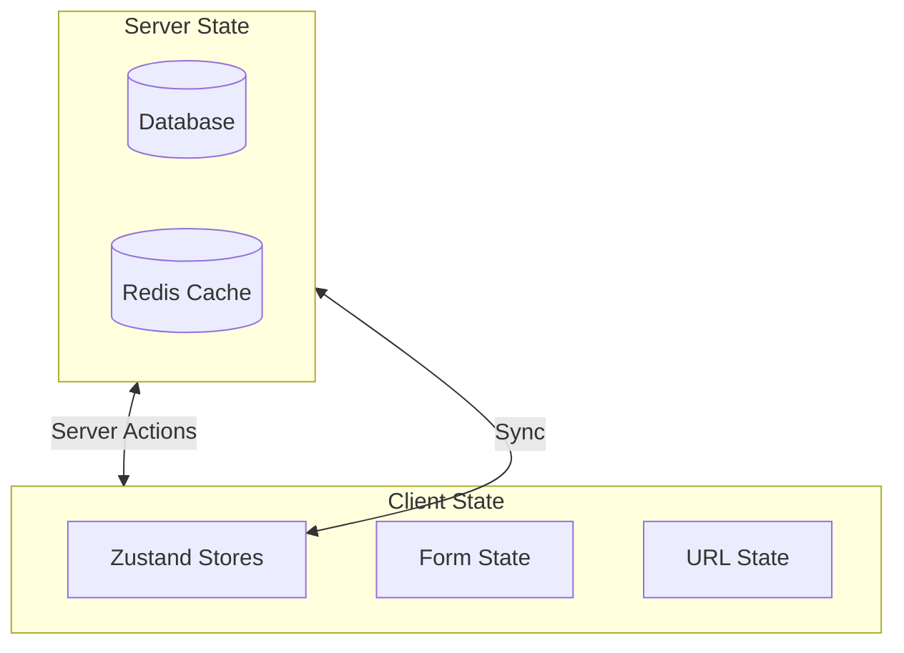

# State Management

This document covers how state is managed in Alertsify, including Zustand stores, server state, and URL state.

## Understanding State in a Trading Platform

State management is one of the most complex parts of any React application. For a trading platform, it's even more critical because:

### The Challenges We Face

**1. Multiple Sources of Truth** — Positions exist in the database, but we also show them in the UI. Which one is "real"? What happens when they're different?

**2. Real-time Updates** — Prices change every second. Order status changes without user action. The UI must reflect reality.

**3. Optimistic Updates** — When a user places an order, we show it immediately (optimistic). But what if the server rejects it? We need to rollback.

**4. Persistence** — Some state should survive page refreshes (selected account). Other state should reset (search filters).

### Our Philosophy

**Server is the Source of Truth** — The database always has the canonical data. Client state is a cache that may be temporarily out of sync.

**Keep State Close to Where It's Used** — Form state lives in the form. Global UI state lives in Zustand. Don't put everything in a global store.

**Prefer URL State for Shareable Data** — Filters, tabs, and pagination belong in the URL. Users can share links and bookmark views.

---

## State Categories

Alertsify uses different strategies for different types of state:

| State Type | Storage | Example | When to Refetch |
|------------|---------|---------|------------------|
| **Server State** | Database via Server Actions | User positions, trade history | On mutation, on focus, on interval |
| **Client State** | Zustand stores | UI state, optimistic updates | Never (client-only) |
| **URL State** | URL parameters | Filters, pagination, active tab | On navigation |
| **Form State** | React Hook Form | Form inputs, validation | On form reset |



---

## Zustand Stores

We use **Zustand** for client-side state management. It's lightweight, TypeScript-friendly, and requires no providers.

### Why Zustand Over Redux/Context?

| Feature | Zustand | Redux | React Context |
|---------|---------|-------|---------------|
| **Boilerplate** | Minimal | Heavy | Medium |
| **Bundle Size** | 1KB | 7KB+ | 0 (built-in) |
| **Providers** | None needed | Required | Required |
| **DevTools** | Optional | Built-in | Manual |
| **Learning Curve** | Low | High | Low |
| **Performance** | Excellent (selective re-renders) | Good | Poor (all consumers re-render) |

**Our Choice:** Zustand gives us Redux-like power with almost no boilerplate. No `<Provider>` wrapper, no action creators, no reducers. Just functions.

### How Zustand Works

1. **Create a store** — Define state and actions in one object
2. **Use the hook** — Components subscribe to specific parts of state
3. **Call actions** — Update state, and only subscribed components re-render

```tsx
// In a component
const orders = useOrdersStore(state => state.orders);
// Only re-renders when `orders` changes, not when other state changes
```

### Store Location

All stores are in `lib/stores/`:

```
lib/stores/
├── orders-store.ts           # Pending/recent orders
├── positions-store.ts        # Open positions
├── notifications-store.ts    # User notifications
├── traders-store.ts          # Followed traders
└── ui-store.ts               # UI state (modals, sidebars)
```

### Store Pattern

Every store follows this pattern:

<details>
<summary>📝 Store Template</summary>

```typescript
// lib/stores/example-store.ts
import { create } from 'zustand';
import { devtools, persist } from 'zustand/middleware';

// 1. Define the state interface
interface ExampleState {
  // State
  items: Item[];
  isLoading: boolean;
  error: string | null;
  
  // Actions
  setItems: (items: Item[]) => void;
  addItem: (item: Item) => void;
  updateItem: (id: string, updates: Partial<Item>) => void;
  removeItem: (id: string) => void;
  reset: () => void;
}

// 2. Define initial state
const initialState = {
  items: [],
  isLoading: false,
  error: null,
};

// 3. Create the store
export const useExampleStore = create<ExampleState>()(
  devtools(
    persist(
      (set, get) => ({
        ...initialState,

        setItems: (items) => set({ items }),

        addItem: (item) => set((state) => ({
          items: [...state.items, item],
        })),

        updateItem: (id, updates) => set((state) => ({
          items: state.items.map((item) =>
            item.id === id ? { ...item, ...updates } : item
          ),
        })),

        removeItem: (id) => set((state) => ({
          items: state.items.filter((item) => item.id !== id),
        })),

        reset: () => set(initialState),
      }),
      {
        name: 'example-storage', // localStorage key
        partialize: (state) => ({ items: state.items }), // What to persist
      }
    ),
    { name: 'ExampleStore' } // DevTools name
  )
);
```

</details>

---

## Orders Store

Manages pending and recent orders with optimistic updates.

### State Shape

```typescript
interface OrdersState {
  orders: Order[];
  pendingOrders: Order[];
  
  // Actions
  addOrder: (order: Order) => void;
  updateOrder: (id: string, updates: Partial<Order>) => void;
  removeOrder: (id: string) => void;
  setOrders: (orders: Order[]) => void;
}
```

### Usage with Optimistic Updates

<details>
<summary>📝 Optimistic Update Pattern</summary>

```typescript
// hooks/use-trading.ts
'use client';

import { useOrdersStore } from '@/lib/stores/orders-store';
import { placeOptionOrder } from '@/lib/actions/trading.actions';
import { nanoid } from 'nanoid';

export function useTrading() {
  const { addOrder, updateOrder, removeOrder } = useOrdersStore();

  const placeTrade = async (params: TradeParams) => {
    // 1. Create optimistic entry
    const tempId = `temp-${nanoid()}`;
    const optimisticOrder: Order = {
      id: tempId,
      status: 'pending',
      ...params,
      createdAt: new Date().toISOString(),
    };
    
    // 2. Add to store immediately (optimistic)
    addOrder(optimisticOrder);

    try {
      // 3. Call server action
      const result = await placeOptionOrder(params);

      if (result.ok) {
        // 4a. Success: Update with real data
        updateOrder(tempId, {
          id: result.data.id,
          brokerOrderId: result.data.brokerOrderId,
          status: result.data.status,
        });
      } else {
        // 4b. Failure: Remove optimistic entry
        removeOrder(tempId);
        toast.error(result.error);
      }
    } catch (error) {
      // 4c. Network error: Remove optimistic entry
      removeOrder(tempId);
      toast.error('Network error');
    }
  };

  return { placeTrade };
}
```

</details>

---

## Positions Store

Manages open trading positions.

### State Shape

```typescript
interface PositionsState {
  positions: Position[];
  selectedPosition: Position | null;
  
  // Computed
  totalValue: number;
  totalPnL: number;
  
  // Actions
  setPositions: (positions: Position[]) => void;
  updatePosition: (id: string, updates: Partial<Position>) => void;
  selectPosition: (id: string | null) => void;
}
```

### Computed Values

<details>
<summary>📝 Store with Computed Values</summary>

```typescript
// lib/stores/positions-store.ts
import { create } from 'zustand';

interface PositionsState {
  positions: Position[];
  
  // Computed getters
  getTotalValue: () => number;
  getTotalPnL: () => number;
  getPositionsByStatus: (status: string) => Position[];
  
  // Actions
  setPositions: (positions: Position[]) => void;
}

export const usePositionsStore = create<PositionsState>()((set, get) => ({
  positions: [],

  // Computed values as functions
  getTotalValue: () => {
    return get().positions.reduce((sum, p) => sum + p.currentValue, 0);
  },

  getTotalPnL: () => {
    return get().positions.reduce((sum, p) => sum + p.unrealizedPnL, 0);
  },

  getPositionsByStatus: (status) => {
    return get().positions.filter((p) => p.status === status);
  },

  setPositions: (positions) => set({ positions }),
}));

// Usage
function PortfolioSummary() {
  const getTotalPnL = usePositionsStore((s) => s.getTotalPnL);
  const totalPnL = getTotalPnL(); // Called as function
  
  return <div>P&L: ${totalPnL.toFixed(2)}</div>;
}
```

</details>

---

## Notifications Store

Manages user notifications with read/unread state.

### State Shape

```typescript
interface NotificationsState {
  notifications: Notification[];
  unreadCount: number;
  
  // Actions
  addNotification: (notification: Notification) => void;
  markAsRead: (id: string) => void;
  markAllAsRead: () => void;
  removeNotification: (id: string) => void;
}
```

---

## UI Store

Manages UI state like modals, sidebars, and active tabs.

<details>
<summary>📝 UI Store Example</summary>

```typescript
// lib/stores/ui-store.ts
import { create } from 'zustand';

interface UIState {
  // Sidebar
  sidebarOpen: boolean;
  toggleSidebar: () => void;
  
  // Modals
  activeModal: string | null;
  modalData: unknown;
  openModal: (modal: string, data?: unknown) => void;
  closeModal: () => void;
  
  // Trade form
  selectedUnderlying: string | null;
  setSelectedUnderlying: (symbol: string | null) => void;
}

export const useUIStore = create<UIState>()((set) => ({
  // Sidebar
  sidebarOpen: true,
  toggleSidebar: () => set((s) => ({ sidebarOpen: !s.sidebarOpen })),

  // Modals
  activeModal: null,
  modalData: null,
  openModal: (modal, data) => set({ activeModal: modal, modalData: data }),
  closeModal: () => set({ activeModal: null, modalData: null }),

  // Trade form
  selectedUnderlying: null,
  setSelectedUnderlying: (symbol) => set({ selectedUnderlying: symbol }),
}));
```

</details>

---

## URL State

For shareable/bookmarkable state, use URL parameters:

<details>
<summary>📝 URL State with nuqs</summary>

```typescript
// Using nuqs for type-safe URL state
import { useQueryState, parseAsString, parseAsInteger } from 'nuqs';

export function PositionsPage() {
  // URL: /positions?status=open&page=1
  const [status, setStatus] = useQueryState('status', parseAsString.withDefault('open'));
  const [page, setPage] = useQueryState('page', parseAsInteger.withDefault(1));

  return (
    <div>
      <select 
        value={status} 
        onChange={(e) => setStatus(e.target.value)}
      >
        <option value="open">Open</option>
        <option value="closed">Closed</option>
      </select>
      
      <Pagination 
        page={page} 
        onPageChange={setPage} 
      />
    </div>
  );
}
```

</details>

---

## Syncing Server & Client State

### Pattern: Initial Data + Updates

<details>
<summary>📝 Hybrid State Pattern</summary>

```typescript
// Server Component fetches initial data
// app/(dashboard)/positions/page.tsx
export default async function PositionsPage() {
  const positions = await getPositions();
  return <PositionsView initialPositions={positions} />;
}

// Client Component manages updates
// components/dashboard/positions-view.tsx
'use client';

import { useEffect } from 'react';
import { usePositionsStore } from '@/lib/stores/positions-store';

export function PositionsView({ initialPositions }: Props) {
  const { positions, setPositions } = usePositionsStore();

  // Initialize store with server data
  useEffect(() => {
    setPositions(initialPositions);
  }, [initialPositions, setPositions]);

  // Display from store (includes optimistic updates)
  const displayPositions = positions.length > 0 ? positions : initialPositions;

  return <PositionsTable positions={displayPositions} />;
}
```

</details>

---

## Best Practices

### ✅ Do

| Practice | Reason |
|----------|--------|
| Use selectors | Prevents unnecessary re-renders |
| Split stores by domain | Better code organization |
| Use devtools in dev | Easier debugging |
| Persist critical state | Better UX on refresh |

### ❌ Don't

| Anti-Pattern | Reason |
|--------------|--------|
| Store derived data | Compute on demand instead |
| Put server data in stores permanently | Use server actions for source of truth |
| Create massive stores | Split by feature |
| Mutate state directly | Always use actions |

### Selector Pattern

```typescript
// ✅ Good - specific selector
const orders = useOrdersStore((s) => s.orders);

// ❌ Bad - selecting entire store
const store = useOrdersStore(); // Re-renders on ANY change
```

---

## Next Steps

- [Caching Strategy](/architecture/caching) — Redis caching patterns
- [Backend Architecture](/architecture/backend) — Server-side state management
