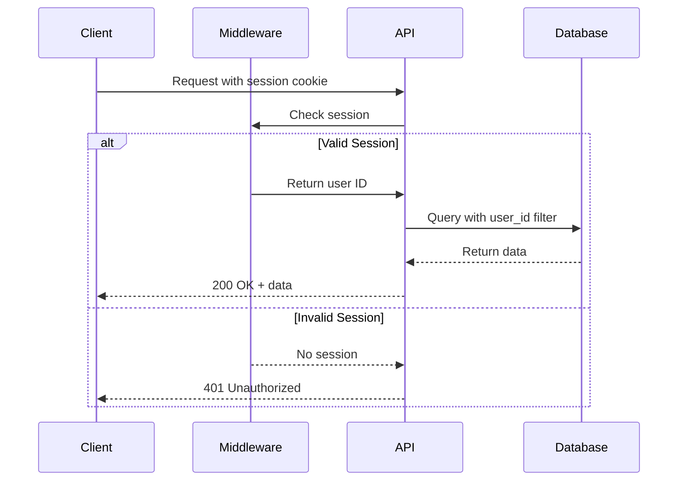

# API Endpoints

The Dashboard Module exposes REST API endpoints for analytics data, trading operations, and position management. These endpoints are consumed by React components and can also be used for external integrations.

## Understanding the API Layer

The API layer serves as the bridge between the frontend components and the database. Let's understand why we structured it this way.

### Why REST API Endpoints?

While Next.js 14 offers Server Actions for data mutations, we use REST API endpoints for several reasons:

**1. Separation of Concerns** — API routes are pure HTTP handlers. They're easy to test independently of the UI. You can hit them with curl, Postman, or any HTTP client.

**2. Caching Compatibility** — REST endpoints work seamlessly with HTTP caching headers, CDN caching, and Vercel's edge cache. Server Actions are harder to cache.

**3. External Integration** — If we ever need to expose analytics to a mobile app, Discord bot, or third-party integration, the API is already there.

**4. Rate Limiting** — It's easier to apply rate limiting middleware to API routes than to Server Actions.

### API Design Principles

We follow these principles throughout our API:

- **User Isolation** — Every endpoint filters by the authenticated user's ID. You can only see your own data.
- **Pagination** — Large result sets (like closed positions) are paginated to prevent slow responses.
- **Consistent Errors** — All errors return the same JSON structure with an `error` field.
- **Source Filtering** — Most analytics endpoints accept a `source` parameter to filter by manual, copied, or all trades.

## API Overview

| Category | Base Path | Description |
|----------|-----------|-------------|
| **Analytics V2** | `/api/analytics-v2` | Trading statistics and performance metrics |
| **Trading** | `/api/trading` | Order execution and management |
| **SnapTrade** | `/api/snaptrade` | Brokerage account operations |
| **Positions** | `/api/positions` | Open and closed position queries |

## Authentication

All endpoints require authentication via NextAuth session. Unauthenticated requests receive a `401 Unauthorized` response.

### How Authentication Works

When a user logs in, NextAuth creates a session cookie. This cookie is automatically sent with every request. On the server, we validate this cookie and extract the user ID.

**Why Cookie-Based Auth?**

- Cookies are sent automatically by the browser—no need for the frontend to manage tokens
- HttpOnly cookies prevent JavaScript access, protecting against XSS attacks
- Session validation happens server-side, so the client can't forge authentication



---

## Analytics V2 Endpoints

These endpoints power the analytics dashboard. They query the database views we covered earlier and return calculated statistics.

### GET /api/analytics-v2/user-stats

Returns comprehensive trading statistics for the authenticated user.

**Purpose:** Primary metrics for the analytics dashboard header cards.

**When to Use:** Call this endpoint when loading the analytics page to populate the main metric cards (Total P&L, Win Rate, etc.).

**The `source` Parameter:** This is crucial for copy trading users. Setting `source=manual` shows only trades the user executed themselves. Setting `source=copied` shows only trades that were automatically copied from other traders. This helps users evaluate which strategy is working better.

| Parameter | Type | Required | Description |
|-----------|------|----------|-------------|
| `source` | query | No | Filter by trade source: `all`, `manual`, `copied` |

**Response Fields:**

| Field | Type | Description |
|-------|------|-------------|
| `total_closed_trades` | number | Total completed trades |
| `total_open_positions` | number | Currently open positions |
| `manual_trades` | number | User-initiated trades |
| `copied_trades` | number | Trades copied from other traders |
| `total_pnl` | number | Net profit/loss (USD) |
| `wins` | number | Winning trade count |
| `losses` | number | Losing trade count |
| `win_rate_pct` | number | Win rate percentage |
| `roi_pct` | number | Return on investment % |
| `biggest_win` | number | Largest single win |
| `biggest_loss` | number | Largest single loss |

<details>
<summary><strong>Request Example</strong></summary>

```bash
curl -X GET "https://api.alertsify.com/api/analytics-v2/user-stats?source=manual" \
  -H "Cookie: next-auth.session-token=..."
```

</details>

<details>
<summary><strong>Response Example</strong></summary>

```json
{
  "data": {
    "total_closed_trades": 150,
    "total_open_positions": 5,
    "manual_trades": 100,
    "copied_trades": 50,
    "total_pnl": 12500.50,
    "manual_pnl": 8000.00,
    "copied_pnl": 4500.50,
    "wins": 90,
    "losses": 55,
    "breakeven": 5,
    "win_rate_pct": 60.00,
    "roi_pct": 25.50,
    "biggest_win": 2500.00,
    "biggest_loss": -1200.00
  }
}
```

</details>

<details>
<summary><strong>Route Handler Implementation</strong></summary>

```typescript
// app/api/analytics-v2/user-stats/route.ts
import { NextResponse } from 'next/server';
import { auth } from '@/app/(auth)/auth';
import { db } from '@/lib/db';
import { sql } from 'drizzle-orm';

export async function GET() {
  try {
    const session = await auth();
    if (!session?.user?.id) {
      return NextResponse.json({ error: 'Unauthorized' }, { status: 401 });
    }

    const userId = session.user.id;

    const result = await db.execute(sql`
      SELECT * FROM user_trading_stats_v2 WHERE user_id = ${userId}
    `);

    const rows = Array.isArray(result) ? result : [];

    if (rows.length === 0) {
      return NextResponse.json({
        data: {
          total_closed_trades: 0,
          total_open_positions: 0,
          manual_trades: 0,
          copied_trades: 0,
          total_pnl: 0,
          wins: 0,
          losses: 0,
          win_rate_pct: 0,
          roi_pct: 0,
        },
      });
    }

    return NextResponse.json({ data: rows[0] });
  } catch (error) {
    console.error('[analytics-v2/user-stats] Error:', error);
    return NextResponse.json(
      { error: 'Failed to fetch user stats' },
      { status: 500 }
    );
  }
}
```

</details>

---

### GET /api/analytics-v2/period-stats

Returns trading statistics grouped by time periods.

**Purpose:** Period comparison (7d, 30d, 90d, YTD, all-time).

| Parameter | Type | Required | Description |
|-----------|------|----------|-------------|
| `source` | query | No | Filter: `all`, `manual`, `copied` |

**Response Fields:**

| Field | Type | Description |
|-------|------|-------------|
| `trades_7d` | number | Trades in last 7 days |
| `pnl_7d` | number | P&L in last 7 days |
| `wins_7d` | number | Wins in last 7 days |
| `trades_30d` | number | Trades in last 30 days |
| `pnl_30d` | number | P&L in last 30 days |
| `trades_ytd` | number | Year-to-date trades |
| `pnl_ytd` | number | Year-to-date P&L |
| `trades_all` | number | All-time trade count |
| `pnl_all` | number | All-time P&L |

<details>
<summary><strong>Response Example</strong></summary>

```json
{
  "data": {
    "trades_7d": 12,
    "pnl_7d": 850.25,
    "wins_7d": 8,
    "trades_30d": 45,
    "pnl_30d": 2340.50,
    "trades_90d": 120,
    "pnl_90d": 5600.00,
    "trades_ytd": 200,
    "pnl_ytd": 8500.00,
    "trades_all": 450,
    "pnl_all": 15000.00,
    "manual_trades_all": 300,
    "manual_pnl_all": 10000.00,
    "copied_trades_all": 150,
    "copied_pnl_all": 5000.00
  }
}
```

</details>

---

### GET /api/analytics-v2/closed-positions

Returns paginated list of closed positions with P&L details.

**Purpose:** "All Trades" tab showing trade history.

| Parameter | Type | Required | Description |
|-----------|------|----------|-------------|
| `trade_type` | query | No | Filter: `manual`, `copied` |
| `limit` | query | No | Results per page (default: 50) |
| `offset` | query | No | Pagination offset (default: 0) |
| `sort` | query | No | Sort field (default: `closed_at`) |
| `order` | query | No | Sort order: `asc`, `desc` (default: `desc`) |

**Response Structure:**

| Field | Type | Description |
|-------|------|-------------|
| `data` | array | Array of ClosedPosition objects |
| `pagination.total` | number | Total matching records |
| `pagination.limit` | number | Current page size |
| `pagination.offset` | number | Current offset |
| `pagination.hasMore` | boolean | More pages available |

<details>
<summary><strong>Request Example</strong></summary>

```bash
curl -X GET "https://api.alertsify.com/api/analytics-v2/closed-positions?limit=20&offset=0&trade_type=manual" \
  -H "Cookie: next-auth.session-token=..."
```

</details>

<details>
<summary><strong>Response Example</strong></summary>

```json
{
  "data": [
    {
      "id": "uuid-123",
      "symbol": "SPY240315C00520000",
      "ticker": "SPY",
      "option_type": "call",
      "strike_price": "520.00",
      "expiration_date": "2024-03-15",
      "quantity": 5,
      "avg_buy_price": "2.50",
      "avg_sell_price": "3.75",
      "pnl": "625.00",
      "pnl_pct": "50.00",
      "result": "win",
      "trade_type": "manual",
      "closed_at": "2024-03-14T15:30:00Z",
      "hold_time_days": "0.5"
    }
  ],
  "pagination": {
    "total": 150,
    "limit": 20,
    "offset": 0,
    "hasMore": true
  }
}
```

</details>

<details>
<summary><strong>Route Handler Implementation</strong></summary>

```typescript
// app/api/analytics-v2/closed-positions/route.ts
import { NextRequest, NextResponse } from 'next/server';
import { auth } from '@/app/(auth)/auth';
import { db } from '@/lib/db';
import { sql } from 'drizzle-orm';

export async function GET(request: NextRequest) {
  try {
    const session = await auth();
    if (!session?.user?.id) {
      return NextResponse.json({ error: 'Unauthorized' }, { status: 401 });
    }

    const userId = session.user.id;
    const { searchParams } = new URL(request.url);
    
    const tradeType = searchParams.get('trade_type');
    const limit = parseInt(searchParams.get('limit') || '50', 10);
    const offset = parseInt(searchParams.get('offset') || '0', 10);

    let query = sql`
      SELECT * FROM closed_positions_v2 
      WHERE user_id = ${userId}
    `;

    if (tradeType === 'manual') {
      query = sql`${query} AND trade_type = 'manual'`;
    } else if (tradeType === 'copied') {
      query = sql`${query} AND trade_type = 'copied'`;
    }

    query = sql`${query} ORDER BY closed_at DESC NULLS LAST LIMIT ${limit} OFFSET ${offset}`;

    const result = await db.execute(query);
    const rows = Array.isArray(result) ? result : [];

    // Get total count for pagination
    const countResult = await db.execute(sql`
      SELECT COUNT(*) as total FROM closed_positions_v2 WHERE user_id = ${userId}
    `);
    const total = Number(countResult[0]?.total || 0);

    return NextResponse.json({
      data: rows,
      pagination: {
        total,
        limit,
        offset,
        hasMore: offset + rows.length < total,
      },
    });
  } catch (error) {
    console.error('[closed-positions] Error:', error);
    return NextResponse.json({ error: 'Failed to fetch' }, { status: 500 });
  }
}
```

</details>

---

### GET /api/analytics-v2/open-positions

Returns currently open positions.

**Purpose:** "Open Positions" tab showing active trades.

| Parameter | Type | Required | Description |
|-----------|------|----------|-------------|
| `trade_type` | query | No | Filter: `manual`, `copied` |

<details>
<summary><strong>Response Example</strong></summary>

```json
{
  "data": [
    {
      "id": "uuid-456",
      "symbol": "AAPL240322P00170000",
      "ticker": "AAPL",
      "option_type": "put",
      "strike_price": "170.00",
      "expiration_date": "2024-03-22",
      "open_quantity": 3,
      "avg_buy_price": "1.85",
      "open_cost_basis": "555.00",
      "trade_type": "manual",
      "opened_at": "2024-03-18T10:15:00Z",
      "buy_count": 1,
      "sell_count": 0
    }
  ]
}
```

</details>

---

### GET /api/analytics-v2/symbol-stats

Returns trading statistics grouped by symbol.

**Purpose:** Symbol performance analysis, best/worst performers.

<details>
<summary><strong>Response Example</strong></summary>

```json
{
  "data": [
    {
      "symbol": "SPY",
      "option_type": "call",
      "total_trades": 45,
      "wins": 28,
      "total_pnl": "3500.00",
      "win_rate_pct": "62.22",
      "avg_pnl": "77.78",
      "total_quantity": 120
    },
    {
      "symbol": "QQQ",
      "option_type": "put",
      "total_trades": 20,
      "wins": 12,
      "total_pnl": "1200.00",
      "win_rate_pct": "60.00",
      "avg_pnl": "60.00",
      "total_quantity": 50
    }
  ]
}
```

</details>

---

### GET /api/analytics-v2/daily-stats

Returns daily aggregated trading statistics.

**Purpose:** Calendar heatmap and daily P&L chart.

| Parameter | Type | Required | Description |
|-----------|------|----------|-------------|
| `start_date` | query | No | Start date (ISO format) |
| `end_date` | query | No | End date (ISO format) |

<details>
<summary><strong>Response Example</strong></summary>

```json
{
  "data": [
    {
      "trade_date": "2024-03-18",
      "total_trades": 5,
      "manual_trades": 3,
      "copied_trades": 2,
      "total_pnl": 450.00,
      "wins": 4,
      "losses": 1
    },
    {
      "trade_date": "2024-03-17",
      "total_trades": 3,
      "manual_trades": 2,
      "copied_trades": 1,
      "total_pnl": -120.00,
      "wins": 1,
      "losses": 2
    }
  ]
}
```

</details>

---

### GET /api/analytics-v2/heatmap

Returns trading activity by day of week and hour.

**Purpose:** Trading time heatmap visualization.

<details>
<summary><strong>Response Example</strong></summary>

```json
{
  "data": [
    {
      "day_of_week": 1,
      "hour_of_day": 9,
      "trades": 15,
      "pnl": 850.00,
      "wins": 10
    },
    {
      "day_of_week": 1,
      "hour_of_day": 10,
      "trades": 22,
      "pnl": 1200.00,
      "wins": 15
    }
  ]
}
```

</details>

---

### GET /api/analytics-v2/cumulative

Returns cumulative P&L data for equity curve charts.

**Purpose:** Account growth visualization over time.

| Parameter | Type | Required | Description |
|-----------|------|----------|-------------|
| `range` | query | No | Time range: `1w`, `1m`, `3m`, `6m`, `1y`, `all` |

<details>
<summary><strong>Response Example</strong></summary>

```json
{
  "data": [
    {
      "trade_date": "2024-01-02",
      "pnl": 250.00,
      "cumulative_pnl": 250.00
    },
    {
      "trade_date": "2024-01-03",
      "pnl": -100.00,
      "cumulative_pnl": 150.00
    },
    {
      "trade_date": "2024-01-04",
      "pnl": 400.00,
      "cumulative_pnl": 550.00
    }
  ]
}
```

</details>

---

## Error Responses

All endpoints follow a consistent error response format:

| Status | Description | Response |
|--------|-------------|----------|
| `400` | Bad Request | `{ "error": "Invalid parameters" }` |
| `401` | Unauthorized | `{ "error": "Unauthorized" }` |
| `403` | Forbidden | `{ "error": "Access denied" }` |
| `404` | Not Found | `{ "error": "Resource not found" }` |
| `500` | Server Error | `{ "error": "Internal server error" }` |

<details>
<summary><strong>Error Response Example</strong></summary>

```json
{
  "error": "Invalid parameters",
  "details": {
    "limit": "Must be a positive integer",
    "offset": "Must be a non-negative integer"
  }
}
```

</details>

---

## Rate Limiting

API endpoints are rate-limited to prevent abuse:

| Tier | Limit | Window |
|------|-------|--------|
| Standard | 100 requests | 1 minute |
| Premium | 500 requests | 1 minute |

Rate limit headers are included in responses:

```
X-RateLimit-Limit: 100
X-RateLimit-Remaining: 95
X-RateLimit-Reset: 1710777600
```

:::tip Caching
Analytics endpoints are cached for 60 seconds. Repeated requests within this window return cached data, reducing database load and improving response times.
:::
