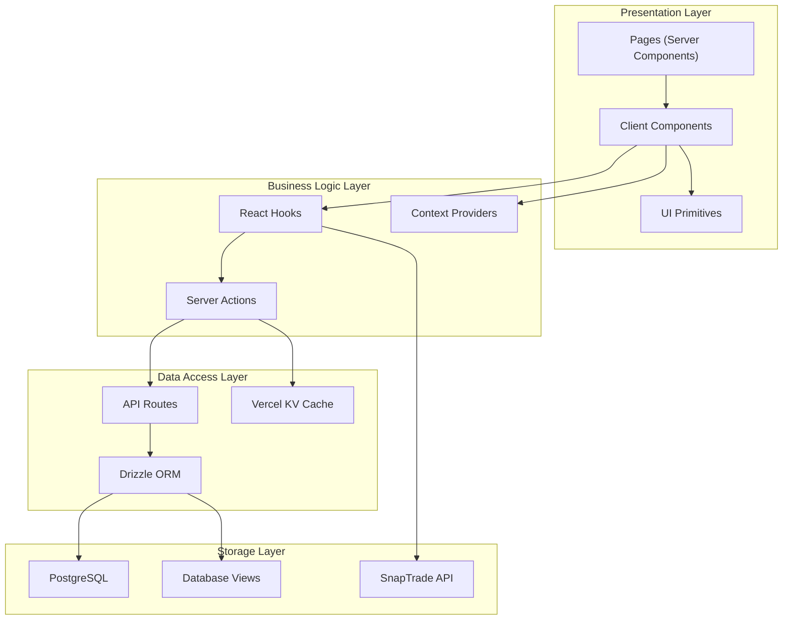
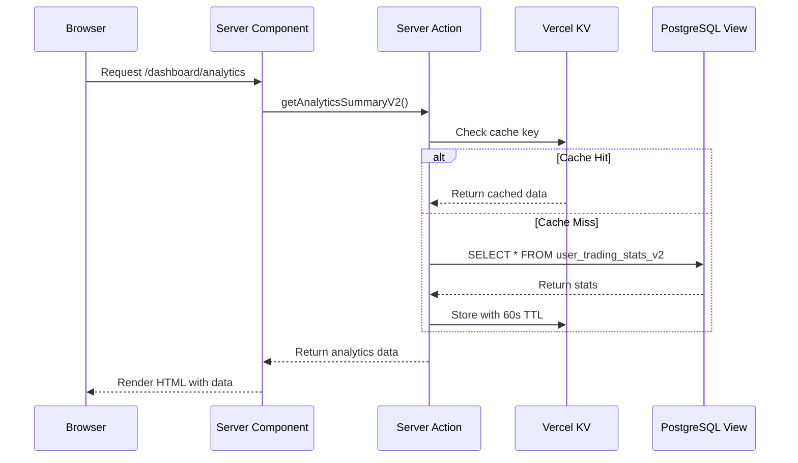
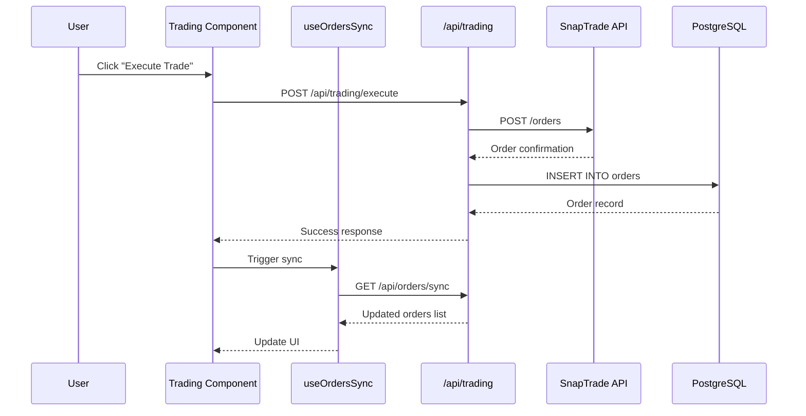
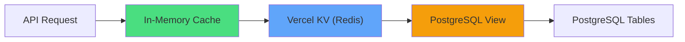

# Dashboard Architecture

The Dashboard Module follows a layered architecture that separates concerns between presentation, business logic, and data access. This design ensures maintainability, testability, and optimal performance.

## Understanding the Architecture

Before diving into the technical details, let's understand **why** the architecture is designed this way:

### The Problem We're Solving

Building a trading dashboard presents unique challenges:

- **Multiple Data Sources** — We need to combine data from our database (trade history), external APIs (SnapTrade for brokerage data), and real-time feeds (market prices). Each source has different latency and reliability characteristics.

- **Performance Requirements** — Traders expect instant feedback. A slow dashboard means missed opportunities. We need aggressive caching without showing stale data.

- **Complex State** — The UI needs to reflect order status changes, position updates, and price movements—all happening simultaneously.

- **Type Safety** — Financial data demands accuracy. A typo in a price field could lead to incorrect P&L calculations.

### Our Solution: Layered Architecture

We solved these challenges by separating the system into four distinct layers:

1. **Presentation Layer** — What the user sees. React components that render the UI.
2. **Business Logic Layer** — How things work. Hooks and actions that coordinate data flow.
3. **Data Access Layer** — Where data comes from. API routes and database queries.
4. **Storage Layer** — Where data lives. PostgreSQL, Redis cache, and external APIs.

This separation means each layer has one job, making the code easier to understand, test, and modify.

## High-Level Architecture

The Dashboard is structured in distinct layers, each with a specific responsibility:



## Layer Responsibilities

### Presentation Layer

The presentation layer handles all UI rendering and user interactions. Think of it as the "face" of the application—everything the user sees and touches.

**Why Two Types of Components?**

Next.js 14 introduced Server Components and Client Components. Understanding when to use each is crucial:

- **Server Components** run on the server. They can directly access the database, fetch data, and send pre-rendered HTML to the browser. This is faster for initial page loads and better for SEO.

- **Client Components** run in the browser. They handle clicks, form inputs, and anything that requires JavaScript interactivity.

We use Server Components for the initial page load (fetching analytics data) and Client Components for interactive elements (clicking trade buttons, filtering data).

| Component Type | Responsibility | Example |
|----------------|----------------|---------|
| **Server Components** | Initial data fetching, SEO | `DashboardPage` |
| **Client Components** | Interactivity, state updates | `MasterTradingTab` |
| **UI Primitives** | Reusable UI elements | `MetricCard`, `Button` |

:::info Server vs Client Components
Server Components fetch data on the server and send pre-rendered HTML to the client. Client Components (marked with `'use client'`) handle interactivity and are hydrated on the client.
:::

### Business Logic Layer

The business logic layer contains the core application logic and state management. This is where we answer questions like "how do we calculate P&L?" and "what happens when an order fills?"

**Why Separate Business Logic?**

Putting business logic directly in components leads to problems:

- Components become bloated and hard to read
- Logic gets duplicated across components
- Testing requires rendering the entire UI

By extracting logic into hooks and server actions, we can:

- Reuse the same logic in multiple components
- Test business logic without UI dependencies
- Keep components focused on rendering

| Component | Responsibility | Example |
|-----------|----------------|---------|
| **React Hooks** | Data fetching, side effects | `useOrdersSync` |
| **Server Actions** | Type-safe mutations | `getAnalyticsSummaryV2` |
| **Context Providers** | Global state sharing | `TradeSourceProvider` |

### Data Access Layer

The data access layer handles communication with databases and external APIs. It acts as a translator between our application and the outside world.

**Why Abstract Data Access?**

Direct database calls scattered throughout the code create problems:

- SQL injection vulnerabilities
- Inconsistent query patterns
- Difficult to switch databases or add caching

Our data access layer provides:

- Type-safe queries via Drizzle ORM
- Automatic caching with configurable TTL
- Consistent error handling

| Component | Responsibility | Example |
|-----------|----------------|---------|
| **API Routes** | HTTP endpoints | `/api/analytics-v2/user-stats` |
| **Drizzle ORM** | Database queries | Query `parent_trades_v2` |
| **Cache** | Performance optimization | 60s TTL on analytics |

## Data Flow

Understanding how data flows through the system is crucial for debugging and extending the Dashboard. Let's trace what happens when a user interacts with the platform.

### Read Flow (Analytics Data)

**What Happens When You Open the Analytics Page?**

When a user navigates to the analytics dashboard, a series of steps occur to fetch and display their trading data:

1. **Browser Request** — The user clicks on "Analytics" in the navigation. The browser sends a request to the server.

2. **Server Component Renders** — Next.js renders the page on the server. The Server Component calls our server action to fetch data.

3. **Cache Check** — Before hitting the database, we check if this data was recently fetched. If the cache has valid data (less than 60 seconds old), we use it immediately. This saves database queries and speeds up response time.

4. **Database Query** — If the cache is empty or stale, we query the PostgreSQL view. The view performs all the complex calculations (P&L, win rate, etc.) in the database.

5. **Cache Storage** — Fresh data is stored in the cache for the next request.

6. **HTML Response** — The server sends pre-rendered HTML to the browser. The user sees their analytics almost instantly.



### Write Flow (Execute Trade)

**What Happens When You Click "Buy"?**

Executing a trade involves multiple systems working together. Here's the step-by-step flow:

1. **User Action** — The user selects an option contract and clicks the "Buy" button.

2. **API Request** — The trading component sends a POST request to our API with the order details (symbol, quantity, price).

3. **Brokerage Communication** — Our API forwards the order to SnapTrade, which routes it to the user's connected brokerage (TD Ameritrade, Schwab, etc.).

4. **Order Confirmation** — SnapTrade returns an order ID and initial status (usually "pending" or "submitted").

5. **Database Recording** — We store the order in our database so we can track it.

6. **UI Update** — The order appears in the Orders Table with a "pending" status.

7. **Polling for Updates** — The `useOrdersSync` hook polls every 3 seconds to check if the order has filled, been rejected, or cancelled.

8. **Celebration (Optional)** — If the order fills a position at a profit, the winning trade modal celebrates the success!



## Component Architecture

The Dashboard page is composed of nested components, each with a specific role.

### Dashboard Page Structure

```
DashboardPage (Server Component)
└── DashboardPageClient (Client Component)
    ├── PageHeader
    │   ├── AccountSelector
    │   └── NotificationBell
    ├── PageContentTabs
    │   ├── MasterTradingTab (default)
    │   │   ├── MasterPortfolioSummary
    │   │   ├── MasterTradingControls
    │   │   ├── MasterOptionsGrid
    │   │   ├── MasterOrdersTable
    │   │   └── SignalsFeedWidget
    │   ├── CopyTradingDashboardTab
    │   │   ├── TraderPerformanceTab
    │   │   └── SubscriberTraderPerformanceTab
    │   └── PositionsTab
    │       ├── OpenPositionsGrid
    │       └── ClosedPositionsList
    └── WinningTradeModal
```

### Analytics Page Structure

```
Analytics3V2Page (Client Component)
└── Analytics3V2TabsContainer
    ├── TradeSourceToggleV2
    └── Tabs
        ├── DashboardTabV2
        │   ├── MetricCardV2 (Total P&L)
        │   ├── MetricCardV2 (Win Rate)
        │   ├── MetricCardV2 (7 Day P&L)
        │   ├── MetricCardV2 (Open Positions)
        │   ├── SecondaryStats
        │   └── ManualVsCopiedBreakdown
        ├── AllTradesTabV2
        │   └── ClosedPositionsList (paginated)
        ├── OpenPositionsTabV2
        │   └── OpenPositionsGrid
        ├── SymbolsTabV2
        │   └── SymbolPerformanceCards
        └── HeatmapTab
            └── TradingHeatmapChart
```

## Real-Time Data Strategy

The Dashboard combines polling and WebSocket strategies for different data types:

| Data Type | Strategy | Frequency | Rationale |
|-----------|----------|-----------|-----------|
| **Order Status** | Polling | 3 seconds | Order updates are critical, polling ensures reliability |
| **Market Data** | WebSocket | Real-time | Price data must be instant for trading decisions |
| **Analytics** | Polling | 60 seconds | Statistical data doesn't change frequently |
| **Positions** | Polling | 10 seconds | Balance between freshness and server load |

<details>
<summary><strong>Polling Implementation Pattern</strong></summary>

```typescript
export function useOrdersSync(intervalMs = 3000) {
  const { syncOrders } = useOrderStore();
  const intervalRef = useRef<NodeJS.Timeout>();

  useEffect(() => {
    // Initial sync on mount
    syncOrders();

    // Set up polling interval
    intervalRef.current = setInterval(syncOrders, intervalMs);

    // Cleanup on unmount
    return () => {
      if (intervalRef.current) clearInterval(intervalRef.current);
    };
  }, [intervalMs, syncOrders]);
}
```

</details>

## Caching Strategy

The Dashboard uses a multi-layer caching strategy:

### Cache Layers



| Layer | TTL | Use Case |
|-------|-----|----------|
| **In-Memory** | Request duration | Prevent duplicate fetches in single render |
| **Vercel KV** | 60 seconds | Cross-request caching |
| **Database Views** | Real-time | No caching, always fresh calculations |

<details>
<summary><strong>Cached Query Pattern</strong></summary>

```typescript
export async function cachedQuery<T>(
  cacheKey: string[],
  fetcher: () => Promise<T>,
  options: { revalidate: number }
): Promise<T> {
  const key = cacheKey.join(':');
  
  // Try cache first
  const cached = await kv.get<T>(key);
  if (cached !== null) {
    return cached;
  }
  
  // Fetch fresh data
  const data = await fetcher();
  
  // Store in cache with TTL
  await kv.set(key, data, { ex: options.revalidate });
  
  return data;
}
```

</details>

## Error Handling Strategy

Errors are handled at multiple levels to ensure graceful degradation:

| Level | Strategy | User Experience |
|-------|----------|-----------------|
| **API Route** | Try-catch with error response | Shows error message |
| **Server Action** | SafeError wrapper | Type-safe error handling |
| **Component** | Error boundaries | Fallback UI |
| **Hook** | SWR error state | Retry with backoff |

<details>
<summary><strong>SafeError Pattern</strong></summary>

```typescript
// Server Action with error handling
export async function getAnalyticsSummaryV2(source: TradeSource = "all") {
  try {
    const session = await auth();
    if (!session?.user?.id) {
      throw new SafeError("Unauthorized");
    }
    
    return await fetchAnalytics(session.user.id, source);
  } catch (error) {
    if (error instanceof SafeError) {
      throw error; // Re-throw known errors
    }
    
    console.error('[getAnalyticsSummaryV2] Error:', error);
    throw new SafeError("Failed to fetch analytics");
  }
}
```

</details>

## Security Considerations

The Dashboard implements several security measures:

| Measure | Implementation | Purpose |
|---------|----------------|---------|
| **Authentication** | NextAuth session check | Verify user identity |
| **Authorization** | User ID filtering | Ensure data isolation |
| **Input Validation** | Zod schemas | Prevent injection attacks |
| **Rate Limiting** | API route middleware | Prevent abuse |

:::warning Data Isolation
All database queries include a `WHERE user_id = ${userId}` clause to ensure users can only access their own data. This is enforced at the database view level.
:::
