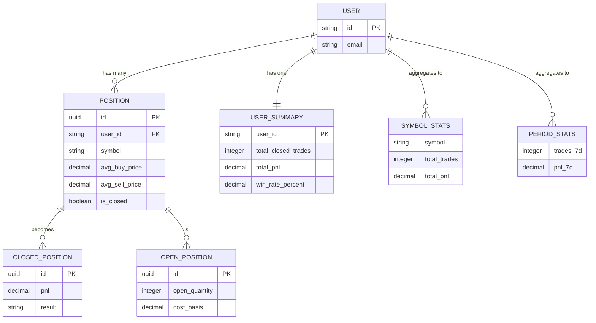

# Data Models

The Dashboard Module uses TypeScript interfaces and Drizzle ORM schemas to ensure type safety throughout the application. This document covers the core types used for analytics, trading, and position tracking.

## Why Data Models Matter

In a trading application, data accuracy is critical. A wrong price, incorrect quantity, or miscalculated P&L can lead to real financial consequences. Data models provide several safeguards:

### Type Safety Benefits

- **Compile-Time Errors** — TypeScript catches mistakes before the code runs. If you try to add a string to a number, the compiler stops you.

- **IDE Autocomplete** — When you type `userStats.`, your editor shows all available fields. No more guessing or checking documentation.

- **Refactoring Confidence** — When you rename a field, TypeScript finds every place it's used. Nothing gets missed.

- **Documentation** — The types themselves serve as documentation. New developers can understand the data structure by reading the interfaces.

### How We Organize Types

We group data models into three categories based on their purpose:

| Category | Purpose | Examples |
|----------|---------|----------|
| **Analytics Types** | Trading statistics and performance metrics | `UserStats`, `PeriodStats` |
| **Position Types** | Open and closed position data | `OpenPosition`, `ClosedPosition` |
| **Trading Types** | Order and trade execution data | `RowModel`, `DashboardSnapshot` |

---

## Analytics Types

These types represent calculated trading statistics used in the analytics dashboard. They answer questions like "How am I performing?" and "What's my win rate?"

### DashboardSnapshot

**Purpose:** Provide a quick, at-a-glance summary of trading activity.

This is the simplest analytics type. It powers the dashboard header, showing just four numbers that traders check constantly: today's trades, today's P&L, total trades, and total P&L.

**Why These Fields?**

- `tradesToday` and `pnlToday` — Traders want to know "How am I doing right now?" These fields answer that immediately.
- `tradesTotal` and `pnlTotal` — Provides context. A $500 day feels different if your total is $50,000 vs $5,000.

| Field | Type | Description |
|-------|------|-------------|
| `tradesToday` | `number` | Number of trades executed today |
| `pnlToday` | `number` | Profit/loss for today in USD |
| `tradesTotal` | `number` | Total trades (all time) |
| `pnlTotal` | `number` | Total P&L (all time) in USD |

<details>
<summary><strong>TypeScript Definition</strong></summary>

```typescript
export type DashboardSnapshot = {
  tradesToday: number;
  pnlToday: number;
  tradesTotal: number;
  pnlTotal: number;
};
```

</details>

### UserStats

**Purpose:** Comprehensive trading statistics for in-depth analysis.

This is the main analytics type used throughout the dashboard. It provides everything a trader needs to evaluate their performance, identify strengths and weaknesses, and track improvement over time.

**Why These Fields?**

- **Trade Counts** (`total_closed_trades`, `total_open_positions`) — Shows activity level and current exposure.
- **Manual vs Copied** (`manual_trades`, `copied_trades`, `manual_pnl`, `copied_pnl`) — Critical for copy trading users who need to know which strategy is working.
- **Win/Loss Metrics** (`wins`, `losses`, `win_rate_pct`) — The most common way traders evaluate themselves.
- **ROI** (`roi_pct`) — More useful than raw P&L for comparing different account sizes.
- **Extremes** (`biggest_win`, `biggest_loss`) — Helps identify outliers and manage risk.

| Field | Type | Description |
|-------|------|-------------|
| `total_closed_trades` | `number` | Count of all closed positions |
| `total_open_positions` | `number` | Count of currently open positions |
| `manual_trades` | `number` | Trades executed manually by user |
| `copied_trades` | `number` | Trades copied from other traders |
| `total_pnl` | `number` | Total profit/loss in USD |
| `manual_pnl` | `number` | P&L from manual trades only |
| `copied_pnl` | `number` | P&L from copied trades only |
| `wins` | `number` | Count of winning trades |
| `losses` | `number` | Count of losing trades |
| `win_rate_pct` | `number` | Win rate percentage (0-100) |
| `roi_pct` | `number` | Return on investment percentage |
| `biggest_win` | `number` | Largest single winning trade |
| `biggest_loss` | `number` | Largest single losing trade |

<details>
<summary><strong>TypeScript Definition</strong></summary>

```typescript
interface UserStats {
  total_closed_trades: number;
  total_open_positions: number;
  manual_trades: number;
  copied_trades: number;
  total_pnl: number;
  manual_pnl: number;
  copied_pnl: number;
  wins: number;
  losses: number;
  win_rate_pct: number;
  roi_pct: number;
  biggest_win: number;
  biggest_loss: number;
}
```

</details>

### PeriodStats

Trading statistics broken down by time periods. Used for trend analysis and performance comparison.

| Field | Type | Description |
|-------|------|-------------|
| `trades_7d` | `number` | Trades in last 7 days |
| `pnl_7d` | `number` | P&L in last 7 days |
| `wins_7d` | `number` | Wins in last 7 days |
| `trades_30d` | `number` | Trades in last 30 days |
| `pnl_30d` | `number` | P&L in last 30 days |
| `trades_90d` | `number` | Trades in last 90 days |
| `pnl_90d` | `number` | P&L in last 90 days |
| `trades_ytd` | `number` | Trades year-to-date |
| `pnl_ytd` | `number` | P&L year-to-date |
| `trades_all` | `number` | All-time trade count |
| `pnl_all` | `number` | All-time P&L |
| `manual_trades_all` | `number` | All-time manual trades |
| `manual_pnl_all` | `number` | All-time manual P&L |
| `copied_trades_all` | `number` | All-time copied trades |
| `copied_pnl_all` | `number` | All-time copied P&L |

<details>
<summary><strong>TypeScript Definition</strong></summary>

```typescript
interface PeriodStats {
  trades_7d: number;
  pnl_7d: number;
  wins_7d: number;
  trades_30d: number;
  pnl_30d: number;
  trades_90d: number;
  pnl_90d: number;
  trades_ytd: number;
  pnl_ytd: number;
  trades_all: number;
  pnl_all: number;
  manual_trades_all: number;
  manual_pnl_all: number;
  copied_trades_all: number;
  copied_pnl_all: number;
}
```

</details>

## Position Types

These types represent individual trading positions, both open and closed.

### ClosedPosition

A position that has been fully closed with realized P&L.

| Field | Type | Description |
|-------|------|-------------|
| `id` | `string` | Unique position identifier |
| `symbol` | `string` | Full option symbol (OCC format) |
| `ticker` | `string \| null` | Underlying ticker (e.g., "SPY") |
| `option_type` | `string \| null` | "call" or "put" |
| `strike_price` | `string \| null` | Strike price |
| `expiration_date` | `string \| null` | Option expiration date |
| `quantity` | `number` | Number of contracts traded |
| `avg_buy_price` | `string` | Average entry price |
| `avg_sell_price` | `string` | Average exit price |
| `pnl` | `string` | Realized profit/loss |
| `pnl_pct` | `string` | P&L as percentage |
| `result` | `'win' \| 'loss' \| 'breakeven'` | Trade outcome |
| `trade_type` | `'manual' \| 'copied'` | How trade was initiated |
| `closed_at` | `string \| null` | When position was closed |
| `hold_time_days` | `string \| null` | Days position was held |

<details>
<summary><strong>TypeScript Definition</strong></summary>

```typescript
interface ClosedPosition {
  id: string;
  symbol: string;
  ticker: string | null;
  option_type: string | null;
  strike_price: string | null;
  expiration_date: string | null;
  quantity: number;
  avg_buy_price: string;
  avg_sell_price: string;
  pnl: string;
  pnl_pct: string;
  result: 'win' | 'loss' | 'breakeven';
  trade_type: 'manual' | 'copied';
  closed_at: string | null;
  hold_time_days: string | null;
}
```

</details>

### OpenPosition

A currently active position with unrealized P&L.

| Field | Type | Description |
|-------|------|-------------|
| `id` | `string` | Unique position identifier |
| `symbol` | `string` | Full option symbol |
| `ticker` | `string \| null` | Underlying ticker |
| `option_type` | `string \| null` | "call" or "put" |
| `strike_price` | `string \| null` | Strike price |
| `expiration_date` | `string \| null` | Option expiration date |
| `open_quantity` | `number` | Current open contracts |
| `avg_buy_price` | `string` | Average entry price |
| `open_cost_basis` | `string` | Total cost of open position |
| `trade_type` | `'manual' \| 'copied'` | How trade was initiated |
| `opened_at` | `string \| null` | When position was opened |
| `buy_count` | `number` | Number of buy fills |
| `sell_count` | `number` | Number of sell fills |

<details>
<summary><strong>TypeScript Definition</strong></summary>

```typescript
interface OpenPosition {
  id: string;
  symbol: string;
  ticker: string | null;
  option_type: string | null;
  strike_price: string | null;
  expiration_date: string | null;
  open_quantity: number;
  avg_buy_price: string;
  open_cost_basis: string;
  trade_type: 'manual' | 'copied';
  opened_at: string | null;
  buy_count: number;
  sell_count: number;
}
```

</details>

### SymbolStats

Performance statistics grouped by symbol, useful for identifying best/worst performing tickers.

| Field | Type | Description |
|-------|------|-------------|
| `symbol` | `string` | Ticker symbol |
| `option_type` | `string \| null` | "call" or "put" |
| `total_trades` | `number` | Total trades for this symbol |
| `wins` | `number` | Winning trades count |
| `total_pnl` | `string` | Total P&L for symbol |
| `win_rate_pct` | `string` | Win rate percentage |
| `avg_pnl` | `string` | Average P&L per trade |
| `total_quantity` | `number` | Total contracts traded |

<details>
<summary><strong>TypeScript Definition</strong></summary>

```typescript
interface SymbolStats {
  symbol: string;
  option_type: string | null;
  total_trades: number;
  wins: number;
  total_pnl: string;
  win_rate_pct: string;
  avg_pnl: string;
  total_quantity: number;
}
```

</details>

## Trading Types

These types are used for the trading interface and order management.

### RowModel

Represents a row in the options trading grid.

| Field | Type | Description |
|-------|------|-------------|
| `id` | `string` | Unique row identifier |
| `ticker` | `string` | Underlying ticker symbol |
| `callPut` | `'C' \| 'P'` | Call or Put option |
| `expDate` | `string \| null` | Selected expiration date |
| `near` | `number \| undefined` | "Near the money" filter offset |

<details>
<summary><strong>TypeScript Definition</strong></summary>

```typescript
type RowModel = {
  id: string;
  ticker: string;
  callPut: 'C' | 'P';
  expDate: string | null;
  near?: number;
};
```

</details>

### TradeSource

Filter type for separating manual and copied trades in analytics.

<details>
<summary><strong>TypeScript Definition</strong></summary>

```typescript
type TradeSource = 'all' | 'manual' | 'copied';
```

</details>

## Database Schemas

The Dashboard uses Drizzle ORM for type-safe database access. Below are the core table schemas.

### analytics_v2_positions

Stores individual position data for analytics calculations.

| Column | Type | Description |
|--------|------|-------------|
| `id` | `uuid` | Primary key |
| `user_id` | `varchar(64)` | User identifier |
| `account_id` | `uuid` | Brokerage account ID |
| `parent_trade_id` | `uuid` | Parent trade reference |
| `symbol` | `text` | Full option symbol |
| `ticker` | `text` | Underlying ticker |
| `option_type` | `text` | "call" or "put" |
| `strike_price` | `decimal` | Strike price |
| `expiration_date` | `date` | Expiration date |
| `position_status` | `text` | "open" or "closed" |
| `is_closed` | `boolean` | Whether position is closed |
| `total_buy_quantity` | `integer` | Total contracts bought |
| `total_sell_quantity` | `integer` | Total contracts sold |
| `avg_buy_price` | `decimal` | Average buy price |
| `avg_sell_price` | `decimal` | Average sell price |
| `realized_pnl` | `decimal` | Realized profit/loss |
| `realized_pnl_percent` | `decimal` | P&L percentage |
| `is_win` | `boolean` | Whether trade was profitable |
| `opened_at` | `timestamp` | Position open time |
| `closed_at` | `timestamp` | Position close time |
| `copied_from_trader_id` | `varchar(64)` | Source trader (if copied) |

<details>
<summary><strong>Drizzle Schema Definition</strong></summary>

```typescript
export const analyticsV2Positions = pgTable('analytics_v2_positions', {
  id: uuid('id').primaryKey().notNull().defaultRandom(),
  userId: varchar('user_id', { length: 64 }).notNull(),
  accountId: uuid('account_id').notNull(),
  parentTradeId: uuid('parent_trade_id').notNull(),
  symbol: text('symbol').notNull(),
  ticker: text('ticker'),
  optionType: text('option_type'),
  strikePrice: decimal('strike_price'),
  expirationDate: date('expiration_date'),
  positionStatus: text('position_status').notNull().default('open'),
  isClosed: boolean('is_closed').notNull().default(false),
  totalBuyQuantity: integer('total_buy_quantity').notNull().default(0),
  totalSellQuantity: integer('total_sell_quantity').notNull().default(0),
  closedQuantity: integer('closed_quantity').notNull().default(0),
  remainingQuantity: integer('remaining_quantity').notNull().default(0),
  scaleInCount: integer('scale_in_count').notNull().default(0),
  scaleOutCount: integer('scale_out_count').notNull().default(0),
  avgBuyPrice: decimal('avg_buy_price').notNull().default('0'),
  avgSellPrice: decimal('avg_sell_price').notNull().default('0'),
  totalBuyFees: decimal('total_buy_fees').notNull().default('0'),
  totalSellFees: decimal('total_sell_fees').notNull().default('0'),
  totalFees: decimal('total_fees').notNull().default('0'),
  realizedPnl: decimal('realized_pnl'),
  realizedPnlPercent: decimal('realized_pnl_percent'),
  tradeProfitType: text('trade_profit_type').default('open'),
  isWin: boolean('is_win'),
  firstBuyAt: timestamp('first_buy_at', { withTimezone: true }),
  lastBuyAt: timestamp('last_buy_at', { withTimezone: true }),
  firstSellAt: timestamp('first_sell_at', { withTimezone: true }),
  lastSellAt: timestamp('last_sell_at', { withTimezone: true }),
  openedAt: timestamp('opened_at', { withTimezone: true }),
  closedAt: timestamp('closed_at', { withTimezone: true }),
  holdTimeDays: decimal('hold_time_days'),
  copiedFromTraderId: varchar('copied_from_trader_id', { length: 64 }),
  copySourceParentTradeId: uuid('copy_source_parent_trade_id'),
  createdAt: timestamp('created_at', { withTimezone: true }).notNull().defaultNow(),
  updatedAt: timestamp('updated_at', { withTimezone: true }).notNull().defaultNow(),
});
```

</details>

### analytics_v2_user_summary

Pre-aggregated user statistics for fast dashboard loading.

| Column | Type | Description |
|--------|------|-------------|
| `user_id` | `varchar(64)` | Primary key - user identifier |
| `total_closed_trades` | `integer` | Total closed positions |
| `winning_trades` | `integer` | Count of wins |
| `losing_trades` | `integer` | Count of losses |
| `breakeven_trades` | `integer` | Count of breakeven |
| `total_open_trades` | `integer` | Current open positions |
| `win_rate_percent` | `decimal` | Win rate (0-100) |
| `total_pnl` | `decimal` | Total profit/loss |
| `avg_pnl_per_trade` | `decimal` | Average P&L per trade |
| `avg_return_percent` | `decimal` | Average return % |
| `profit_factor` | `decimal` | Gross profit / gross loss |
| `best_trade` | `decimal` | Largest winning trade |
| `worst_trade` | `decimal` | Largest losing trade |
| `avg_hold_time_days` | `decimal` | Average holding period |
| `total_fees_paid` | `decimal` | Total trading fees |
| `last_computed_at` | `timestamp` | When stats were last updated |

<details>
<summary><strong>Drizzle Schema Definition</strong></summary>

```typescript
export const analyticsV2UserSummary = pgTable('analytics_v2_user_summary', {
  userId: varchar('user_id', { length: 64 }).primaryKey(),
  totalClosedTrades: integer('total_closed_trades').notNull().default(0),
  winningTrades: integer('winning_trades').notNull().default(0),
  losingTrades: integer('losing_trades').notNull().default(0),
  breakevenTrades: integer('breakeven_trades').notNull().default(0),
  totalOpenTrades: integer('total_open_trades').notNull().default(0),
  winRatePercent: decimal('win_rate_percent'),
  totalPnl: decimal('total_pnl').notNull().default('0'),
  avgPnlPerTrade: decimal('avg_pnl_per_trade'),
  avgReturnPercent: decimal('avg_return_percent'),
  avgWinningTrade: decimal('avg_winning_trade'),
  avgLosingTrade: decimal('avg_losing_trade'),
  profitFactor: decimal('profit_factor'),
  bestTrade: decimal('best_trade'),
  worstTrade: decimal('worst_trade'),
  avgHoldTimeDays: decimal('avg_hold_time_days'),
  totalFeesPaid: decimal('total_fees_paid').notNull().default('0'),
  grossProfit: decimal('gross_profit').notNull().default('0'),
  grossLoss: decimal('gross_loss').notNull().default('0'),
  lastComputedAt: timestamp('last_computed_at', { withTimezone: true }).notNull().defaultNow(),
  createdAt: timestamp('created_at', { withTimezone: true }).notNull().defaultNow(),
  updatedAt: timestamp('updated_at', { withTimezone: true }).notNull().defaultNow(),
});
```

</details>

## Type Relationships

Understanding how these types relate to each other:



:::tip Usage Pattern
Most components consume these types through React hooks or server actions, which handle the data fetching and transformation. Direct database access is encapsulated in the data layer.
:::
