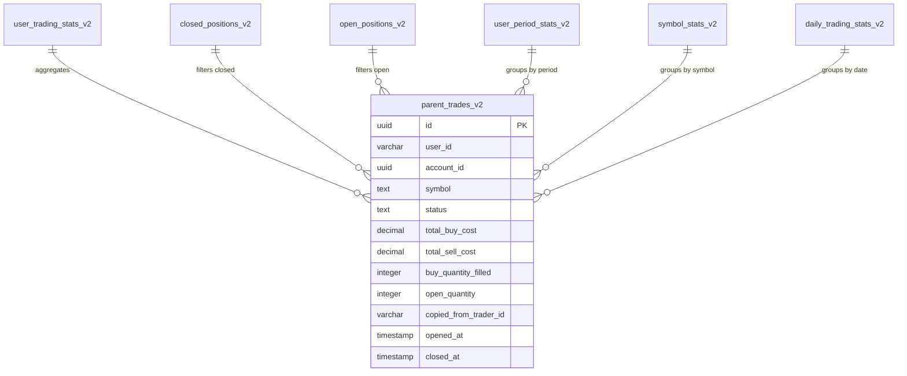

# Database Views

The Dashboard analytics system uses PostgreSQL views to perform real-time calculations directly in the database. This approach offloads complex aggregations from the application server and ensures consistent calculations across all API endpoints.

## Understanding Database Views

Before we dive into the specific views, let's understand what database views are and why we use them.

### What is a Database View?

A database view is like a saved SQL query that you can use as if it were a table. Instead of writing the same complex query in multiple places, you define it once as a view and then simply `SELECT * FROM view_name`.

Think of it like a recipe:
- The **table** is your pantry of ingredients (raw data)
- The **view** is your recipe (how to combine ingredients)
- Each time you query the view, the database follows the recipe to prepare your meal (calculated results)

### Why Use Views for Analytics?

We chose views over application-level calculations for several important reasons:

**1. Consistency** — The P&L calculation is defined once in SQL. Every part of the application that needs P&L uses the same formula. There's no risk of one developer calculating it differently than another.

**2. Performance** — PostgreSQL is optimized for aggregating data. Calculating P&L for 10,000 trades in SQL is faster than fetching all 10,000 rows and calculating in JavaScript.

**3. Security** — Views can enforce that users only see their own data. The `WHERE user_id = ?` clause is built into the view, preventing accidental data leaks.

**4. Maintainability** — When the P&L formula needs to change (for example, to account for fees), we update one SQL view rather than searching through application code.

| Benefit | Description |
|---------|-------------|
| **Performance** | Aggregations run close to the data, minimizing transfer |
| **Consistency** | Single source of truth for calculations |
| **Real-time** | Always return current data (no stale cache) |
| **Maintainability** | Business logic in SQL is easier to audit |
| **Security** | Views can enforce row-level access |

:::info Views vs Materialized Views
Standard views (used here) calculate data on every query, ensuring freshness. Materialized views cache results and require explicit refresh. For trading analytics where data changes frequently, standard views are preferred.
:::

---

## Source Table: parent_trades_v2

All analytics views query from the `parent_trades_v2` table, which contains the canonical trade data. Understanding this table is essential because every view derives from it.

### What is a "Parent Trade"?

In Alertsify, a "parent trade" represents a complete position lifecycle. When you buy 5 SPY calls, that creates one parent trade. If you later buy 3 more (scaling in), those get added to the same parent trade. When you sell, the parent trade tracks the sells until the position is closed.

This is different from individual orders. You might have 10 orders (3 buys, 7 sells) that all belong to one parent trade.

**Key Fields Explained:**

- `status` — Can be "open" (position active), "closed" (fully exited), or "filled" (order complete but position may still be open)
- `total_buy_cost` — Sum of all money spent buying this position
- `total_sell_cost` — Sum of all money received from selling
- `copied_from_trader_id` — If this trade was copied from another trader, their ID is stored here. NULL means manual trade.



---

## View: user_trading_stats_v2

**Purpose:** Real-time user trading statistics aggregated across all trades.

This is the most important view in the analytics system. It powers the main dashboard metrics and answers the question: "How am I performing overall?"

### How the Calculations Work

**P&L Calculation** — For each closed trade, we calculate:
```
P&L = total_sell_cost - total_buy_cost
```
If you bought for $1,000 and sold for $1,500, your P&L is $500.

**Win Rate** — A trade is a "win" if P&L > 0. Win rate is simply:
```
win_rate = wins / total_trades × 100
```
If you have 60 wins out of 100 trades, your win rate is 60%.

**ROI (Return on Investment)** — How much you made relative to what you risked:
```
ROI = total_pnl / total_buy_cost × 100
```
If you invested $10,000 total and made $2,500, your ROI is 25%.

### Calculated Fields

| Field | Calculation | Description |
|-------|-------------|-------------|
| `total_closed_trades` | `COUNT(*) WHERE status = 'closed'` | All closed positions |
| `total_open_positions` | `COUNT(*) WHERE open_quantity > 0` | Currently open trades |
| `manual_trades` | `COUNT(*) WHERE copied_from_trader_id IS NULL` | User-initiated trades |
| `copied_trades` | `COUNT(*) WHERE copied_from_trader_id IS NOT NULL` | Copied from traders |
| `total_pnl` | `SUM(total_sell_cost - total_buy_cost)` | Net profit/loss |
| `win_rate_pct` | `wins / total_closed_trades * 100` | Percentage of winning trades |
| `roi_pct` | `total_pnl / total_buy_cost * 100` | Return on investment |

<details>
<summary><strong>SQL Definition</strong></summary>

```sql
CREATE OR REPLACE VIEW user_trading_stats_v2 AS
SELECT
  pt.user_id,
  
  -- Trade counts
  COUNT(*) FILTER (WHERE pt.status = 'closed') AS total_closed_trades,
  COUNT(*) FILTER (WHERE pt.open_quantity > 0) AS total_open_positions,
  
  -- Manual vs Copied breakdown
  COUNT(*) FILTER (WHERE pt.status = 'closed' AND pt.copied_from_trader_id IS NULL) AS manual_trades,
  COUNT(*) FILTER (WHERE pt.status = 'closed' AND pt.copied_from_trader_id IS NOT NULL) AS copied_trades,
  
  -- P&L calculations
  COALESCE(SUM(
    CASE WHEN pt.status = 'closed' THEN
      (COALESCE(pt.total_sell_cost, 0) - COALESCE(pt.total_buy_cost, 0))
    END
  ), 0) AS total_pnl,
  
  -- Manual P&L only
  COALESCE(SUM(
    CASE WHEN pt.status = 'closed' AND pt.copied_from_trader_id IS NULL THEN
      (COALESCE(pt.total_sell_cost, 0) - COALESCE(pt.total_buy_cost, 0))
    END
  ), 0) AS manual_pnl,
  
  -- Copied P&L only
  COALESCE(SUM(
    CASE WHEN pt.status = 'closed' AND pt.copied_from_trader_id IS NOT NULL THEN
      (COALESCE(pt.total_sell_cost, 0) - COALESCE(pt.total_buy_cost, 0))
    END
  ), 0) AS copied_pnl,
  
  -- Win/Loss counts
  COUNT(*) FILTER (
    WHERE pt.status = 'closed' 
    AND (COALESCE(pt.total_sell_cost, 0) - COALESCE(pt.total_buy_cost, 0)) > 0
  ) AS wins,
  COUNT(*) FILTER (
    WHERE pt.status = 'closed' 
    AND (COALESCE(pt.total_sell_cost, 0) - COALESCE(pt.total_buy_cost, 0)) < 0
  ) AS losses,
  
  -- Win rate percentage
  CASE 
    WHEN COUNT(*) FILTER (WHERE pt.status = 'closed') > 0 THEN
      ROUND(
        COUNT(*) FILTER (
          WHERE pt.status = 'closed' 
          AND (COALESCE(pt.total_sell_cost, 0) - COALESCE(pt.total_buy_cost, 0)) > 0
        )::numeric / COUNT(*) FILTER (WHERE pt.status = 'closed') * 100,
        2
      )
    ELSE 0
  END AS win_rate_pct,
  
  -- ROI percentage
  CASE 
    WHEN COALESCE(SUM(CASE WHEN pt.status = 'closed' THEN pt.total_buy_cost END), 0) > 0 THEN
      ROUND(
        COALESCE(SUM(
          CASE WHEN pt.status = 'closed' THEN
            (COALESCE(pt.total_sell_cost, 0) - COALESCE(pt.total_buy_cost, 0))
          END
        ), 0) / SUM(CASE WHEN pt.status = 'closed' THEN pt.total_buy_cost END) * 100,
        2
      )
    ELSE 0
  END AS roi_pct,
  
  -- Biggest win/loss
  MAX(CASE WHEN pt.status = 'closed' THEN
    (COALESCE(pt.total_sell_cost, 0) - COALESCE(pt.total_buy_cost, 0))
  END) AS biggest_win,
  MIN(CASE WHEN pt.status = 'closed' THEN
    (COALESCE(pt.total_sell_cost, 0) - COALESCE(pt.total_buy_cost, 0))
  END) AS biggest_loss

FROM parent_trades_v2 pt
WHERE pt.status IN ('filled', 'open', 'closed') OR pt.open_quantity > 0
GROUP BY pt.user_id;
```

</details>

## View: closed_positions_v2

**Purpose:** All closed positions with full P&L details for the trades history.

This view powers the "All Trades" tab in analytics, showing every closed position with calculated profit/loss and win/loss classification.

### P&L Calculation

For options, P&L is calculated as:

```
P&L = (total_sell_cost - total_buy_cost) × contract_multiplier
```

Where `contract_multiplier` is 100 for options (each contract represents 100 shares).

<details>
<summary><strong>SQL Definition</strong></summary>

```sql
CREATE OR REPLACE VIEW closed_positions_v2 AS
SELECT DISTINCT ON (pt.id)
  pt.id,
  pt.user_id,
  pt.account_id,
  pt.symbol,
  pt.ticker,
  pt.option_type,
  pt.strike_price,
  pt.expiration_date,
  pt.is_option,
  pt.buy_quantity_filled AS quantity,
  pt.avg_buy_price,
  pt.avg_sell_price,
  pt.total_buy_cost,
  pt.total_sell_cost,
  
  -- P&L calculation (multiply by 100 for options)
  (COALESCE(pt.total_sell_cost, 0) - COALESCE(pt.total_buy_cost, 0)) 
    * CASE WHEN pt.is_option THEN 100 ELSE 1 END AS pnl,
  
  -- P&L percentage
  CASE 
    WHEN COALESCE(pt.total_buy_cost, 0) > 0 THEN
      ROUND(
        (COALESCE(pt.total_sell_cost, 0) - COALESCE(pt.total_buy_cost, 0)) 
        / pt.total_buy_cost * 100,
        2
      )
    ELSE 0
  END AS pnl_percent,
  
  -- Win/Loss/Breakeven classification
  CASE 
    WHEN (COALESCE(pt.total_sell_cost, 0) - COALESCE(pt.total_buy_cost, 0)) > 0 THEN 'win'
    WHEN (COALESCE(pt.total_sell_cost, 0) - COALESCE(pt.total_buy_cost, 0)) < 0 THEN 'loss'
    ELSE 'breakeven'
  END AS result,
  
  -- Trade type classification
  CASE WHEN pt.copied_from_trader_id IS NULL THEN 'manual' ELSE 'copied' END AS trade_type,
  
  pt.status,
  pt.opened_at,
  pt.closed_at,
  
  -- Hold time in days
  EXTRACT(EPOCH FROM (pt.closed_at - pt.opened_at)) / 86400.0 AS hold_time_days

FROM parent_trades_v2 pt
WHERE pt.status = 'closed'
ORDER BY pt.id, pt.created_at DESC;
```

</details>

## View: open_positions_v2

**Purpose:** Currently open positions with cost basis and scale-in/out tracking.

This view shows positions that still have open contracts, including partial closes where some contracts have been sold.

<details>
<summary><strong>SQL Definition</strong></summary>

```sql
CREATE OR REPLACE VIEW open_positions_v2 AS
SELECT
  pt.id,
  pt.user_id,
  pt.account_id,
  pt.symbol,
  pt.ticker,
  pt.option_type,
  pt.strike_price,
  pt.expiration_date,
  pt.open_quantity,
  pt.avg_buy_price,
  
  -- Open cost basis (remaining position value)
  (pt.open_quantity * pt.avg_buy_price * 
    CASE WHEN pt.is_option THEN 100 ELSE 1 END
  ) AS open_cost_basis,
  
  -- Trade type
  CASE WHEN pt.copied_from_trader_id IS NULL THEN 'manual' ELSE 'copied' END AS trade_type,
  
  pt.opened_at,
  pt.buy_quantity_filled AS buy_count,
  pt.sell_quantity_filled AS sell_count

FROM parent_trades_v2 pt
WHERE pt.open_quantity > 0;
```

</details>

## View: user_period_stats_v2

**Purpose:** Statistics aggregated by time periods (7d, 30d, 90d, YTD, all-time).

This view enables the period comparison charts and trend analysis features.

### Time Period Filters

| Period | SQL Filter |
|--------|------------|
| 7 Days | `closed_at >= NOW() - INTERVAL '7 days'` |
| 30 Days | `closed_at >= NOW() - INTERVAL '30 days'` |
| 90 Days | `closed_at >= NOW() - INTERVAL '90 days'` |
| YTD | `closed_at >= DATE_TRUNC('year', NOW())` |
| All Time | No filter |

<details>
<summary><strong>SQL Definition</strong></summary>

```sql
CREATE OR REPLACE VIEW user_period_stats_v2 AS
WITH base AS (
  SELECT
    pt.user_id,
    pt.closed_at,
    (COALESCE(pt.total_sell_cost, 0) - COALESCE(pt.total_buy_cost, 0)) AS pnl,
    (COALESCE(pt.total_sell_cost, 0) - COALESCE(pt.total_buy_cost, 0)) > 0 AS is_win,
    pt.copied_from_trader_id IS NULL AS is_manual
  FROM parent_trades_v2 pt
  WHERE pt.status = 'closed'
)
SELECT
  user_id,
  
  -- 7 Days
  COUNT(*) FILTER (WHERE closed_at >= NOW() - INTERVAL '7 days') AS trades_7d,
  COALESCE(SUM(pnl) FILTER (WHERE closed_at >= NOW() - INTERVAL '7 days'), 0) AS pnl_7d,
  COUNT(*) FILTER (WHERE closed_at >= NOW() - INTERVAL '7 days' AND is_win) AS wins_7d,
  
  -- 30 Days
  COUNT(*) FILTER (WHERE closed_at >= NOW() - INTERVAL '30 days') AS trades_30d,
  COALESCE(SUM(pnl) FILTER (WHERE closed_at >= NOW() - INTERVAL '30 days'), 0) AS pnl_30d,
  
  -- 90 Days
  COUNT(*) FILTER (WHERE closed_at >= NOW() - INTERVAL '90 days') AS trades_90d,
  COALESCE(SUM(pnl) FILTER (WHERE closed_at >= NOW() - INTERVAL '90 days'), 0) AS pnl_90d,
  
  -- YTD
  COUNT(*) FILTER (WHERE closed_at >= DATE_TRUNC('year', NOW())) AS trades_ytd,
  COALESCE(SUM(pnl) FILTER (WHERE closed_at >= DATE_TRUNC('year', NOW())), 0) AS pnl_ytd,
  
  -- All Time
  COUNT(*) AS trades_all,
  COALESCE(SUM(pnl), 0) AS pnl_all,
  
  -- Manual only (all time)
  COUNT(*) FILTER (WHERE is_manual) AS manual_trades_all,
  COALESCE(SUM(pnl) FILTER (WHERE is_manual), 0) AS manual_pnl_all,
  
  -- Copied only (all time)
  COUNT(*) FILTER (WHERE NOT is_manual) AS copied_trades_all,
  COALESCE(SUM(pnl) FILTER (WHERE NOT is_manual), 0) AS copied_pnl_all

FROM base
GROUP BY user_id;
```

</details>

## View: symbol_stats_v2

**Purpose:** Trading performance broken down by symbol, useful for identifying best/worst performers.

<details>
<summary><strong>SQL Definition</strong></summary>

```sql
CREATE OR REPLACE VIEW symbol_stats_v2 AS
SELECT
  pt.user_id,
  pt.symbol,
  pt.ticker,
  pt.option_type,
  COUNT(*) AS total_trades,
  
  -- Win count
  COUNT(*) FILTER (
    WHERE (COALESCE(pt.total_sell_cost, 0) - COALESCE(pt.total_buy_cost, 0)) > 0
  ) AS wins,
  
  -- Total P&L for symbol
  COALESCE(SUM(COALESCE(pt.total_sell_cost, 0) - COALESCE(pt.total_buy_cost, 0)), 0) AS total_pnl,
  
  -- Win rate for symbol
  CASE 
    WHEN COUNT(*) > 0 THEN
      ROUND(
        COUNT(*) FILTER (
          WHERE (COALESCE(pt.total_sell_cost, 0) - COALESCE(pt.total_buy_cost, 0)) > 0
        )::numeric / COUNT(*) * 100,
        2
      )
    ELSE 0
  END AS win_rate_pct,
  
  -- Average P&L per trade
  ROUND(AVG(COALESCE(pt.total_sell_cost, 0) - COALESCE(pt.total_buy_cost, 0))::numeric, 2) AS avg_pnl,
  
  -- Total contracts traded
  SUM(pt.buy_quantity_filled) AS total_quantity

FROM parent_trades_v2 pt
WHERE pt.status = 'closed'
GROUP BY pt.user_id, pt.symbol, pt.ticker, pt.option_type;
```

</details>

## View: daily_trading_stats_v2

**Purpose:** Daily aggregated statistics for calendar heatmap and daily performance charts.

<details>
<summary><strong>SQL Definition</strong></summary>

```sql
CREATE OR REPLACE VIEW daily_trading_stats_v2 AS
SELECT
  pt.user_id,
  DATE(pt.closed_at) AS trade_date,
  COUNT(*) AS total_trades,
  
  -- Manual vs Copied breakdown
  COUNT(*) FILTER (WHERE pt.copied_from_trader_id IS NULL) AS manual_trades,
  COUNT(*) FILTER (WHERE pt.copied_from_trader_id IS NOT NULL) AS copied_trades,
  
  -- Daily P&L
  COALESCE(SUM(COALESCE(pt.total_sell_cost, 0) - COALESCE(pt.total_buy_cost, 0)), 0) AS total_pnl,
  
  -- Win/Loss counts for the day
  COUNT(*) FILTER (
    WHERE (COALESCE(pt.total_sell_cost, 0) - COALESCE(pt.total_buy_cost, 0)) > 0
  ) AS wins,
  COUNT(*) FILTER (
    WHERE (COALESCE(pt.total_sell_cost, 0) - COALESCE(pt.total_buy_cost, 0)) < 0
  ) AS losses

FROM parent_trades_v2 pt
WHERE pt.status = 'closed' AND pt.closed_at IS NOT NULL
GROUP BY pt.user_id, DATE(pt.closed_at);
```

</details>

## View: trading_heatmap_v2

**Purpose:** Trading activity grouped by day of week and hour, for heatmap visualization.

This view helps traders identify their most active and profitable trading times.

<details>
<summary><strong>SQL Definition</strong></summary>

```sql
CREATE OR REPLACE VIEW trading_heatmap_v2 AS
SELECT 
  cp.user_id,
  EXTRACT(DOW FROM COALESCE(cp.closed_at, cp.opened_at))::INTEGER AS day_of_week,
  EXTRACT(HOUR FROM COALESCE(cp.closed_at, cp.opened_at))::INTEGER AS hour_of_day,
  COUNT(*) AS trades,
  SUM(cp.pnl) AS pnl,
  COUNT(*) FILTER (WHERE cp.result = 'win') AS wins,
  (cp.trade_type = 'copied') AS is_copied
FROM closed_positions_v2 cp
GROUP BY 
  cp.user_id, 
  EXTRACT(DOW FROM COALESCE(cp.closed_at, cp.opened_at)), 
  EXTRACT(HOUR FROM COALESCE(cp.closed_at, cp.opened_at)),
  (cp.trade_type = 'copied');
```

</details>

## View: cumulative_performance_v2

**Purpose:** Cumulative P&L over time for equity curve charts.

This view calculates a running total of P&L, showing account growth over time.

<details>
<summary><strong>SQL Definition</strong></summary>

```sql
CREATE OR REPLACE VIEW cumulative_performance_v2 AS
WITH daily_pnl AS (
  SELECT
    cp.user_id,
    COALESCE(cp.closed_at, cp.opened_at)::DATE AS trade_date,
    SUM(cp.pnl) AS daily_pnl,
    (cp.trade_type = 'copied') AS is_copied
  FROM closed_positions_v2 cp
  GROUP BY cp.user_id, COALESCE(cp.closed_at, cp.opened_at)::DATE, (cp.trade_type = 'copied')
)
SELECT
  user_id,
  trade_date,
  daily_pnl AS pnl,
  SUM(daily_pnl) OVER (
    PARTITION BY user_id, is_copied
    ORDER BY trade_date
    ROWS BETWEEN UNBOUNDED PRECEDING AND CURRENT ROW
  ) AS cumulative_pnl,
  is_copied
FROM daily_pnl;
```

</details>

## Migration & Deployment

To deploy these views to your database:

### Using Drizzle Kit

```bash
# Generate migration
pnpm drizzle-kit generate

# Push to database
pnpm drizzle-kit push
```

### Using Supabase SQL Editor

1. Open Supabase Dashboard → SQL Editor
2. Paste each view definition
3. Run the SQL

:::warning View Dependencies
Views that reference other views (like `trading_heatmap_v2` referencing `closed_positions_v2`) must be created in the correct order. Create base views first.
:::

## Performance Optimization

### Indexing Recommendations

For optimal view performance, ensure these indexes exist:

```sql
-- Primary query filters
CREATE INDEX idx_parent_trades_user_status 
  ON parent_trades_v2 (user_id, status);

-- Date range queries
CREATE INDEX idx_parent_trades_closed_at 
  ON parent_trades_v2 (closed_at) 
  WHERE status = 'closed';

-- Symbol grouping
CREATE INDEX idx_parent_trades_symbol 
  ON parent_trades_v2 (user_id, symbol);

-- Copy trading filter
CREATE INDEX idx_parent_trades_copied 
  ON parent_trades_v2 (user_id, copied_from_trader_id);
```

### Query Plan Analysis

To analyze view performance:

```sql
EXPLAIN ANALYZE 
SELECT * FROM user_trading_stats_v2 
WHERE user_id = 'user_123';
```

:::tip Performance Tip
If views become slow with large datasets, consider adding materialized views with periodic refresh for historical data, while keeping real-time views for recent trades (e.g., last 30 days).
:::
