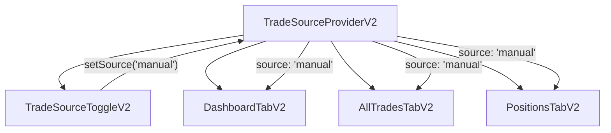

# Hooks & State Management

The Dashboard Module uses a combination of React hooks and context providers to manage data fetching, real-time updates, and shared state. This document covers the custom hooks and state management patterns used throughout the module.

## Understanding React Hooks in Our Dashboard

Before diving into the code, let's understand why we use custom hooks and what problems they solve.

### What Are Custom Hooks?

Custom hooks are reusable functions that encapsulate complex logic. They start with `use` (like `useOrdersSync`) and can call other hooks inside them. Think of them as "behavior packages" that you can plug into any component.

**Why Not Just Put Logic in Components?**

1. **Reusability** — The same order synchronization logic is needed in multiple components. Without hooks, you'd copy-paste the same code everywhere.

2. **Testability** — A hook can be tested in isolation. You can verify `useOrdersSync` works correctly without rendering any UI.

3. **Separation of Concerns** — Components focus on rendering UI. Hooks focus on behavior and data. This makes both easier to understand.

4. **Composability** — Complex behaviors can be built by combining simple hooks. `MasterTradingTab` uses 5 different hooks, each handling one aspect.

### Our Hook Categories

We organize hooks into categories based on what they do:

| Category | What It Does | When to Use |
|----------|--------------|-------------|
| **Data Fetching** | Gets data from APIs and keeps it fresh | When you need server data in a component |
| **Real-time** | Handles WebSocket connections and live updates | When data changes frequently (prices, order status) |
| **UI Behavior** | Manages modals, toasts, and user interactions | When you need UI logic shared across components |
| **Context Consumers** | Reads from React Context providers | When you need global state (selected account, trade source filter) |

## Overview

| Category | Purpose | Examples |
|----------|---------|----------|
| **Data Fetching Hooks** | Fetch and cache data from APIs | `useOrdersSync`, `useBrokerAccounts` |
| **Real-time Hooks** | Handle WebSocket subscriptions | `useMarketDataCoordinator` |
| **UI Hooks** | Manage UI state and interactions | `useWinningTradeCelebration` |
| **Context Providers** | Share state across components | `TradeSourceProvider` |

---

## Data Fetching Hooks

Data fetching is one of the trickiest parts of a React application. You need to handle loading states, errors, caching, and refetching. Our custom hooks encapsulate all of this complexity.

### useOrdersSync

Polls order statuses at regular intervals to keep the UI synchronized with the brokerage.

**The Problem This Solves:**

When a user places an order, it doesn't execute instantly. The order goes to the brokerage, which may take seconds or even minutes to fill it. During this time, the user is looking at the orders table wondering "did my order go through?"

Without synchronization, the UI would show stale data. The order might be filled, but the UI still shows "pending." This creates confusion and can lead to users placing duplicate orders.

**How It Works:**

1. When the component mounts, it immediately fetches the latest order statuses
2. Then it sets up a polling interval (default: every 3 seconds)
3. Each poll checks for any status changes and updates the UI
4. When the component unmounts, the polling stops

**Why Polling Instead of WebSockets?**

Great question! We use WebSockets for market data (prices change constantly), but polling for orders because:
- Orders don't change that frequently (maybe a few times per minute)
- Polling is simpler and more reliable
- If a poll fails, we just try again in 3 seconds

**Purpose:** Ensure order table reflects current order states (filled, cancelled, etc.)

| Parameter | Type | Default | Description |
|-----------|------|---------|-------------|
| `intervalMs` | `number` | `3000` | Polling interval in milliseconds |

<details>
<summary><strong>Hook Implementation</strong></summary>

```typescript
import { useEffect, useRef } from 'react';
import { useOrderStore } from '@/stores/order-store';

export function useOrdersSync(intervalMs = 3000) {
  const { syncOrders, isLoading } = useOrderStore();
  const intervalRef = useRef<NodeJS.Timeout>();

  useEffect(() => {
    // Initial sync on mount
    syncOrders();

    // Set up polling interval
    intervalRef.current = setInterval(() => {
      if (!isLoading) {
        syncOrders();
      }
    }, intervalMs);

    // Cleanup on unmount
    return () => {
      if (intervalRef.current) {
        clearInterval(intervalRef.current);
      }
    };
  }, [intervalMs, syncOrders, isLoading]);
}
```

</details>

**Usage:**

```tsx
function MasterTradingTab() {
  // Poll orders every 3 seconds
  useOrdersSync(3000);
  
  return <MasterOrdersTable />;
}
```

---

### useBrokerAccounts

Fetches and manages broker account data with SWR caching.

**The Problem This Solves:**

Users can have multiple brokerage accounts connected (Robinhood, TD Ameritrade, etc.). We need to:
- Fetch the list of accounts when the app loads
- Cache the data so we don't re-fetch on every page navigation
- Allow users to refresh the data manually
- Handle loading and error states

**Why SWR?**

SWR (Stale-While-Revalidate) is a data fetching library that:
- Returns cached data immediately (fast UI)
- Revalidates in the background (fresh data)
- Deduplicates requests (multiple components can call the hook without extra requests)
- Handles retries on failure

**Purpose:** Provide account selection and balance information.

**Returns:**

| Property | Type | Description |
|----------|------|-------------|
| `accounts` | `BrokerAccount[]` | List of connected accounts |
| `isLoading` | `boolean` | Loading state |
| `error` | `Error \| undefined` | Error if fetch failed |
| `refresh` | `() => void` | Force refresh data |

<details>
<summary><strong>Hook Implementation</strong></summary>

```typescript
import useSWR from 'swr';

type BrokerAccount = {
  id: string;
  accountId: string;
  brokerName: string;
  balance: number;
  buyingPower: number;
  isActive: boolean;
  accountType: 'live' | 'paper';
};

const fetcher = (url: string) => fetch(url).then(r => r.json());

export function useBrokerAccounts() {
  const { data, error, isLoading, mutate } = useSWR<{ data: BrokerAccount[] }>(
    '/api/brokers/accounts',
    fetcher,
    { 
      refreshInterval: 60000, // Refresh every minute
      revalidateOnFocus: true,
    }
  );

  return {
    accounts: data?.data || [],
    isLoading,
    error,
    refresh: mutate,
  };
}
```

</details>

**Usage:**

```tsx
function AccountSelector() {
  const { accounts, isLoading } = useBrokerAccounts();
  
  if (isLoading) return <Skeleton />;
  
  return (
    <Select>
      {accounts.map(acc => (
        <SelectItem key={acc.id} value={acc.id}>
          {acc.brokerName} - ${acc.balance}
        </SelectItem>
      ))}
    </Select>
  );
}
```

---

## Real-time Hooks

Real-time hooks manage WebSocket connections and live data streams. These are essential for a trading platform where price data changes every second.

### useMarketDataCoordinator

Coordinates real-time market data subscriptions via WebSocket.

**The Problem This Solves:**

Stock and option prices change constantly during market hours. Users need to see current prices to make informed trading decisions. But managing WebSocket connections is tricky:

1. **Connection Lifecycle** — WebSockets can disconnect unexpectedly. We need to detect this and reconnect automatically.

2. **Subscription Management** — We only want to receive data for tickers the user is watching. Subscribing to everything would overwhelm the connection.

3. **Resource Efficiency** — If a user opens multiple tabs, we don't want multiple WebSocket connections. We need to coordinate.

**How It Works:**

1. When the hook is enabled, it establishes a WebSocket connection to our market data server
2. It subscribes to the tickers passed in the `tickers` array
3. When new tickers are added to the watchlist, it sends subscribe messages
4. If the connection drops, it automatically reconnects with exponential backoff
5. When the component unmounts, it cleans up subscriptions and closes the connection

**Why WebSocket Instead of Polling?**

For market data, WebSockets are essential because:
- Prices update multiple times per second
- Polling would create too much server load
- WebSockets push data immediately when it changes
- Lower latency = better trading decisions

**Purpose:** Manage WebSocket connection and ticker subscriptions for live pricing.

| Parameter | Type | Description |
|-----------|------|-------------|
| `tickers` | `string[]` | Tickers to subscribe to |
| `tradingOptions` | `TradingOption[]` | Additional option-specific subscriptions |
| `enabled` | `boolean` | Whether to enable the connection |

**Returns:**

| Property | Type | Description |
|----------|------|-------------|
| `connectionStatus` | `ConnectionStatus` | Current WebSocket state |
| `subscribeTicker` | `(ticker: string) => void` | Add ticker subscription |
| `requestOptionsChain` | `(ticker: string) => void` | Request options chain data |
| `forceReconnect` | `() => void` | Force reconnection |

<details>
<summary><strong>Hook Implementation</strong></summary>

```typescript
import { useCallback, useEffect, useRef, useState } from 'react';

export type ConnectionStatus = 'connecting' | 'connected' | 'disconnected' | 'error';

export interface TradingOption {
  ticker: string;
  expDate: string | null;
  callPut: 'C' | 'P';
  enabled: boolean;
}

interface UseMarketDataCoordinatorOptions {
  tickers: string[];
  tradingOptions?: TradingOption[];
  enabled?: boolean;
}

export function useMarketDataCoordinator({
  tickers,
  tradingOptions = [],
  enabled = true,
}: UseMarketDataCoordinatorOptions) {
  const [connectionStatus, setConnectionStatus] = useState<ConnectionStatus>('disconnected');
  const wsRef = useRef<WebSocket | null>(null);
  const reconnectTimeoutRef = useRef<NodeJS.Timeout>();

  // Subscribe to ticker updates
  const subscribeTicker = useCallback((ticker: string) => {
    if (wsRef.current?.readyState === WebSocket.OPEN) {
      wsRef.current.send(JSON.stringify({
        type: 'subscribe',
        ticker: ticker.toUpperCase(),
      }));
    }
  }, []);

  // Request options chain for a ticker
  const requestOptionsChain = useCallback((ticker: string) => {
    if (wsRef.current?.readyState === WebSocket.OPEN) {
      wsRef.current.send(JSON.stringify({
        type: 'options_chain',
        ticker: ticker.toUpperCase(),
      }));
    }
  }, []);

  // Force reconnection
  const forceReconnect = useCallback(() => {
    if (wsRef.current) {
      wsRef.current.close();
    }
    // Reconnect logic will trigger in onclose handler
  }, []);

  // WebSocket connection management
  useEffect(() => {
    if (!enabled || tickers.length === 0) {
      return;
    }

    const connect = () => {
      setConnectionStatus('connecting');
      
      const ws = new WebSocket(process.env.NEXT_PUBLIC_WS_URL!);
      wsRef.current = ws;

      ws.onopen = () => {
        setConnectionStatus('connected');
        // Subscribe to all tickers
        tickers.forEach(ticker => {
          ws.send(JSON.stringify({
            type: 'subscribe',
            ticker: ticker.toUpperCase(),
          }));
        });
      };

      ws.onclose = () => {
        setConnectionStatus('disconnected');
        // Attempt reconnection after 3 seconds
        reconnectTimeoutRef.current = setTimeout(connect, 3000);
      };

      ws.onerror = () => {
        setConnectionStatus('error');
      };

      ws.onmessage = (event) => {
        const data = JSON.parse(event.data);
        // Dispatch to appropriate handlers
        handleMarketDataUpdate(data);
      };
    };

    connect();

    return () => {
      if (reconnectTimeoutRef.current) {
        clearTimeout(reconnectTimeoutRef.current);
      }
      if (wsRef.current) {
        wsRef.current.close();
      }
    };
  }, [enabled, tickers]);

  return {
    connectionStatus,
    subscribeTicker,
    requestOptionsChain,
    forceReconnect,
  };
}
```

</details>

**Usage:**

```tsx
function MasterTradingTab() {
  const tickers = ['SPY', 'QQQ', 'AAPL'];
  
  const {
    connectionStatus,
    subscribeTicker,
    requestOptionsChain,
  } = useMarketDataCoordinator({ tickers, enabled: true });

  return (
    <div>
      <ConnectionIndicator status={connectionStatus} />
      <MasterOptionsGrid 
        subscribeTicker={subscribeTicker}
        requestOptionsChain={requestOptionsChain}
      />
    </div>
  );
}
```

---

## UI Hooks

UI hooks manage interactive elements like modals, toasts, and animations. These hooks encapsulate complex UI logic so components can stay focused on rendering.

### useWinningTradeCelebration

Manages the winning trade celebration modal display.

**Why Celebrate Winning Trades?**

Trading is emotional. Users feel the highs of wins and the lows of losses. By celebrating winning trades, we:

1. **Create Positive Reinforcement** — Users associate the platform with good feelings
2. **Help Users Recognize Patterns** — The celebration makes them pause and think "what did I do right?"
3. **Encourage Engagement** — Users want to keep using the platform to see more celebrations

**How It Works:**

1. When the order sync hook detects a closed trade with positive P&L, it dispatches a `winning-trade` custom event
2. This hook listens for that event and shows the celebration modal
3. The modal displays the symbol, P&L, and percentage gain with confetti animation
4. After 10 seconds (or when the user clicks), the modal auto-dismisses
5. The hook cleans up after the animation completes

**Why Custom Events Instead of Direct Calls?**

We use custom events to decouple the order sync logic from the celebration UI. This way:
- The order sync hook doesn't need to know about modals
- We can easily add other celebration types (sound effects, push notifications) without changing the order sync
- The celebration can be triggered from anywhere in the app

**Purpose:** Show a celebratory modal when a trade closes with profit.

**Returns:**

| Property | Type | Description |
|----------|------|-------------|
| `showModal` | `boolean` | Whether modal is visible |
| `winningTrade` | `WinningTrade \| null` | Trade data for display |
| `celebrate` | `(trade: WinningTrade) => void` | Trigger celebration |
| `dismissModal` | `() => void` | Close the modal |

<details>
<summary><strong>Hook Implementation</strong></summary>

```typescript
import { useState, useCallback, useEffect } from 'react';

type WinningTrade = {
  symbol: string;
  pnl: number;
  percentGain: number;
};

export function useWinningTradeCelebration() {
  const [showModal, setShowModal] = useState(false);
  const [winningTrade, setWinningTrade] = useState<WinningTrade | null>(null);

  // Trigger celebration
  const celebrate = useCallback((trade: WinningTrade) => {
    if (trade.pnl > 0) {
      setWinningTrade(trade);
      setShowModal(true);
    }
  }, []);

  // Dismiss modal
  const dismissModal = useCallback(() => {
    setShowModal(false);
    // Clear trade data after animation
    setTimeout(() => setWinningTrade(null), 300);
  }, []);

  // Listen for winning trade events from order sync
  useEffect(() => {
    const handler = (event: CustomEvent<WinningTrade>) => {
      celebrate(event.detail);
    };
    
    window.addEventListener('winning-trade', handler as EventListener);
    return () => {
      window.removeEventListener('winning-trade', handler as EventListener);
    };
  }, [celebrate]);

  // Auto-dismiss after 10 seconds
  useEffect(() => {
    if (showModal) {
      const timeout = setTimeout(dismissModal, 10000);
      return () => clearTimeout(timeout);
    }
  }, [showModal, dismissModal]);

  return { 
    showModal, 
    winningTrade, 
    celebrate, 
    dismissModal 
  };
}
```

</details>

**Usage:**

```tsx
function MasterTradingTab() {
  const { showModal, winningTrade, dismissModal } = useWinningTradeCelebration();

  return (
    <>
      {/* Trading UI */}
      <MasterOptionsGrid />
      
      {/* Winning trade modal */}
      <WinningTradeModal
        open={showModal}
        trade={winningTrade}
        onDismiss={dismissModal}
      />
    </>
  );
}
```

---

### useOrderNotifications

Shows toast notifications for order status changes.

**The Problem This Solves:**

When a user has multiple browser tabs open, or they're looking at a different part of the dashboard, they might miss order status changes. Toast notifications ensure users always know when something important happens.

**How It Works:**

1. The hook subscribes to the order store to get the current list of orders
2. It keeps a reference to the previous order statuses
3. On each update, it compares current status to previous status
4. If a status changed, it shows an appropriate toast notification
5. Different statuses get different toast styles (success for filled, error for rejected)

**Why Use a Ref for Previous Orders?**

We use `useRef` instead of `useState` for the previous orders because:
- Changing a ref doesn't trigger a re-render
- We don't want to show the toast again when the component re-renders
- It's purely for comparison, not for display

**Purpose:** Alert users when orders are filled, cancelled, or encounter errors.

<details>
<summary><strong>Hook Implementation</strong></summary>

```typescript
import { useEffect, useRef } from 'react';
import { toast } from 'sonner';
import { useOrderStore } from '@/stores/order-store';

export function useOrderNotifications() {
  const { orders } = useOrderStore();
  const prevOrdersRef = useRef<Map<string, string>>(new Map());

  useEffect(() => {
    const prevOrders = prevOrdersRef.current;

    orders.forEach(order => {
      const prevStatus = prevOrders.get(order.id);
      
      // Only notify on status changes
      if (prevStatus && prevStatus !== order.status) {
        switch (order.status) {
          case 'filled':
            toast.success(`Order Filled: ${order.symbol}`, {
              description: `${order.quantity} contracts at $${order.filledPrice}`,
            });
            break;
          case 'cancelled':
            toast.info(`Order Cancelled: ${order.symbol}`);
            break;
          case 'rejected':
            toast.error(`Order Rejected: ${order.symbol}`, {
              description: order.rejectReason,
            });
            break;
        }
      }
      
      prevOrders.set(order.id, order.status);
    });

    prevOrdersRef.current = prevOrders;
  }, [orders]);
}
```

</details>

---

## State Management

State management is about sharing data between components without "prop drilling" (passing props through many layers). We use React Context for global state that many components need.

### Understanding React Context

React Context is like a "broadcast channel" for data. You create a provider at the top of your component tree, and any component below can subscribe to that data without it being passed through intermediate components.

**When to Use Context:**
- Data needed by many components (user settings, theme, selected account)
- Data that changes infrequently (changing context causes all consumers to re-render)
- Avoiding prop drilling through many layers

**When NOT to Use Context:**
- Data that changes very frequently (like live prices—use a store or WebSocket instead)
- Data only needed by one or two closely related components (just use props)

### TradeSourceContext

Provides global trade source filtering across the analytics components.

**The Problem This Solves:**

On the analytics page, users can filter between:
- **All Trades** — Everything, including copied trades
- **Manual Trades** — Only trades they placed themselves
- **Copied Trades** — Only trades from copy trading

This filter affects multiple components: the stats cards, the positions table, the performance chart. Without context, we'd have to:
1. Store the filter state in a parent component
2. Pass it down through props to every child
3. Pass the setter function down too

With context, any component can read and update the filter directly.

**How It Works:**

1. `TradeSourceProviderV2` wraps the analytics page and holds the filter state
2. `TradeSourceToggleV2` lets users change the filter
3. All analytics components call `useTradeSourceFilterV2()` to get the current filter
4. When the filter changes, all consumers automatically re-render with the new value

**Purpose:** Allow users to filter analytics by trade source (all, manual, copied).



<details>
<summary><strong>Context Implementation</strong></summary>

```typescript
'use client';

import { 
  createContext, 
  useContext, 
  useState, 
  useCallback, 
  type ReactNode 
} from 'react';

type TradeSource = 'all' | 'manual' | 'copied';

interface TradeSourceContextValue {
  source: TradeSource;
  setSource: (source: TradeSource) => void;
}

const TradeSourceContext = createContext<TradeSourceContextValue | null>(null);

export function TradeSourceProviderV2({ 
  children,
  defaultSource = 'all',
}: { 
  children: ReactNode;
  defaultSource?: TradeSource;
}) {
  const [source, setSourceState] = useState<TradeSource>(defaultSource);

  const setSource = useCallback((newSource: TradeSource) => {
    setSourceState(newSource);
  }, []);

  return (
    <TradeSourceContext.Provider value={{ source, setSource }}>
      {children}
    </TradeSourceContext.Provider>
  );
}

export function useTradeSourceFilterV2() {
  const context = useContext(TradeSourceContext);
  
  if (!context) {
    throw new Error(
      'useTradeSourceFilterV2 must be used within TradeSourceProviderV2'
    );
  }
  
  return context;
}
```

</details>

**Usage:**

```tsx
// Layout wraps analytics with provider
function AnalyticsLayout({ children }) {
  return (
    <TradeSourceProviderV2 defaultSource="all">
      {children}
    </TradeSourceProviderV2>
  );
}

// Components consume the context
function AnalyticsHeader() {
  return (
    <div className="flex justify-between">
      <h1>Analytics</h1>
      <TradeSourceToggleV2 />
    </div>
  );
}

function DashboardTabV2() {
  const { source } = useTradeSourceFilterV2();
  
  // Use source in API calls
  useEffect(() => {
    fetch(`/api/analytics-v2/user-stats?source=${source}`);
  }, [source]);
}
```

---

## Server Actions

Server actions provide type-safe, cached data mutations.

### Analytics Server Actions

<details>
<summary><strong>analytics-v2-queries.actions.ts</strong></summary>

```typescript
"use server";

import { auth } from "@/app/(auth)/auth";
import type { TradeSource } from "@/types/trade-source";
import { SafeError } from "../server-action-errors";
import { cachedQuery } from "../cache/vercel-cache";

const ANALYTICS_CACHE_TTL = 60; // seconds

async function getCurrentUserId(): Promise<string> {
  const session = await auth();
  if (!session?.user?.id) throw new SafeError("Unauthorized");
  return session.user.id;
}

// User Stats
export async function getAnalyticsSummaryV2(source: TradeSource = "all") {
  const userId = await getCurrentUserId();
  
  return cachedQuery(
    ["analytics-v2", "summary", userId, source],
    () => analyticsGetSummaryV2({ userId, source }),
    { revalidate: ANALYTICS_CACHE_TTL }
  );
}

// Performance Data (Equity Curve)
export async function getAnalyticsPerformanceV2(source: TradeSource = "all") {
  const userId = await getCurrentUserId();
  
  return cachedQuery(
    ["analytics-v2", "performance", userId, source],
    () => analyticsGetPerformanceV2({ userId, source }),
    { revalidate: ANALYTICS_CACHE_TTL }
  );
}

// Heatmap Data
export async function getAnalyticsHeatmapV2(source: TradeSource = "all") {
  const userId = await getCurrentUserId();
  
  return cachedQuery(
    ["analytics-v2", "heatmap", userId, source],
    () => analyticsGetHeatmapV2({ userId, source }),
    { revalidate: ANALYTICS_CACHE_TTL }
  );
}

// Monthly Calendar Stats
export async function getAnalyticsMonthlyV2(
  year: number,
  month: number,
  source: TradeSource = "all"
) {
  const userId = await getCurrentUserId();
  
  return cachedQuery(
    ["analytics-v2", "monthly", userId, year, month, source],
    () => analyticsGetMonthlyV2({ userId, year, month, source }),
    { revalidate: ANALYTICS_CACHE_TTL }
  );
}

// Cumulative Performance
export async function getAnalyticsCumulativePerformanceV2(
  range: '1w' | '1m' | '3m' | '6m' | '1y' | 'all' = 'all',
  source: TradeSource = "all"
) {
  const userId = await getCurrentUserId();
  
  const rawData = await cachedQuery(
    ["analytics-v2", "cumulative", userId, range, source],
    () => analyticsGetCumulativePerformanceV2({ userId, window: range, source }),
    { revalidate: ANALYTICS_CACHE_TTL }
  );
  
  // Transform to chart format
  const points = rawData.map((item) => ({
    date: item.date,
    pnl: item.pnl,
    cumulativePnl: item.cumulative,
    tradesCount: 1,
  }));
  
  return { 
    points, 
    summary: buildSummary(rawData) 
  };
}

// Snapshot Summary for Dashboard Header
export async function getSnapshotSummaryV2(
  dateRange: 'today' | 'this-week' | 'this-month' | 'all' = 'this-month',
  source: TradeSource = "all"
) {
  const userId = await getCurrentUserId();
  
  const summary = await analyticsGetSummaryV2({ userId, source });
  
  return {
    netPnl: summary?.totalPnl ?? 0,
    winRate: summary?.winRate ?? 0,
    totalTrades: summary?.totalTrades ?? 0,
    openPositions: summary?.openPositions ?? 0,
  };
}
```

</details>

---

## Hook Patterns

### Polling Pattern

For data that needs periodic updates:

```typescript
function usePolling(fetcher: () => Promise<void>, interval: number) {
  useEffect(() => {
    fetcher(); // Initial fetch
    const id = setInterval(fetcher, interval);
    return () => clearInterval(id);
  }, [fetcher, interval]);
}
```

### Subscription Pattern

For WebSocket or EventSource connections:

```typescript
function useSubscription<T>(
  subscribe: () => () => void,
  deps: unknown[]
) {
  useEffect(() => {
    const unsubscribe = subscribe();
    return unsubscribe;
  }, deps);
}
```

### Optimistic Updates

For mutations with immediate UI feedback:

```typescript
async function handleDelete(id: string) {
  // Optimistically remove from UI
  setItems(prev => prev.filter(i => i.id !== id));
  
  try {
    await deleteItem(id);
  } catch (error) {
    // Revert on failure
    refetch();
    toast.error('Failed to delete');
  }
}
```

:::tip Performance
Use `useMemo` and `useCallback` to prevent unnecessary re-renders, especially for callbacks passed to child components. Always include proper dependency arrays.
:::
