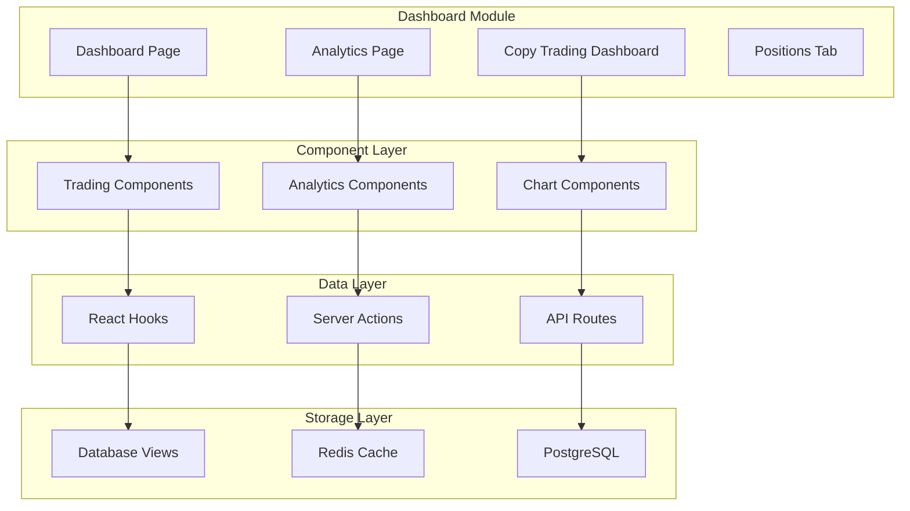

# Dashboard Module

The Dashboard Module is the central hub of Alertsify, providing traders with real-time analytics, trading interfaces, and comprehensive performance tracking. This module combines multiple features into a unified experience for both manual traders and copy trading subscribers.

## What is the Dashboard Module?

The Dashboard Module serves as the primary interface where users interact with the Alertsify platform. It aggregates data from multiple sources—brokerage accounts, trading history, and real-time market data—to provide actionable insights and seamless trading capabilities.

:::info Core Purpose
The Dashboard enables traders to **execute trades, monitor positions, track performance, and analyze trading patterns**—all from a single, unified interface.
:::

### Why We Built It This Way

When designing the Dashboard, we focused on solving real problems that traders face:

- **Information Overload** — Traders need to see their P&L, open positions, and market data simultaneously. We consolidated everything into a single view so users don't need to switch between multiple screens or applications.

- **Speed of Execution** — In options trading, prices move fast. The trading controls and options grid are designed for rapid order entry with pre-configured amounts and one-click execution.

- **Manual vs. Copied Trade Separation** — Users who participate in copy trading need to understand which trades they executed themselves versus which were automatically copied. We built filtering throughout the analytics to separate these clearly.

- **Real-Time Accuracy** — Stale data leads to bad decisions. The dashboard uses a combination of WebSocket connections for market data and polling for order status to ensure users always see current information.

- **Performance at Scale** — Some users have thousands of historical trades. We use database views and caching to ensure the analytics load quickly regardless of data volume.

## Key Features

Each feature in the Dashboard serves a specific purpose in the trading workflow:

| Feature | Description | Primary Use Case |
|---------|-------------|------------------|
| **Portfolio Summary** | Daily P&L, total trades, cumulative performance | Quick performance overview |
| **Trading Controls** | Amount presets, order types, broker selection | Execute trades efficiently |
| **Options Grid** | Multi-ticker options chain with real-time pricing | View and trade options |
| **Orders Table** | Active/pending/filled orders with management | Track order status |
| **Analytics Dashboard** | Comprehensive trading statistics and charts | Analyze trading patterns |
| **Copy Trading View** | Track copied trades and trader performance | Monitor copy trading |
| **Open Positions** | Real-time positions from connected brokers | Position management |

### Feature Deep Dive

**Portfolio Summary** — This is the first thing users see when they open the dashboard. It answers the most important question: "How am I doing today?" The summary shows today's P&L prominently, along with comparison to previous periods. This helps traders quickly assess whether to continue their current strategy or adjust.

**Trading Controls** — Instead of typing amounts for each trade, users configure preset amounts (e.g., $500, $1000, $2500). When they spot an opportunity, they select the preset and execute immediately. The broker selector allows users with multiple brokerage accounts to choose which account to trade from.

**Options Grid** — This is the heart of the trading interface. Users add ticker symbols (like SPY, QQQ, AAPL) and the grid fetches the options chain in real-time. They can see bid/ask prices, select expiration dates, and choose between calls and puts. Each row in the grid represents one position they're tracking or considering.

**Orders Table** — After placing an order, it appears here. Users can see pending orders waiting to fill, partially filled orders, and recently completed orders. They can also cancel pending orders directly from this table.

**Analytics Dashboard** — This goes beyond simple P&L. Users can analyze their win rate, biggest wins and losses, performance by symbol, and even which times of day they trade best. The data helps identify patterns and improve trading strategies.

## Module Components

The Dashboard Module consists of several interconnected sub-modules:

## User Journeys

### Manual Trader Journey

1. **Login** → Dashboard loads with portfolio summary
2. **Add Tickers** → Options grid populates with real-time data
3. **Execute Trade** → Order sent through SnapTrade API
4. **Monitor Position** → Track in Orders Table and Positions Tab
5. **Close Position** → P&L calculated and reflected in analytics

### Copy Trading Subscriber Journey

1. **Login** → Dashboard shows both manual and copied trades
2. **Receive Signal** → Copied trade executes automatically
3. **Monitor Copied Position** → Track alongside manual trades
4. **Review Performance** → Analyze manual vs. copied performance separately

## Quick Navigation

| Section | Description |
|---------|-------------|
| [Architecture](/dashboard/architecture) | System design and data flow |
| [Data Models](/dashboard/data-models) | TypeScript types and database schemas |
| [Database Views](/dashboard/database-views) | SQL views for analytics calculations |
| [API Endpoints](/dashboard/api-endpoints) | REST API reference |
| [Components](/dashboard/components) | UI component architecture |
| [Hooks & State](/dashboard/hooks-state) | React hooks and state management |

## Technology Stack

The Dashboard Module leverages the following technologies:

| Layer | Technology | Purpose |
|-------|------------|---------|
| **Frontend** | React 18 + Next.js 14 | UI rendering and server components |
| **State** | Zustand + React Context | Client-side state management |
| **Data Fetching** | SWR + Server Actions | Cached data fetching with revalidation |
| **Real-time** | WebSocket | Live market data streaming |
| **Database** | PostgreSQL (Supabase) | Persistent storage with views |
| **Cache** | Redis (Vercel KV) | Performance optimization |

## Performance Considerations

The Dashboard is optimized for performance through several strategies:

1. **Server Components** - Initial data is fetched on the server, reducing client-side load
2. **Database Views** - Complex calculations happen in PostgreSQL, not JavaScript
3. **Caching** - 60-second TTL on analytics queries via Vercel KV
4. **Pagination** - Large datasets (closed positions) are paginated
5. **Selective Hydration** - Only interactive components are hydrated on the client

:::tip Design Philosophy
The Dashboard follows a **"explain first, code later"** approach—business logic is clearly documented before implementation details, making it easier for developers to understand the system's behavior.
:::
