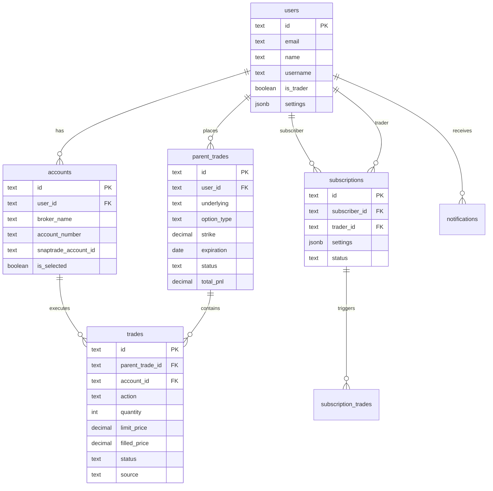

# Database Schema

This document provides a complete reference of the Alertsify database schema, including all tables, relationships, and indexes.

## Understanding Our Database Design

The database is the foundation of Alertsify. Every trade, every user, every subscription lives here. Let's understand the philosophy behind our schema design.

### Why PostgreSQL?

We chose PostgreSQL for several reasons:

**1. ACID Transactions** — When you place an order, multiple tables update atomically. Either everything succeeds, or nothing does. No half-completed trades.

**2. Rich Data Types** — JSONB for flexible settings, arrays for tags, timestamps with timezone awareness. SQL Server and MySQL can't match this flexibility.

**3. Advanced Features** — Triggers, views, window functions, CTEs. We push logic to the database where it's fast and reliable.

**4. Ecosystem** — Supabase gives us auth, realtime subscriptions, and storage on top of PostgreSQL. One platform, many features.

---

## Overview

Alertsify uses **PostgreSQL** via Supabase with **Drizzle ORM** for type-safe database access.

### Key Design Principles

These principles guide every table we create:

| Principle | Implementation | Why It Matters |
|-----------|----------------|----------------|
| **Soft deletes** | `deleted_at` timestamps instead of hard deletes | We can recover data, audit history, and foreign keys don't break |
| **Audit trails** | `created_at`, `updated_at` on all tables | Debug issues, show users when things happened |
| **Referential integrity** | Foreign keys with appropriate cascade rules | Impossible to have orphaned trades or invalid references |
| **Performance** | Strategic indexes on query patterns | Queries stay fast as data grows |

---

## Entity Relationship Diagram

This diagram shows how tables relate to each other. Understanding these relationships is key to understanding how data flows through the system.

### Reading the Diagram

| Symbol | Meaning |
|--------|----------|
| `\|\|--o{` | One-to-many (one user has many accounts) |
| `PK` | Primary key (unique identifier) |
| `FK` | Foreign key (reference to another table) |

### Key Relationships Explained

**User → Accounts (One-to-Many)**
A user can connect multiple brokerage accounts (Robinhood + TD Ameritrade). Each account belongs to exactly one user.

**User → Parent Trades (One-to-Many)**
When a user opens a position (buys an option), we create a `parent_trade`. This groups all related orders together.

**Parent Trade → Trades (One-to-Many)**
A single position might have multiple orders: buy 10, sell 5, sell 5 more. Each order is a `trade` linked to the parent.

**User → Subscriptions (Many-to-Many)**
Copy trading creates a subscriber-trader relationship. The `subscriptions` table connects them.



---

## Core Tables

### `users`

User accounts and profiles.

**What This Table Stores:**

This is the central user table. Every authenticated user has one row here. Key design decisions:

- **`username` is separate from `email`** — Email is for auth, username is for display. Both are unique.
- **`is_trader` flag** — Traders can be copied by subscribers. Regular users can only trade for themselves.
- **JSONB for settings** — Flexible key-value storage avoids schema migrations for every new preference.
- **Soft delete with `deleted_at`** — "Deleted" users still exist for foreign key integrity and potential recovery.

**Why These Indexes?**

| Index | Query Pattern |
|-------|---------------|
| `idx_users_email` | Login by email |
| `idx_users_username` | Profile lookup by username |
| `idx_users_is_trader` | List all traders (for discovery page) |

```sql
CREATE TABLE users (
  id TEXT PRIMARY KEY DEFAULT nanoid(),
  email TEXT UNIQUE NOT NULL,
  name TEXT,
  username TEXT UNIQUE,
  avatar_url TEXT,
  bio TEXT,
  
  -- Trader status
  is_trader BOOLEAN DEFAULT FALSE,
  trader_verified_at TIMESTAMP,
  
  -- SnapTrade integration
  snaptrade_user_id TEXT,
  snaptrade_user_secret TEXT,  -- Encrypted
  
  -- Settings (JSONB for flexibility)
  settings JSONB DEFAULT '{}',
  notification_preferences JSONB DEFAULT '{}',
  
  -- Metadata
  created_at TIMESTAMP DEFAULT NOW(),
  updated_at TIMESTAMP DEFAULT NOW(),
  deleted_at TIMESTAMP
);

-- Indexes
CREATE INDEX idx_users_email ON users(email);
CREATE INDEX idx_users_username ON users(username);
CREATE INDEX idx_users_is_trader ON users(is_trader) WHERE is_trader = TRUE;
```

<details>
<summary>📝 Drizzle Schema</summary>

```typescript
// lib/db/schema/users.ts
import { pgTable, text, boolean, timestamp, jsonb } from 'drizzle-orm/pg-core';

export const users = pgTable('users', {
  id: text('id').primaryKey().$defaultFn(() => nanoid()),
  email: text('email').unique().notNull(),
  name: text('name'),
  username: text('username').unique(),
  avatarUrl: text('avatar_url'),
  bio: text('bio'),
  
  isTrader: boolean('is_trader').default(false),
  traderVerifiedAt: timestamp('trader_verified_at'),
  
  snaptradeUserId: text('snaptrade_user_id'),
  snaptradeUserSecret: text('snaptrade_user_secret'),
  
  settings: jsonb('settings').default({}),
  notificationPreferences: jsonb('notification_preferences').default({}),
  
  createdAt: timestamp('created_at').defaultNow(),
  updatedAt: timestamp('updated_at').defaultNow(),
  deletedAt: timestamp('deleted_at'),
});
```

</details>

---

### `accounts`

Brokerage account connections.

**What This Table Stores:**

When a user connects their brokerage (Robinhood, TD Ameritrade, etc.), we create an `accounts` row. This stores:

- **SnapTrade integration IDs** — References to the external brokerage connection
- **Cached balances** — We don't hit SnapTrade on every request; we cache balances and sync periodically
- **Selection state** — `is_selected` marks which account is currently active for trading

**Key Design Decisions:**

- **`ON DELETE CASCADE`** — If a user is deleted, their accounts go too. No orphaned accounts.
- **Unique constraint on `(user_id, snaptrade_account_id)`** — Prevents connecting the same brokerage account twice
- **Cached balances** — Trade-off: data may be stale, but page loads are fast

```sql
CREATE TABLE accounts (
  id TEXT PRIMARY KEY DEFAULT nanoid(),
  user_id TEXT NOT NULL REFERENCES users(id) ON DELETE CASCADE,
  
  -- Broker info
  broker_name TEXT NOT NULL,
  broker_slug TEXT NOT NULL,
  account_number TEXT NOT NULL,
  account_type TEXT,  -- margin, cash, ira
  account_name TEXT,
  
  -- SnapTrade IDs
  snaptrade_account_id TEXT NOT NULL,
  snaptrade_authorization_id TEXT NOT NULL,
  
  -- State
  is_selected BOOLEAN DEFAULT FALSE,
  is_active BOOLEAN DEFAULT TRUE,
  last_sync_at TIMESTAMP,
  
  -- Cached balances
  balance DECIMAL(15,2),
  buying_power DECIMAL(15,2),
  
  created_at TIMESTAMP DEFAULT NOW(),
  updated_at TIMESTAMP DEFAULT NOW(),
  
  UNIQUE(user_id, snaptrade_account_id)
);

-- Indexes
CREATE INDEX idx_accounts_user ON accounts(user_id);
CREATE INDEX idx_accounts_selected ON accounts(user_id, is_selected) 
  WHERE is_selected = TRUE;
```

---

### `parent_trades`

Position containers that group related trades.

**Understanding Parent Trades:**

This is a key concept in Alertsify. When you buy 10 contracts of an option, you're opening a **position**. That position might have multiple orders:

1. Buy 10 contracts (open the position)
2. Sell 5 contracts (partial close)
3. Sell 5 more contracts (fully closed)

The `parent_trades` table represents the **position** (the grouping). Each individual order is a `trades` row linked to this parent.

**Why This Design?**

- **Aggregate P&L at position level** — Easy to see "how did this position do overall?"
- **Track status** — Is the position open, closed, or expired?
- **Copy trading** — When a trader opens a position, subscribers copy the parent trade

**Aggregated Fields (Updated by Trigger):**

| Field | Calculation |
|-------|-------------|
| `total_cost_basis` | Sum of all buy orders |
| `total_proceeds` | Sum of all sell orders |
| `total_pnl` | `proceeds - cost_basis` |

```sql
CREATE TABLE parent_trades (
  id TEXT PRIMARY KEY DEFAULT nanoid(),
  user_id TEXT NOT NULL REFERENCES users(id) ON DELETE CASCADE,
  
  -- Option details
  underlying TEXT NOT NULL,
  option_type TEXT NOT NULL CHECK (option_type IN ('call', 'put')),
  strike DECIMAL(10,2) NOT NULL,
  expiration DATE NOT NULL,
  
  -- Symbol (OCC format)
  symbol TEXT NOT NULL,
  
  -- Position status
  status TEXT NOT NULL DEFAULT 'open' 
    CHECK (status IN ('open', 'closed', 'expired', 'cancelled')),
  
  -- Aggregated P&L
  total_cost_basis DECIMAL(15,2) DEFAULT 0,
  total_proceeds DECIMAL(15,2) DEFAULT 0,
  total_pnl DECIMAL(15,2) DEFAULT 0,
  
  -- Timestamps
  opened_at TIMESTAMP DEFAULT NOW(),
  closed_at TIMESTAMP,
  created_at TIMESTAMP DEFAULT NOW(),
  updated_at TIMESTAMP DEFAULT NOW()
);

-- Indexes
CREATE INDEX idx_parent_trades_user ON parent_trades(user_id);
CREATE INDEX idx_parent_trades_status ON parent_trades(user_id, status);
CREATE INDEX idx_parent_trades_symbol ON parent_trades(symbol);
CREATE INDEX idx_parent_trades_underlying ON parent_trades(underlying);
```

<details>
<summary>📝 Drizzle Schema</summary>

```typescript
// lib/db/schema/trades.ts
export const parentTrades = pgTable('parent_trades', {
  id: text('id').primaryKey().$defaultFn(() => nanoid()),
  userId: text('user_id').notNull().references(() => users.id, { onDelete: 'cascade' }),
  
  underlying: text('underlying').notNull(),
  optionType: text('option_type').notNull(),
  strike: decimal('strike', { precision: 10, scale: 2 }).notNull(),
  expiration: date('expiration').notNull(),
  symbol: text('symbol').notNull(),
  
  status: text('status').notNull().default('open'),
  
  totalCostBasis: decimal('total_cost_basis', { precision: 15, scale: 2 }).default('0'),
  totalProceeds: decimal('total_proceeds', { precision: 15, scale: 2 }).default('0'),
  totalPnl: decimal('total_pnl', { precision: 15, scale: 2 }).default('0'),
  
  openedAt: timestamp('opened_at').defaultNow(),
  closedAt: timestamp('closed_at'),
  createdAt: timestamp('created_at').defaultNow(),
  updatedAt: timestamp('updated_at').defaultNow(),
});
```

</details>

---

### `trades`

Individual order executions (BTO or STC).

**Understanding Trades:**

A `trades` row represents a single order sent to a brokerage. Key fields:

- **`action`** — `buy` (Buy to Open) or `sell` (Sell to Close)
- **`status`** — `pending`, `filled`, `cancelled`, `rejected`, `expired`
- **`source`** — `manual` (user placed) or `copied` (from copy trading)

**Relationship to Parent Trade:**

Every trade belongs to a `parent_trade`. Multiple trades can belong to the same parent:

```
parent_trade (AAPL $150C 2024-01-19)
├── trade: BTO 10 contracts @ $2.50 (filled)
├── trade: STC 5 contracts @ $3.00 (filled)
└── trade: STC 5 contracts @ $2.80 (filled)
```

**Why Separate `quantity` and `filled_quantity`?**

You might order 10 contracts, but only 7 fill before expiry. We track both:
- `quantity` = what the user requested
- `filled_quantity` = what actually executed

P&L is calculated from `filled_quantity`, not `quantity`.

```sql
CREATE TABLE trades (
  id TEXT PRIMARY KEY DEFAULT nanoid(),
  parent_trade_id TEXT NOT NULL REFERENCES parent_trades(id) ON DELETE CASCADE,
  user_id TEXT NOT NULL REFERENCES users(id) ON DELETE CASCADE,
  account_id TEXT NOT NULL REFERENCES accounts(id),
  
  -- Order details
  action TEXT NOT NULL CHECK (action IN ('buy', 'sell')),
  quantity INTEGER NOT NULL,
  filled_quantity INTEGER DEFAULT 0,
  
  -- Pricing
  order_type TEXT NOT NULL CHECK (order_type IN ('Market', 'Limit', 'Stop', 'StopLimit')),
  limit_price DECIMAL(10,4),
  stop_price DECIMAL(10,4),
  filled_price DECIMAL(10,4),
  
  -- Status
  status TEXT NOT NULL DEFAULT 'pending'
    CHECK (status IN ('pending', 'filled', 'partial', 'cancelled', 'rejected')),
  broker_order_id TEXT,
  
  -- Source tracking
  source TEXT NOT NULL DEFAULT 'manual'
    CHECK (source IN ('manual', 'copy', 'auto')),
  source_trader_id TEXT REFERENCES users(id),
  source_trade_id TEXT REFERENCES trades(id),
  
  -- P&L (for sells)
  pnl DECIMAL(15,2),
  pnl_percent DECIMAL(8,4),
  
  -- Timestamps
  created_at TIMESTAMP DEFAULT NOW(),
  filled_at TIMESTAMP,
  updated_at TIMESTAMP DEFAULT NOW()
);

-- Indexes
CREATE INDEX idx_trades_parent ON trades(parent_trade_id);
CREATE INDEX idx_trades_user ON trades(user_id);
CREATE INDEX idx_trades_status ON trades(status) WHERE status = 'pending';
CREATE INDEX idx_trades_broker_order ON trades(broker_order_id);
CREATE INDEX idx_trades_source ON trades(source, source_trader_id) 
  WHERE source = 'copy';
```

<details>
<summary>📝 Drizzle Schema</summary>

```typescript
export const trades = pgTable('trades', {
  id: text('id').primaryKey().$defaultFn(() => nanoid()),
  parentTradeId: text('parent_trade_id').notNull().references(() => parentTrades.id, { onDelete: 'cascade' }),
  userId: text('user_id').notNull().references(() => users.id, { onDelete: 'cascade' }),
  accountId: text('account_id').notNull().references(() => accounts.id),
  
  action: text('action').notNull(),
  quantity: integer('quantity').notNull(),
  filledQuantity: integer('filled_quantity').default(0),
  
  orderType: text('order_type').notNull(),
  limitPrice: decimal('limit_price', { precision: 10, scale: 4 }),
  stopPrice: decimal('stop_price', { precision: 10, scale: 4 }),
  filledPrice: decimal('filled_price', { precision: 10, scale: 4 }),
  
  status: text('status').notNull().default('pending'),
  brokerOrderId: text('broker_order_id'),
  
  source: text('source').notNull().default('manual'),
  sourceTraderId: text('source_trader_id').references(() => users.id),
  sourceTradeId: text('source_trade_id'),
  
  pnl: decimal('pnl', { precision: 15, scale: 2 }),
  pnlPercent: decimal('pnl_percent', { precision: 8, scale: 4 }),
  
  createdAt: timestamp('created_at').defaultNow(),
  filledAt: timestamp('filled_at'),
  updatedAt: timestamp('updated_at').defaultNow(),
});
```

</details>

---

### `subscriptions`

Copy trading subscriptions.

```sql
CREATE TABLE subscriptions (
  id TEXT PRIMARY KEY DEFAULT nanoid(),
  subscriber_id TEXT NOT NULL REFERENCES users(id) ON DELETE CASCADE,
  trader_id TEXT NOT NULL REFERENCES users(id) ON DELETE CASCADE,
  
  -- Settings
  settings JSONB NOT NULL DEFAULT '{
    "autoExecute": false,
    "maxPositionSize": 10,
    "maxDailyTrades": 5,
    "scalingFactor": 1.0
  }',
  
  -- Status
  status TEXT NOT NULL DEFAULT 'active'
    CHECK (status IN ('active', 'paused', 'cancelled')),
  
  -- Timestamps
  created_at TIMESTAMP DEFAULT NOW(),
  paused_at TIMESTAMP,
  cancelled_at TIMESTAMP,
  updated_at TIMESTAMP DEFAULT NOW(),
  
  -- Constraints
  UNIQUE(subscriber_id, trader_id),
  CHECK(subscriber_id != trader_id)
);

-- Indexes
CREATE INDEX idx_subscriptions_subscriber ON subscriptions(subscriber_id, status);
CREATE INDEX idx_subscriptions_trader ON subscriptions(trader_id, status);
```

---

### `notifications`

In-app notifications.

```sql
CREATE TABLE notifications (
  id TEXT PRIMARY KEY DEFAULT nanoid(),
  user_id TEXT NOT NULL REFERENCES users(id) ON DELETE CASCADE,
  
  -- Content
  type TEXT NOT NULL,
  title TEXT NOT NULL,
  body TEXT NOT NULL,
  data JSONB,
  
  -- State
  read BOOLEAN DEFAULT FALSE,
  read_at TIMESTAMP,
  
  created_at TIMESTAMP DEFAULT NOW()
);

-- Indexes
CREATE INDEX idx_notifications_user ON notifications(user_id, created_at DESC);
CREATE INDEX idx_notifications_unread ON notifications(user_id, read, created_at DESC)
  WHERE read = FALSE;
```

---

## Supporting Tables

### `push_subscriptions`

Web push notification subscriptions.

```sql
CREATE TABLE push_subscriptions (
  id TEXT PRIMARY KEY DEFAULT nanoid(),
  user_id TEXT NOT NULL REFERENCES users(id) ON DELETE CASCADE,
  subscription JSONB NOT NULL,  -- Web Push subscription object
  user_agent TEXT,
  created_at TIMESTAMP DEFAULT NOW(),
  
  UNIQUE(user_id, subscription)
);
```

---

### `rate_limits`

Persistent rate limit tracking.

```sql
CREATE TABLE rate_limits (
  key TEXT PRIMARY KEY,
  count INTEGER DEFAULT 1,
  reset_at TIMESTAMP NOT NULL,
  created_at TIMESTAMP DEFAULT NOW()
);
```

---

### `sessions` (NextAuth)

Authentication sessions.

```sql
CREATE TABLE sessions (
  id TEXT PRIMARY KEY,
  session_token TEXT UNIQUE NOT NULL,
  user_id TEXT NOT NULL REFERENCES users(id) ON DELETE CASCADE,
  expires TIMESTAMP NOT NULL
);

CREATE INDEX idx_sessions_token ON sessions(session_token);
CREATE INDEX idx_sessions_user ON sessions(user_id);
```

---

## Relationships

### Trade Hierarchy

```
User
 └── Account (brokerage connection)
      └── Parent Trade (position)
           └── Trade (individual order)
                ├── BTO (opens position)
                └── STC (closes position)
```

### Copy Trading Relationships

```
Trader (User)
 └── Subscription
      └── Subscriber (User)
           └── Copied Trades
                └── source_trader_id → Trader
                └── source_trade_id → Original Trade
```

---

## Common Query Patterns

### Get User's Open Positions

```sql
SELECT 
  pt.*,
  SUM(CASE WHEN t.action = 'buy' AND t.status = 'filled' 
      THEN t.filled_quantity ELSE 0 END) as total_bought,
  SUM(CASE WHEN t.action = 'sell' AND t.status = 'filled' 
      THEN t.filled_quantity ELSE 0 END) as total_sold
FROM parent_trades pt
LEFT JOIN trades t ON t.parent_trade_id = pt.id
WHERE pt.user_id = $1 
  AND pt.status = 'open'
GROUP BY pt.id
HAVING total_bought > total_sold;
```

### Get Available Quantity for STC

```sql
WITH quantities AS (
  SELECT
    SUM(CASE WHEN action = 'buy' AND status = 'filled' 
        THEN filled_quantity ELSE 0 END) as bought,
    SUM(CASE WHEN action = 'sell' AND status = 'filled' 
        THEN filled_quantity ELSE 0 END) as sold,
    SUM(CASE WHEN action = 'sell' AND status = 'pending' 
        THEN quantity ELSE 0 END) as pending_sell
  FROM trades
  WHERE parent_trade_id = $1
)
SELECT bought - sold - pending_sell as available
FROM quantities;
```

---

## Migrations

Drizzle handles migrations automatically:

```bash
# Generate migration
pnpm drizzle-kit generate

# Apply migration
pnpm drizzle-kit migrate

# Push changes (development)
pnpm drizzle-kit push
```

---

## Next Steps

- [Database Triggers](/database/triggers) — Automated updates
- [Database Views](/database/views) — Materialized views for analytics
- [BTO Execution](/flows/bto-execution) — How trades are created
