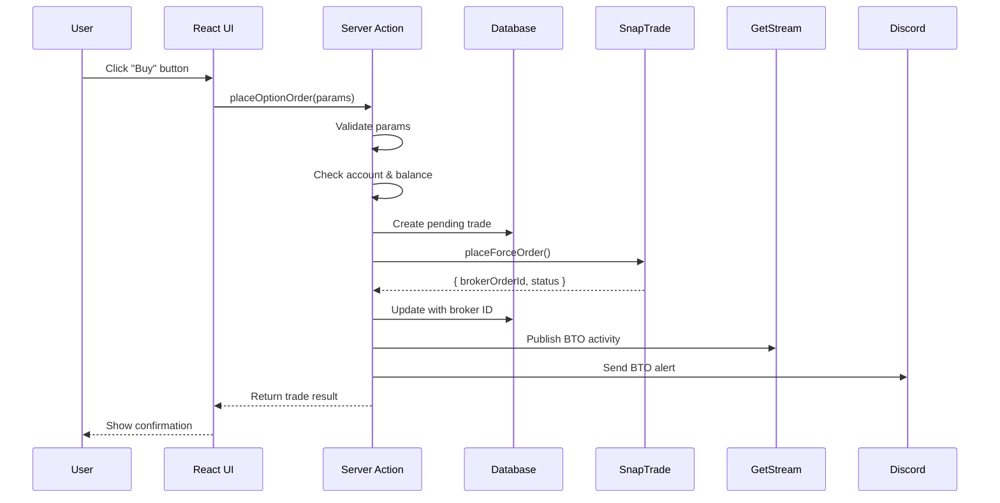

# Buy to Open (BTO) Execution Flow

This document provides a complete walkthrough of how a BTO (Buy to Open) order is executed in Alertsify.

---

## Overview

When a user opens a new options position, the system:

1. Validates the order parameters
2. Creates database records
3. Sends order to broker via SnapTrade
4. Publishes activities and notifications
5. Handles broker confirmation

---

## Flow Diagram



---

## Step-by-Step Breakdown

### Step 1: User Initiates Order

User fills out the order form with:
- Underlying symbol (e.g., "AAPL")
- Option type (call/put)
- Strike price
- Expiration date
- Quantity
- Order type (market/limit)

```typescript
// Order form submission
const handleSubmit = async () => {
  const result = await placeOptionOrder({
    side: 'BTO',
    underlying: 'AAPL',
    optionType: 'call',
    strike: 200,
    expiration: '2025-02-21',
    quantity: 5,
    orderType: 'Limit',
    limitPrice: 3.50,
  });
};
```

---

### Step 2: Server Action Validation

The server action validates all inputs:

<details>
<summary>📝 Validation Logic</summary>

```typescript
// lib/actions/trading.actions.ts
import { z } from 'zod';

const placeOrderSchema = z.object({
  side: z.enum(['BTO', 'STC']),
  underlying: z.string().min(1).max(10),
  optionType: z.enum(['call', 'put']),
  strike: z.number().positive(),
  expiration: z.string().regex(/^\d{4}-\d{2}-\d{2}$/),
  quantity: z.number().int().positive().max(1000),
  orderType: z.enum(['Market', 'Limit']),
  limitPrice: z.number().positive().optional(),
  parentTradeId: z.string().optional(),
});

export async function placeOptionOrder(input: unknown) {
  // 1. Validate input
  const parsed = placeOrderSchema.safeParse(input);
  if (!parsed.success) {
    return { ok: false, error: 'Invalid order parameters' };
  }
  const params = parsed.data;

  // 2. Authenticate user
  const session = await auth();
  if (!session?.user?.id) {
    return { ok: false, error: 'Unauthorized' };
  }

  // 3. Get selected brokerage account
  const account = await getSelectedAccount(session.user.id);
  if (!account) {
    return { ok: false, error: 'No brokerage account connected' };
  }

  // 4. Check buying power (for BTO)
  if (params.side === 'BTO') {
    const cost = params.quantity * (params.limitPrice ?? 0) * 100;
    if (account.buyingPower < cost) {
      return { ok: false, error: 'Insufficient buying power' };
    }
  }

  // Continue with order execution...
}
```

</details>

---

### Step 3: Create Database Records

Before sending to broker, we create records in the database for tracking:

<details>
<summary>📝 Database Operations</summary>

```typescript
// Create parent trade (position container)
const parentTrade = await db.insert(parentTrades).values({
  id: nanoid(),
  userId: session.user.id,
  underlying: params.underlying,
  optionType: params.optionType,
  strike: params.strike,
  expiration: params.expiration,
  status: 'open',
}).returning();

// Create child trade (individual order)
const trade = await db.insert(trades).values({
  id: nanoid(),
  parentTradeId: parentTrade[0].id,
  userId: session.user.id,
  accountId: account.id,
  action: 'buy',
  quantity: params.quantity,
  limitPrice: params.limitPrice,
  orderType: params.orderType,
  status: 'pending',
  source: 'manual',
}).returning();
```

</details>

**Database State After:**

| Table | Record |
|-------|--------|
| `parent_trades` | New position container (status: open) |
| `trades` | New BTO order (status: pending) |

---

### Step 4: Send to Broker via SnapTrade

The order is sent to SnapTrade's `placeForceOrder` endpoint:

<details>
<summary>📝 SnapTrade Integration</summary>

```typescript
// Build option symbol in OCC format
const optionSymbol = buildOptionSymbol({
  underlying: params.underlying,
  expiration: params.expiration,
  optionType: params.optionType,
  strike: params.strike,
});

// Get universal symbol ID
const symbolLookup = await snaptradeService.searchSymbol(optionSymbol);
if (!symbolLookup.success) {
  await rollbackTrade(trade[0].id);
  return { ok: false, error: 'Invalid option symbol' };
}

// Place order
const orderResult = await snaptradeService.placeOrder({
  userId: session.user.id,
  userSecret: account.snaptradeUserSecret,
  accountId: account.snaptradeAccountId,
  action: 'BUY',
  orderType: params.orderType,
  timeInForce: 'Day',
  symbol: symbolLookup.data.universalSymbolId,
  quantity: params.quantity,
  limitPrice: params.limitPrice,
});

if (!orderResult.success) {
  await rollbackTrade(trade[0].id);
  return { ok: false, error: orderResult.error };
}
```

</details>

---

### Step 5: Update Database with Broker Response

Once broker confirms order submission:

```typescript
// Update trade with broker order ID
await db.update(trades)
  .set({
    brokerOrderId: orderResult.data.orderId,
    status: orderResult.data.status === 'FILLED' ? 'filled' : 'pending',
    filledQuantity: orderResult.data.filledQuantity,
    filledPrice: orderResult.data.averagePrice,
    filledAt: orderResult.data.status === 'FILLED' ? new Date() : null,
  })
  .where(eq(trades.id, trade[0].id));
```

---

### Step 6: Publish Activity to GetStream

Publish to user's trade feed and global feed:

<details>
<summary>📝 GetStream Publishing</summary>

```typescript
await getstreamService.publishTradeActivity({
  tradeId: trade[0].id,
  userId: session.user.id,
  type: 'bto',
  symbol: optionSymbol,
  underlying: params.underlying,
  optionType: params.optionType,
  strike: params.strike,
  expiration: params.expiration,
  quantity: params.quantity,
  price: orderResult.data.averagePrice ?? params.limitPrice ?? 0,
});
```

</details>

---

### Step 7: Send Discord Alert

If user has Discord alerts enabled:

<details>
<summary>📝 Discord Alert</summary>

```typescript
// Check if user has Discord alerts enabled
const userSettings = await getUserSettings(session.user.id);

if (userSettings.discordAlertsEnabled) {
  await discordAlertService.sendBTOAlert({
    tradeId: trade[0].id,
    traderId: session.user.id,
    traderName: session.user.name,
    underlying: params.underlying,
    optionType: params.optionType,
    strike: params.strike,
    expiration: params.expiration,
    quantity: params.quantity,
    price: orderResult.data.averagePrice ?? params.limitPrice ?? 0,
  });
}
```

</details>

---

### Step 8: Trigger Copy Trading

If user is a trader with subscribers:

<details>
<summary>📝 Copy Trading Trigger</summary>

```typescript
// Get active subscribers
const subscribers = await copyTradingService.getActiveSubscribers(session.user.id);

for (const subscriber of subscribers) {
  // Scale quantity based on settings
  const scaledQuantity = Math.floor(
    params.quantity * subscriber.settings.scalingFactor
  );

  // Check subscriber's daily trade limit
  const dailyCount = await getDailyTradeCount(subscriber.userId);
  if (dailyCount >= subscriber.settings.maxDailyTrades) {
    continue;
  }

  // Enforce max position size
  const finalQuantity = Math.min(
    scaledQuantity, 
    subscriber.settings.maxPositionSize
  );

  if (subscriber.settings.autoExecute) {
    // Auto-execute
    await placeOptionOrder({
      ...params,
      quantity: finalQuantity,
      userId: subscriber.userId,  // Override user
      source: 'copy',
    });
  } else {
    // Send notification for approval
    await notificationService.sendCopyTradeAlert({
      subscriberId: subscriber.userId,
      traderId: session.user.id,
      traderName: session.user.name,
      trade: params,
      suggestedQuantity: finalQuantity,
    });
  }
}
```

</details>

---

### Step 9: Return Result to UI

```typescript
return {
  ok: true,
  data: {
    id: trade[0].id,
    parentTradeId: parentTrade[0].id,
    brokerOrderId: orderResult.data.orderId,
    status: orderResult.data.status.toLowerCase(),
  },
};
```

---

## Error Handling

### Common Failure Points

| Stage | Possible Error | Recovery |
|-------|----------------|----------|
| Validation | Invalid params | Return validation error |
| Account | No account connected | Prompt to connect broker |
| Balance | Insufficient funds | Show buying power |
| Symbol | Invalid option | Suggest alternatives |
| Broker | Order rejected | Show broker message |
| Post-order | Activity publish fails | Log, don't fail order |

### Rollback Strategy

If broker order fails after database insert:

```typescript
async function rollbackTrade(tradeId: string): Promise<void> {
  await db.update(trades)
    .set({ status: 'cancelled' })
    .where(eq(trades.id, tradeId));

  // If parent trade has no other trades, close it
  const parentId = await getParentTradeId(tradeId);
  const otherTrades = await getTradesByParent(parentId);
  
  if (otherTrades.length === 0) {
    await db.update(parentTrades)
      .set({ status: 'cancelled' })
      .where(eq(parentTrades.id, parentId));
  }
}
```

---

## Post-Execution Sync

After order submission, the sync service monitors for fills:

```typescript
// Cron job runs every 5 minutes
const pendingOrders = await db.query.trades.findMany({
  where: eq(trades.status, 'pending'),
  with: { account: true },
});

for (const order of pendingOrders) {
  const status = await snaptradeService.getOrderStatus({
    accountId: order.account.snaptradeAccountId,
    orderId: order.brokerOrderId,
  });

  if (status.data.status === 'FILLED') {
    await handleOrderFilled(order.id, status.data);
  }
}
```

---

## Timing Diagram

```mermaid
gantt
    title BTO Order Execution Timeline
    dateFormat X
    axisFormat %Lms

    section Frontend
    Form validation       :a1, 0, 50
    
    section Server Action
    Auth check            :a2, after a1, 20
    Input validation      :a3, after a2, 30
    DB: Create records    :a4, after a3, 100
    
    section SnapTrade
    Place order           :a5, after a4, 500
    
    section Database
    Update with broker ID :a6, after a5, 50
    
    section Notifications
    GetStream publish     :a7, after a6, 100
    Discord alert         :a8, after a6, 150
    Copy trading          :a9, after a6, 200
```



---

## Next Steps

- [STC Execution Flow](/flows/stc-execution) — Closing positions
- [Order Sync Flow](/flows/order-sync) — Monitoring fills
- [Copy Trading Flow](/flows/copy-trading) — How trades propagate
