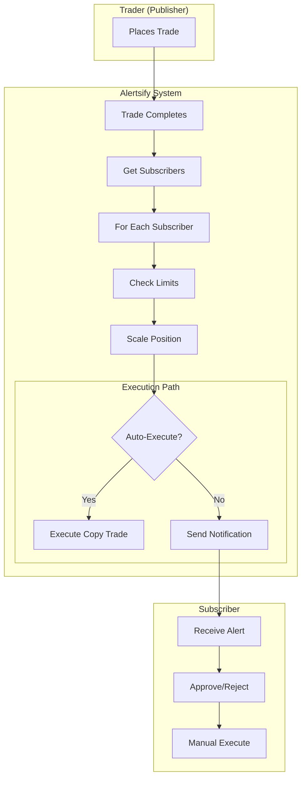
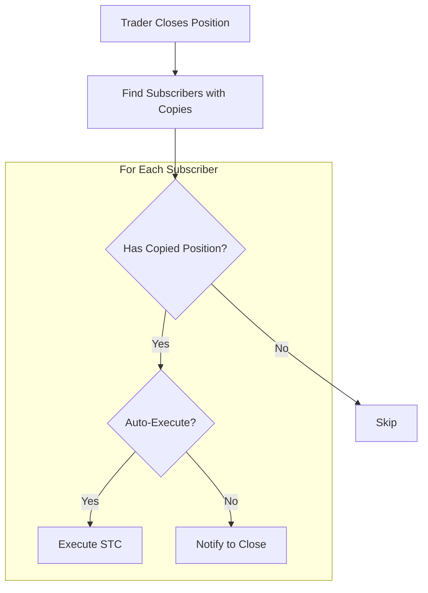

# Copy Trading Flow

This document explains how copy trading works in Alertsify, from subscription to trade execution.

---

## Overview

Copy trading allows users to automatically or manually copy trades from traders they subscribe to. The system handles:

- Subscription management
- Position sizing & scaling
- Trade limits & protections
- Notification delivery
- Auto-execution (optional)

---

## Architecture



---

## Subscription Settings

Each subscription has configurable settings:

| Setting | Type | Description | Default |
|---------|------|-------------|---------|
| `autoExecute` | boolean | Auto-execute trades immediately | `false` |
| `maxPositionSize` | number | Maximum contracts per trade | `10` |
| `maxDailyTrades` | number | Maximum trades per day | `5` |
| `scalingFactor` | number | Position size multiplier | `1.0` |

<details>
<summary>📝 Settings Schema</summary>

```typescript
// lib/types/copy-trading.ts
interface SubscriptionSettings {
  /** Automatically execute copied trades without approval */
  autoExecute: boolean;

  /** Maximum number of contracts per copied trade */
  maxPositionSize: number;

  /** Maximum number of trades to copy per day */
  maxDailyTrades: number;

  /** 
   * Position size multiplier
   * - 1.0 = Same size as trader
   * - 0.5 = Half the trader's size
   * - 2.0 = Double the trader's size
   */
  scalingFactor: number;
}
```

</details>

---

## Subscription Lifecycle

### Creating a Subscription

<details>
<summary>📝 Subscribe Flow</summary>

```typescript
// lib/actions/copy-trading.actions.ts
export async function subscribeToTrader(params: {
  traderId: string;
  settings: SubscriptionSettings;
}): Promise<ActionResult<Subscription>> {
  const session = await auth();
  if (!session?.user?.id) {
    return { ok: false, error: 'Unauthorized' };
  }

  // Prevent self-subscription
  if (params.traderId === session.user.id) {
    return { ok: false, error: 'Cannot subscribe to yourself' };
  }

  // Check for existing subscription
  const existing = await db.query.subscriptions.findFirst({
    where: and(
      eq(subscriptions.subscriberId, session.user.id),
      eq(subscriptions.traderId, params.traderId),
      eq(subscriptions.status, 'active')
    ),
  });

  if (existing) {
    return { ok: false, error: 'Already subscribed to this trader' };
  }

  // Validate trader exists and is eligible
  const trader = await db.query.users.findFirst({
    where: eq(users.id, params.traderId),
  });

  if (!trader || !trader.isTrader) {
    return { ok: false, error: 'Invalid trader' };
  }

  // Create subscription
  const subscription = await db.insert(subscriptions).values({
    id: nanoid(),
    subscriberId: session.user.id,
    traderId: params.traderId,
    settings: params.settings,
    status: 'active',
  }).returning();

  // Follow trader's feed on GetStream
  await getstreamService.followTrader(session.user.id, params.traderId);

  return { ok: true, data: subscription[0] };
}
```

</details>

---

### Pausing/Resuming

Subscribers can pause without unsubscribing:

```typescript
export async function pauseSubscription(
  subscriptionId: string
): Promise<ActionResult<void>> {
  await db.update(subscriptions)
    .set({ status: 'paused' })
    .where(eq(subscriptions.id, subscriptionId));

  return { ok: true, data: undefined };
}
```

---

### Unsubscribing

```typescript
export async function unsubscribeFromTrader(
  subscriptionId: string
): Promise<ActionResult<void>> {
  const subscription = await db.query.subscriptions.findFirst({
    where: eq(subscriptions.id, subscriptionId),
  });

  // Soft delete
  await db.update(subscriptions)
    .set({ 
      status: 'cancelled',
      cancelledAt: new Date(),
    })
    .where(eq(subscriptions.id, subscriptionId));

  // Unfollow on GetStream
  await getstreamService.unfollowTrader(
    subscription.subscriberId, 
    subscription.traderId
  );

  return { ok: true, data: undefined };
}
```

---

## Trade Copy Flow

### Step 1: Trader Places Trade

When a trader executes a trade, the copy trading system is triggered:

```typescript
// At the end of placeOptionOrder (for traders)
if (trade.source === 'manual') {
  await copyTradingService.handleTraderTrade({
    traderId: session.user.id,
    traderName: session.user.name,
    trade: tradeData,
    parentTradeId: parentTrade.id,
  });
}
```

---

### Step 2: Get Active Subscribers

<details>
<summary>📝 Subscriber Retrieval</summary>

```typescript
// lib/services/copy-trading.service.ts
async function getActiveSubscribers(traderId: string): Promise<Subscriber[]> {
  const subs = await db.query.subscriptions.findMany({
    where: and(
      eq(subscriptions.traderId, traderId),
      eq(subscriptions.status, 'active')
    ),
    with: {
      subscriber: true,
      account: true,  // Get their brokerage account
    },
  });

  // Filter subscribers with connected accounts
  return subs.filter(s => s.account?.isActive);
}
```

</details>

---

### Step 3: Apply Limits & Scaling

For each subscriber:

<details>
<summary>📝 Limit Checking & Scaling</summary>

```typescript
async function calculateCopyQuantity(params: {
  subscription: Subscription;
  originalQuantity: number;
}): Promise<{ quantity: number; skipped: boolean; reason?: string }> {
  const { subscription, originalQuantity } = params;
  const settings = subscription.settings;

  // Check daily trade limit
  const today = new Date().toISOString().split('T')[0];
  const dailyCount = await db
    .select({ count: count() })
    .from(trades)
    .where(and(
      eq(trades.userId, subscription.subscriberId),
      eq(trades.source, 'copy'),
      gte(trades.createdAt, new Date(today))
    ));

  if (dailyCount[0].count >= settings.maxDailyTrades) {
    return { 
      quantity: 0, 
      skipped: true, 
      reason: 'Daily trade limit reached' 
    };
  }

  // Scale the position
  let scaledQuantity = Math.floor(originalQuantity * settings.scalingFactor);

  // Apply max position size
  if (scaledQuantity > settings.maxPositionSize) {
    scaledQuantity = settings.maxPositionSize;
  }

  // Minimum 1 contract
  if (scaledQuantity < 1) {
    return { 
      quantity: 0, 
      skipped: true, 
      reason: 'Scaled quantity less than 1' 
    };
  }

  return { quantity: scaledQuantity, skipped: false };
}
```

</details>

---

### Step 4: Execute or Notify

<details>
<summary>📝 Execution Decision</summary>

```typescript
async function processSubscriber(params: {
  subscription: Subscription;
  traderTrade: Trade;
}): Promise<void> {
  const { subscription, traderTrade } = params;

  // Calculate quantity
  const { quantity, skipped, reason } = await calculateCopyQuantity({
    subscription,
    originalQuantity: traderTrade.quantity,
  });

  if (skipped) {
    // Log skip but don't notify (to avoid spam)
    console.log(`[CopyTrade] Skipped for ${subscription.subscriberId}: ${reason}`);
    return;
  }

  if (subscription.settings.autoExecute) {
    // AUTO-EXECUTE
    await executeCopyTrade({
      subscriberId: subscription.subscriberId,
      accountId: subscription.account.id,
      originalTrade: traderTrade,
      quantity,
    });
  } else {
    // SEND NOTIFICATION
    await notificationService.sendCopyTradeAlert({
      subscriberId: subscription.subscriberId,
      traderId: subscription.traderId,
      traderName: traderTrade.traderName,
      trade: traderTrade,
      suggestedQuantity: quantity,
    });
  }
}
```

</details>

---

### Step 5a: Auto-Execute Path

<details>
<summary>📝 Auto-Execute Implementation</summary>

```typescript
async function executeCopyTrade(params: {
  subscriberId: string;
  accountId: string;
  originalTrade: Trade;
  quantity: number;
}): Promise<void> {
  const { subscriberId, accountId, originalTrade, quantity } = params;

  try {
    // Execute using the same flow as manual trades
    const result = await placeOptionOrderInternal({
      userId: subscriberId,
      accountId,
      side: originalTrade.action === 'buy' ? 'BTO' : 'STC',
      underlying: originalTrade.underlying,
      optionType: originalTrade.optionType,
      strike: originalTrade.strike,
      expiration: originalTrade.expiration,
      quantity,
      orderType: 'Market',  // Copy trades use market orders
      source: 'copy',
      sourceTraderId: originalTrade.userId,
      sourceTradeId: originalTrade.id,
    });

    if (result.ok) {
      // Send confirmation notification
      await notificationService.sendCopyTradeExecuted({
        subscriberId,
        traderId: originalTrade.userId,
        trade: result.data,
        originalQuantity: originalTrade.quantity,
        copiedQuantity: quantity,
      });
    } else {
      // Send failure notification
      await notificationService.sendCopyTradeFailed({
        subscriberId,
        traderId: originalTrade.userId,
        trade: originalTrade,
        error: result.error,
      });
    }
  } catch (error) {
    console.error('[CopyTrade] Auto-execute failed:', error);
  }
}
```

</details>

---

### Step 5b: Notification Path

<details>
<summary>📝 Notification Flow</summary>

```typescript
async function sendCopyTradeAlert(params: {
  subscriberId: string;
  traderId: string;
  traderName: string;
  trade: Trade;
  suggestedQuantity: number;
}): Promise<void> {
  const { subscriberId, traderId, traderName, trade, suggestedQuantity } = params;

  // In-app notification
  await db.insert(notifications).values({
    id: nanoid(),
    userId: subscriberId,
    type: 'copy_trade_alert',
    title: `${traderName} opened a position`,
    body: `${trade.action.toUpperCase()} ${trade.underlying} $${trade.strike} ${trade.optionType}`,
    data: {
      traderId,
      tradeId: trade.id,
      suggestedQuantity,
    },
    read: false,
  });

  // Push notification
  await pushService.send({
    userId: subscriberId,
    title: `🔔 ${traderName} Trade Alert`,
    body: `${trade.underlying} $${trade.strike} ${trade.optionType}`,
    data: { type: 'copy_trade', tradeId: trade.id },
  });

  // GetStream notification
  await getstreamService.sendNotification({
    userId: subscriberId,
    type: 'copy_trade_alert',
    message: `${traderName} opened a ${trade.underlying} position`,
    data: { traderId, tradeId: trade.id },
  });
}
```

</details>

---

## STC Copy Trading

When a trader closes a position:



<details>
<summary>📝 STC Copy Logic</summary>

```typescript
async function handleTraderSTC(params: {
  traderId: string;
  parentTradeId: string;
  stcTrade: Trade;
}): Promise<void> {
  const subscribers = await getActiveSubscribers(params.traderId);

  for (const subscriber of subscribers) {
    // Find if subscriber copied this position
    const copiedParent = await db.query.parentTrades.findFirst({
      where: and(
        eq(parentTrades.userId, subscriber.subscriberId),
        eq(parentTrades.sourceParentTradeId, params.parentTradeId),
        eq(parentTrades.status, 'open')
      ),
    });

    if (!copiedParent) {
      continue; // Subscriber didn't copy this trade
    }

    // Get subscriber's available quantity
    const availableQty = await calculateAvailableQuantity(copiedParent.id);
    
    if (availableQty === 0) {
      continue; // Already fully closed
    }

    if (subscriber.settings.autoExecute) {
      // Auto-close the copied position
      await placeOptionOrderInternal({
        userId: subscriber.subscriberId,
        side: 'STC',
        parentTradeId: copiedParent.id,
        quantity: availableQty,
        orderType: 'Market',
        source: 'copy',
      });
    } else {
      // Notify subscriber
      await notificationService.sendCopyTradeCloseAlert({
        subscriberId: subscriber.subscriberId,
        traderId: params.traderId,
        copiedPosition: copiedParent,
        suggestedQuantity: availableQty,
      });
    }
  }
}
```

</details>

---

## Scaling Examples

### Example 1: Default Settings

Trader buys 10 contracts, subscriber has `scalingFactor: 1.0`:

| Setting | Value | Result |
|---------|-------|--------|
| Trader quantity | 10 | - |
| Scaling factor | 1.0 | 10 |
| Max position | 10 | **10** |

---

### Example 2: Conservative Scaling

Trader buys 10 contracts, subscriber has `scalingFactor: 0.5`:

| Setting | Value | Result |
|---------|-------|--------|
| Trader quantity | 10 | - |
| Scaling factor | 0.5 | 5 |
| Max position | 10 | **5** |

---

### Example 3: Position Cap

Trader buys 20 contracts, subscriber has `scalingFactor: 1.0`, `maxPositionSize: 5`:

| Setting | Value | Result |
|---------|-------|--------|
| Trader quantity | 20 | - |
| Scaling factor | 1.0 | 20 |
| Max position | 5 | **5** (capped) |

---

## Best Practices

### For Traders

| Practice | Reason |
|----------|--------|
| Trade normal sizes | Subscribers scale, so extremes hurt them |
| Use limit orders | Market slippage affects followers |
| Communicate closures | Give followers time to decide |

### For Subscribers

| Practice | Reason |
|----------|--------|
| Start with low scaling | Test the trader first |
| Set daily limits | Protect against overtrading |
| Monitor regularly | Even auto-execute needs oversight |

---

## Next Steps

- [BTO Execution](/flows/bto-execution) — How orders execute
- [STC Execution](/flows/stc-execution) — Closing positions
- [Notifications Flow](/flows/notifications) — Multi-channel alerts
