# Notifications Flow

This document explains how notifications are delivered across multiple channels in Alertsify.

---

## Overview

Alertsify delivers notifications through multiple channels:

- **In-App**: Database-backed notifications in the UI
- **Push**: Browser/mobile push notifications
- **GetStream**: Activity feed notifications
- **Discord**: Webhook alerts to Discord channels
- **Email**: Transactional emails (coming soon)

---

## Architecture


---

## Notification Types

| Type | Description | Channels |
|------|-------------|----------|
| `order_filled` | Order was filled | In-App, Push |
| `order_cancelled` | Order was cancelled | In-App |
| `copy_trade_alert` | Trader opened position | In-App, Push, GetStream |
| `copy_trade_close` | Trader closed position | In-App, Push, GetStream |
| `copy_trade_executed` | Auto-copy completed | In-App, Push |
| `subscription_new` | New subscriber | In-App, Push |
| `achievement` | Achievement unlocked | In-App, Push, GetStream |
| `leaderboard` | Rank changed | In-App |
| `bto_alert` | Trade alert (public) | Discord, GetStream |
| `stc_alert` | Close alert (public) | Discord, GetStream |
| `system` | System announcement | In-App, Email |

---

## User Preferences

Users can configure which channels receive which notifications:

```typescript
interface NotificationPreferences {
  // Channel toggles
  inApp: boolean;
  push: boolean;
  email: boolean;
  discord: boolean;

  // Per-type settings
  types: {
    orderUpdates: ChannelPrefs;
    copyTradeAlerts: ChannelPrefs;
    socialActivity: ChannelPrefs;
    marketing: ChannelPrefs;
  };
}

interface ChannelPrefs {
  inApp: boolean;
  push: boolean;
  email: boolean;
}
```

---

## Notification Service

<details>
<summary>📝 Core Notification Service</summary>

```typescript
// lib/services/notification.service.ts

interface SendNotificationParams {
  userId: string;
  type: NotificationType;
  title: string;
  body: string;
  data?: Record<string, unknown>;
  // Override channels (ignores preferences)
  channels?: NotificationChannel[];
}

export const notificationService = {
  /**
   * Main entry point for sending notifications
   */
  async send(params: SendNotificationParams): Promise<void> {
    const { userId, type, title, body, data, channels } = params;

    // Get user preferences
    const prefs = await this.getUserPreferences(userId);
    
    // Determine which channels to use
    const activeChannels = channels ?? this.getChannelsForType(type, prefs);

    // Send to each channel in parallel
    await Promise.all(
      activeChannels.map(channel => 
        this.sendToChannel(channel, { userId, type, title, body, data })
      )
    );
  },

  /**
   * Route to specific channel
   */
  async sendToChannel(
    channel: NotificationChannel,
    params: NotificationParams
  ): Promise<void> {
    switch (channel) {
      case 'in_app':
        await this.sendInApp(params);
        break;
      case 'push':
        await this.sendPush(params);
        break;
      case 'getstream':
        await this.sendGetStream(params);
        break;
      case 'discord':
        await this.sendDiscord(params);
        break;
      case 'email':
        await this.sendEmail(params);
        break;
    }
  },

  /**
   * In-App notification (database)
   */
  async sendInApp(params: NotificationParams): Promise<void> {
    await db.insert(notifications).values({
      id: nanoid(),
      userId: params.userId,
      type: params.type,
      title: params.title,
      body: params.body,
      data: params.data,
      read: false,
      createdAt: new Date(),
    });
  },

  /**
   * Push notification (web/mobile)
   */
  async sendPush(params: NotificationParams): Promise<void> {
    // Get user's push subscriptions
    const subscriptions = await db.query.pushSubscriptions.findMany({
      where: eq(pushSubscriptions.userId, params.userId),
    });

    for (const sub of subscriptions) {
      try {
        await webpush.sendNotification(
          sub.subscription,
          JSON.stringify({
            title: params.title,
            body: params.body,
            icon: '/icon-192.png',
            badge: '/badge-72.png',
            data: params.data,
          })
        );
      } catch (error) {
        // Remove invalid subscriptions
        if (error.statusCode === 410) {
          await db.delete(pushSubscriptions)
            .where(eq(pushSubscriptions.id, sub.id));
        }
      }
    }
  },

  /**
   * GetStream notification
   */
  async sendGetStream(params: NotificationParams): Promise<void> {
    await getstreamService.sendNotification({
      userId: params.userId,
      type: params.type,
      message: params.body,
      data: params.data,
    });
  },
};
```

</details>

---

## In-App Notifications

### Database Schema

```sql
CREATE TABLE notifications (
  id TEXT PRIMARY KEY,
  user_id TEXT NOT NULL REFERENCES users(id),
  type TEXT NOT NULL,
  title TEXT NOT NULL,
  body TEXT NOT NULL,
  data JSONB,
  read BOOLEAN DEFAULT FALSE,
  created_at TIMESTAMP DEFAULT NOW()
);

CREATE INDEX idx_notifications_user_unread 
  ON notifications(user_id, read, created_at DESC);
```

### Reading Notifications

```typescript
// lib/actions/notification.actions.ts
export async function getNotifications(params?: {
  limit?: number;
  cursor?: string;
  unreadOnly?: boolean;
}): Promise<ActionResult<PaginatedNotifications>> {
  const session = await auth();
  
  const conditions = [eq(notifications.userId, session.user.id)];
  
  if (params?.unreadOnly) {
    conditions.push(eq(notifications.read, false));
  }
  
  if (params?.cursor) {
    conditions.push(lt(notifications.createdAt, new Date(params.cursor)));
  }

  const items = await db.query.notifications.findMany({
    where: and(...conditions),
    orderBy: [desc(notifications.createdAt)],
    limit: params?.limit ?? 20,
  });

  return {
    ok: true,
    data: {
      items,
      nextCursor: items.at(-1)?.createdAt.toISOString() ?? null,
      hasMore: items.length === (params?.limit ?? 20),
    },
  };
}
```

### Marking as Read

```typescript
export async function markNotificationsRead(
  notificationIds: string[]
): Promise<ActionResult<void>> {
  const session = await auth();

  await db.update(notifications)
    .set({ read: true })
    .where(and(
      inArray(notifications.id, notificationIds),
      eq(notifications.userId, session.user.id)
    ));

  return { ok: true, data: undefined };
}
```

---

## Push Notifications

### Setup (Client)

<details>
<summary>📝 Service Worker Registration</summary>

```typescript
// Register service worker
if ('serviceWorker' in navigator && 'PushManager' in window) {
  const registration = await navigator.serviceWorker.register('/sw.js');
  
  // Request permission
  const permission = await Notification.requestPermission();
  if (permission !== 'granted') return;
  
  // Subscribe to push
  const subscription = await registration.pushManager.subscribe({
    userVisibleOnly: true,
    applicationServerKey: process.env.NEXT_PUBLIC_VAPID_PUBLIC_KEY,
  });
  
  // Send subscription to server
  await savePushSubscription(subscription.toJSON());
}
```

</details>

### Service Worker

<details>
<summary>📝 Push Handler (sw.js)</summary>

```javascript
// public/sw.js
self.addEventListener('push', (event) => {
  const data = event.data?.json() ?? {};
  
  const options = {
    body: data.body,
    icon: data.icon ?? '/icon-192.png',
    badge: data.badge ?? '/badge-72.png',
    data: data.data,
    actions: [
      { action: 'view', title: 'View' },
      { action: 'dismiss', title: 'Dismiss' },
    ],
  };

  event.waitUntil(
    self.registration.showNotification(data.title, options)
  );
});

self.addEventListener('notificationclick', (event) => {
  event.notification.close();
  
  if (event.action === 'view') {
    const url = event.notification.data?.url ?? '/';
    event.waitUntil(clients.openWindow(url));
  }
});
```

</details>

---

## GetStream Notifications

GetStream provides a special notification feed:

```typescript
// Publish notification
await client.feed('notification', userId).addActivity({
  actor: 'system',
  verb: type,
  object: `notification:${nanoid()}`,
  message: body,
  ...data,
});

// Read notifications (marks as seen)
const notifications = await client.feed('notification', userId).get({
  limit: 20,
  mark_seen: true,
});

// Get unread count
const counts = await client.feed('notification', userId).get({
  limit: 0,
});
console.log('Unread:', counts.unread);
console.log('Unseen:', counts.unseen);
```

---

## Discord Integration

For public trade alerts:

<details>
<summary>📝 Discord Alert Flow</summary>

```typescript
async function sendDiscordTradeAlert(params: {
  userId: string;
  type: 'bto' | 'stc';
  trade: Trade;
}): Promise<void> {
  // Check if user has Discord alerts enabled
  const settings = await getUserSettings(params.userId);
  if (!settings.discordAlertsEnabled) return;

  // Get the webhook URL (user-specific or platform default)
  const webhookUrl = settings.discordWebhookUrl 
    ?? process.env.DISCORD_WEBHOOK_URL;

  if (!webhookUrl) return;

  // Build and send alert
  if (params.type === 'bto') {
    await discordAlertService.sendBTOAlert({
      webhookUrl,
      traderId: params.userId,
      traderName: settings.displayName,
      trade: params.trade,
    });
  } else {
    await discordAlertService.sendSTCAlert({
      webhookUrl,
      traderId: params.userId,
      traderName: settings.displayName,
      trade: params.trade,
    });
  }
}
```

</details>

---

## Specific Notification Flows

### Order Filled

```mermaid
sequenceDiagram
    participant Sync as Sync Service
    participant Notif as Notification Service
    participant DB as Database
    participant Push as Push Service

    Sync->>Notif: Order filled
    Notif->>DB: Create in-app notification
    Notif->>Push: Send push notification
    Push-->>User: 🔔 "Order Filled: AAPL $200C"
```



---

### Copy Trade Alert


---

## Real-time Updates

### WebSocket for In-App

```typescript
// hooks/use-notifications.ts
export function useNotifications() {
  const [notifications, setNotifications] = useState<Notification[]>([]);
  const [unreadCount, setUnreadCount] = useState(0);

  useEffect(() => {
    // Initial fetch
    fetchNotifications().then(setNotifications);

    // Subscribe to GetStream for real-time
    const feed = streamClient.feed('notification', userId);
    
    const subscription = feed.subscribe((data) => {
      if (data.new?.length > 0) {
        // Add new notifications
        setNotifications(prev => [...data.new, ...prev]);
        setUnreadCount(prev => prev + data.new.length);
      }
    });

    return () => subscription.unsubscribe();
  }, [userId]);

  return { notifications, unreadCount };
}
```

---

## Rate Limiting

Prevent notification spam:

```typescript
const RATE_LIMITS = {
  push: { max: 10, window: 60 },      // 10 per minute
  discord: { max: 5, window: 60 },    // 5 per minute
  email: { max: 5, window: 3600 },    // 5 per hour
};

async function checkRateLimit(
  userId: string, 
  channel: string
): Promise<boolean> {
  const limit = RATE_LIMITS[channel];
  const key = `ratelimit:${channel}:${userId}`;
  
  const count = await kv.incr(key);
  
  if (count === 1) {
    await kv.expire(key, limit.window);
  }
  
  return count <= limit.max;
}
```

---

## Best Practices

### ✅ Do

| Practice | Reason |
|----------|--------|
| Respect user preferences | Users control their experience |
| Use appropriate urgency | Don't abuse push for low-priority |
| Include action links | Make notifications actionable |
| Deduplicate | Prevent spam from retries |

### ❌ Don't

| Anti-Pattern | Reason |
|--------------|--------|
| Ignore rate limits | Results in blocked channels |
| Send marketing via push | Loses trust |
| Skip error handling | Silent failures |

---

## Next Steps

- [Discord Webhooks](/api/discord) — Discord integration details
- [GetStream API](/api/getstream) — Activity feeds
- [Copy Trading Flow](/flows/copy-trading) — When notifications trigger
