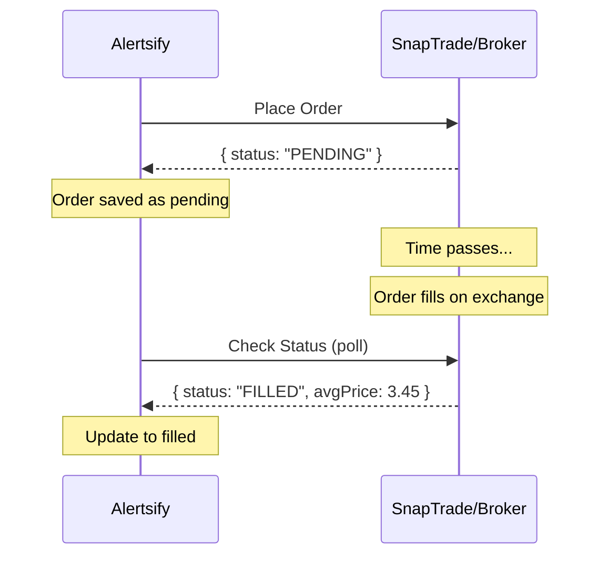
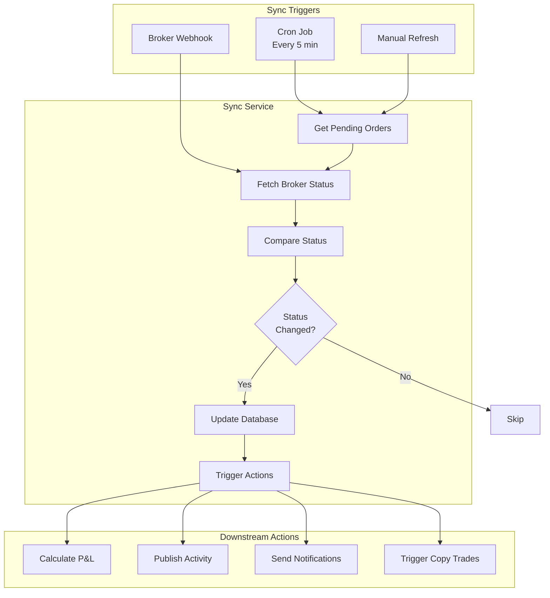
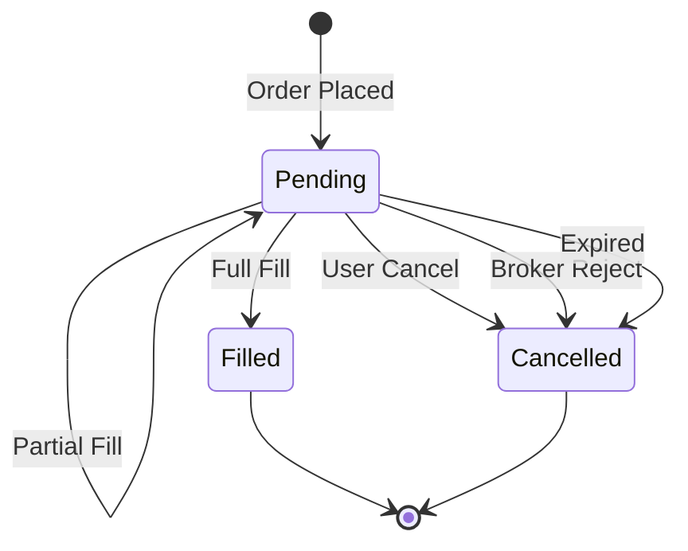

# Order Synchronization Flow

This document explains how Alertsify keeps order statuses synchronized with brokerage data.

---

## Overview

After placing an order, it may take time to fill. The sync system:

1. Monitors pending orders
2. Polls broker for status updates
3. Updates database on status changes
4. Triggers downstream actions on fills

---

## Why Sync is Needed

Brokers handle order execution asynchronously:



---

## Sync Architecture



---

## Sync Triggers

### 1. Cron Job (Primary)

Runs every 5 minutes via Vercel Cron:

```typescript
// app/api/cron/sync-orders/route.ts
export async function GET(request: NextRequest) {
  // Verify cron secret
  const authHeader = request.headers.get('authorization');
  if (authHeader !== `Bearer ${process.env.CRON_SECRET}`) {
    return NextResponse.json({ error: 'Unauthorized' }, { status: 401 });
  }

  const result = await syncService.syncAllPendingOrders();

  return NextResponse.json({
    success: true,
    synced: result.syncedCount,
    errors: result.errors,
  });
}
```

**Vercel Cron Configuration:**

```json
// vercel.json
{
  "crons": [
    {
      "path": "/api/cron/sync-orders",
      "schedule": "*/5 * * * *"
    }
  ]
}
```

---

### 2. Broker Webhooks (Real-time)

When configured, brokers can push updates:

<details>
<summary>📝 Webhook Handler</summary>

```typescript
// app/api/webhooks/snaptrade/route.ts
export async function POST(request: NextRequest) {
  // Verify signature
  const signature = request.headers.get('x-snaptrade-signature');
  const body = await request.text();

  if (!verifySignature(body, signature)) {
    return NextResponse.json({ error: 'Invalid signature' }, { status: 401 });
  }

  const event = JSON.parse(body);

  switch (event.type) {
    case 'order.filled':
      await syncService.handleOrderFilled({
        brokerOrderId: event.data.brokerage_order_id,
        filledQuantity: event.data.filled_quantity,
        averagePrice: event.data.average_price,
        filledAt: new Date(event.data.filled_at),
      });
      break;

    case 'order.cancelled':
      await syncService.handleOrderCancelled({
        brokerOrderId: event.data.brokerage_order_id,
        reason: event.data.cancellation_reason,
      });
      break;

    case 'order.rejected':
      await syncService.handleOrderRejected({
        brokerOrderId: event.data.brokerage_order_id,
        reason: event.data.rejection_reason,
      });
      break;
  }

  return NextResponse.json({ received: true });
}
```

</details>

---

### 3. Manual Refresh

Users can trigger sync from UI:

```typescript
// lib/actions/account.actions.ts
export async function refreshOrderStatus(
  tradeId: string
): Promise<ActionResult<Trade>> {
  const session = await auth();
  
  const trade = await db.query.trades.findFirst({
    where: and(
      eq(trades.id, tradeId),
      eq(trades.userId, session.user.id)
    ),
    with: { account: true },
  });

  if (!trade || trade.status !== 'pending') {
    return { ok: false, error: 'Order not found or not pending' };
  }

  const updated = await syncService.syncSingleOrder(trade);
  
  return { ok: true, data: updated };
}
```

---

## Sync Service Implementation

<details>
<summary>📝 Full Sync Service</summary>

```typescript
// lib/services/sync.service.ts

export const syncService = {
  /**
   * Sync all pending orders across all users
   */
  async syncAllPendingOrders(): Promise<SyncResult> {
    const pendingTrades = await db.query.trades.findMany({
      where: and(
        eq(trades.status, 'pending'),
        // Only orders placed in last 24 hours
        gte(trades.createdAt, subHours(new Date(), 24))
      ),
      with: {
        account: true,
        user: true,
      },
    });

    let syncedCount = 0;
    const errors: string[] = [];

    // Group by account to minimize API calls
    const byAccount = groupBy(pendingTrades, 'accountId');

    for (const [accountId, accountTrades] of Object.entries(byAccount)) {
      try {
        await this.syncAccountOrders(accountTrades);
        syncedCount += accountTrades.length;
      } catch (error) {
        errors.push(`Account ${accountId}: ${error.message}`);
      }
    }

    return { syncedCount, errors };
  },

  /**
   * Sync orders for a single account
   */
  async syncAccountOrders(trades: TradeWithAccount[]): Promise<void> {
    const account = trades[0].account;

    // Get all open orders from broker
    const brokerOrders = await snaptradeService.getOrders({
      userId: account.snaptradeUserId,
      userSecret: account.snaptradeUserSecret,
      accountId: account.snaptradeAccountId,
    });

    if (!brokerOrders.success) {
      throw new Error(brokerOrders.error);
    }

    // Create lookup map
    const orderMap = new Map(
      brokerOrders.data.map(o => [o.brokerage_order_id, o])
    );

    // Check each pending trade
    for (const trade of trades) {
      const brokerOrder = orderMap.get(trade.brokerOrderId);
      
      if (!brokerOrder) {
        // Order not found - might be cancelled or very old
        await this.markAsUnknown(trade);
        continue;
      }

      // Compare status
      const newStatus = this.mapBrokerStatus(brokerOrder.status);
      
      if (newStatus !== trade.status) {
        await this.updateTradeStatus(trade, brokerOrder);
      }
    }
  },

  /**
   * Handle order filled update
   */
  async handleOrderFilled(params: {
    brokerOrderId: string;
    filledQuantity: number;
    averagePrice: number;
    filledAt: Date;
  }): Promise<void> {
    const trade = await db.query.trades.findFirst({
      where: eq(trades.brokerOrderId, params.brokerOrderId),
      with: { parentTrade: true, user: true },
    });

    if (!trade || trade.status === 'filled') {
      return; // Already processed or not found
    }

    // Update trade
    await db.update(trades)
      .set({
        status: 'filled',
        filledQuantity: params.filledQuantity,
        filledPrice: params.averagePrice,
        filledAt: params.filledAt,
      })
      .where(eq(trades.id, trade.id));

    // Trigger downstream actions
    await this.onOrderFilled(trade, params);
  },

  /**
   * Downstream actions after fill
   */
  async onOrderFilled(trade: Trade, fillData: FillData): Promise<void> {
    // 1. Calculate P&L if STC
    if (trade.action === 'sell') {
      const pnl = await calculatePnL({
        parentTradeId: trade.parentTradeId,
        sellQuantity: fillData.filledQuantity,
        sellPrice: fillData.averagePrice,
      });

      await db.update(trades)
        .set({ pnl: pnl.pnl, pnlPercent: pnl.pnlPercent })
        .where(eq(trades.id, trade.id));
    }

    // 2. Check if position should be closed
    if (trade.action === 'sell') {
      await checkAndClosePosition(trade.parentTradeId);
    }

    // 3. Publish activity
    await getstreamService.publishTradeActivity({
      tradeId: trade.id,
      userId: trade.userId,
      type: trade.action === 'buy' ? 'bto' : 'stc',
      // ... other fields
    });

    // 4. Send notifications
    await notificationService.sendOrderFilled({
      userId: trade.userId,
      trade,
      fillData,
    });

    // 5. Trigger copy trading (for BTO only)
    if (trade.action === 'buy' && trade.source === 'manual') {
      await copyTradingService.handleTraderTrade({
        traderId: trade.userId,
        trade,
      });
    }
  },

  mapBrokerStatus(brokerStatus: string): TradeStatus {
    const statusMap: Record<string, TradeStatus> = {
      'PENDING': 'pending',
      'OPEN': 'pending',
      'PARTIALLY_FILLED': 'pending',
      'FILLED': 'filled',
      'CANCELLED': 'cancelled',
      'REJECTED': 'cancelled',
      'EXPIRED': 'cancelled',
    };
    return statusMap[brokerStatus] ?? 'pending';
  },
};
```

</details>

---

## Status Transitions



---

## Timing Considerations

### Poll Frequency

| Factor | Consideration |
|--------|---------------|
| Market hours | More frequent during market hours |
| Order age | Older orders less likely to change |
| Rate limits | SnapTrade: 100 req/min |

### Optimizations

1. **Group by account**: Fetch all orders per account in one call
2. **Skip non-trading hours**: Reduce polling when markets closed
3. **Exponential backoff**: For orders > 1 hour old

<details>
<summary>📝 Market Hours Check</summary>

```typescript
function isMarketHours(): boolean {
  const now = new Date();
  const nyHour = now.toLocaleString('en-US', { 
    timeZone: 'America/New_York', 
    hour: 'numeric', 
    hour12: false 
  });
  const hour = parseInt(nyHour);
  
  // Market hours: 9:30 AM - 4:00 PM ET
  // Pre-market: 4:00 AM - 9:30 AM ET
  // After-hours: 4:00 PM - 8:00 PM ET
  
  return hour >= 4 && hour < 20;
}

// Adjust sync frequency
const SYNC_INTERVAL = isMarketHours() ? 5 : 30; // minutes
```

</details>

---

## Error Handling

### Common Sync Errors

| Error | Cause | Resolution |
|-------|-------|------------|
| Rate limited | Too many API calls | Implement backoff |
| Account disconnected | OAuth token expired | Prompt reconnection |
| Order not found | Already cancelled externally | Mark as unknown |
| Network timeout | Connectivity issue | Retry with backoff |

### Retry Strategy

```typescript
async function syncWithRetry(
  trade: Trade, 
  maxRetries = 3
): Promise<void> {
  for (let attempt = 0; attempt < maxRetries; attempt++) {
    try {
      await syncService.syncSingleOrder(trade);
      return;
    } catch (error) {
      if (attempt === maxRetries - 1) throw error;
      
      // Exponential backoff: 1s, 2s, 4s
      await sleep(Math.pow(2, attempt) * 1000);
    }
  }
}
```

---

## Monitoring

### Metrics to Track

| Metric | Description |
|--------|-------------|
| `sync_duration_ms` | Time to complete sync cycle |
| `pending_orders_count` | Number of pending orders |
| `sync_errors_count` | Failed sync attempts |
| `avg_fill_time_ms` | Time from order to fill |

### Alerting

```typescript
// Alert if sync hasn't run in 15 minutes
const lastSync = await kv.get('last_sync_timestamp');
const fifteenMinutesAgo = Date.now() - 15 * 60 * 1000;

if (lastSync < fifteenMinutesAgo) {
  await alertService.sendAlert({
    type: 'sync_stale',
    message: 'Order sync has not run in 15+ minutes',
    severity: 'warning',
  });
}
```

---

## Next Steps

- [Notifications Flow](/flows/notifications) — How alerts are sent
- [BTO Execution](/flows/bto-execution) — Order placement
- [Database Schema](/database/schema) — Trade table structure
