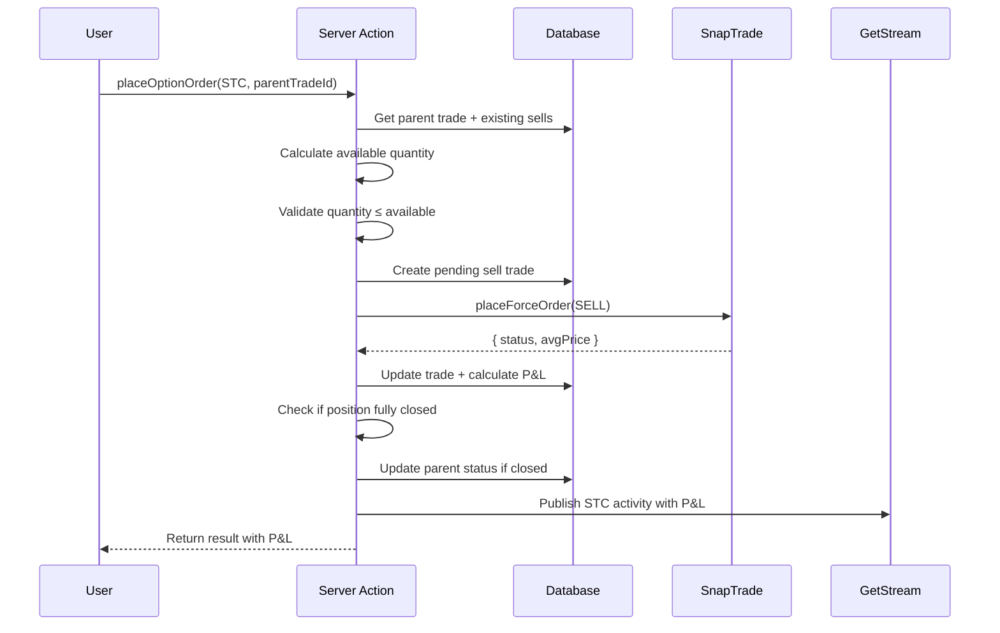
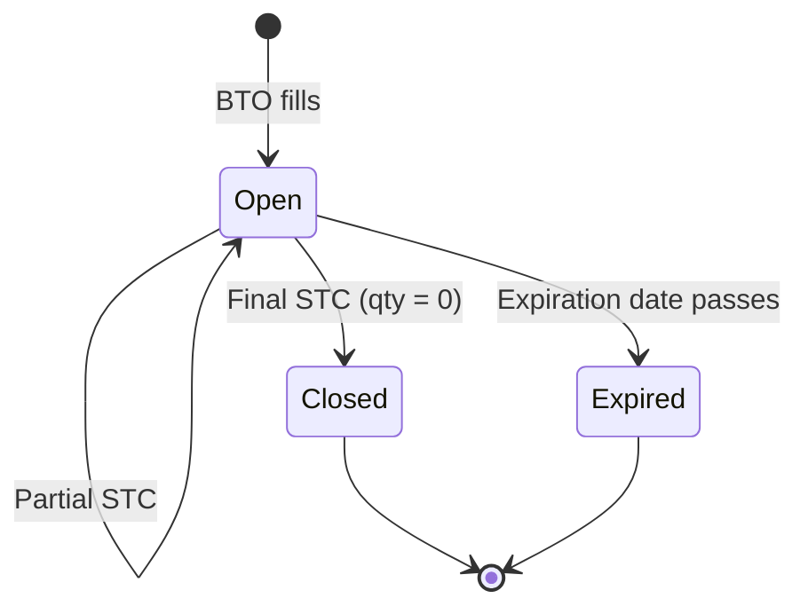

# Sell to Close (STC) Execution Flow

This document provides a complete walkthrough of how an STC (Sell to Close) order is executed in Alertsify.

---

## Overview

When a user closes an existing options position, the system:

1. Validates the order against existing position
2. Prevents overselling with quantity checks
3. Sends order to broker via SnapTrade
4. Calculates P&L on fill
5. Updates position status
6. Publishes activities with P&L data

---

## Key Differences from BTO

| Aspect | BTO | STC |
|--------|-----|-----|
| **Creates** | New parent trade | New child trade on existing parent |
| **Validates** | Buying power | Available quantity |
| **Risk** | Oversell protection | N/A |
| **P&L** | N/A | Calculated on fill |
| **Parent Status** | Opens new position | May close position |

---

## Flow Diagram



---

## Step-by-Step Breakdown

### Step 1: Validate Against Parent Trade

STC orders require a `parentTradeId` to identify which position to close:

<details>
<summary>📝 Parent Trade Validation</summary>

```typescript
export async function placeOptionOrder(input: unknown) {
  const params = placeOrderSchema.parse(input);
  const session = await auth();

  // For STC, parentTradeId is required
  if (params.side === 'STC' && !params.parentTradeId) {
    return { ok: false, error: 'Parent trade ID required for STC' };
  }

  if (params.side === 'STC') {
    // Get parent trade
    const parentTrade = await db.query.parentTrades.findFirst({
      where: and(
        eq(parentTrades.id, params.parentTradeId),
        eq(parentTrades.userId, session.user.id)
      ),
    });

    if (!parentTrade) {
      return { ok: false, error: 'Position not found' };
    }

    if (parentTrade.status !== 'open') {
      return { ok: false, error: 'Position already closed' };
    }

    // Verify option details match
    if (
      parentTrade.underlying !== params.underlying ||
      parentTrade.optionType !== params.optionType ||
      parentTrade.strike !== params.strike ||
      parentTrade.expiration !== params.expiration
    ) {
      return { ok: false, error: 'Option details do not match position' };
    }
  }
}
```

</details>

---

### Step 2: Oversell Protection

The critical safety check that prevents selling more than owned:

<details>
<summary>📝 Oversell Protection Logic</summary>

```typescript
async function calculateAvailableQuantity(parentTradeId: string): Promise<number> {
  // Get all trades for this parent
  const allTrades = await db.query.trades.findMany({
    where: eq(trades.parentTradeId, parentTradeId),
  });

  // Sum up buys and sells
  let totalBought = 0;
  let totalSold = 0;
  let pendingSells = 0;

  for (const trade of allTrades) {
    if (trade.action === 'buy') {
      if (trade.status === 'filled') {
        totalBought += trade.filledQuantity;
      } else if (trade.status === 'pending') {
        // Don't count pending buys (not yet owned)
      }
    } else if (trade.action === 'sell') {
      if (trade.status === 'filled') {
        totalSold += trade.filledQuantity;
      } else if (trade.status === 'pending') {
        // Count pending sells (reserved)
        pendingSells += trade.quantity;
      }
    }
  }

  // Available = owned - sold - reserved for pending sells
  const available = totalBought - totalSold - pendingSells;
  
  return Math.max(0, available);
}

// In the action
const availableQty = await calculateAvailableQuantity(params.parentTradeId);

if (params.quantity > availableQty) {
  return { 
    ok: false, 
    error: `Cannot sell ${params.quantity}. Only ${availableQty} available.` 
  };
}
```

</details>

**Example Scenario:**

| Trade | Action | Quantity | Status | Running Total |
|-------|--------|----------|--------|---------------|
| #1 | BUY | 10 | filled | Owned: 10 |
| #2 | SELL | 3 | filled | Owned: 7 |
| #3 | SELL | 2 | pending | Available: 5 |
| #4 | SELL | 6 | **❌ BLOCKED** | > 5 available |

---

### Step 3: Create Sell Trade Record

```typescript
const trade = await db.insert(trades).values({
  id: nanoid(),
  parentTradeId: params.parentTradeId,
  userId: session.user.id,
  accountId: account.id,
  action: 'sell',
  quantity: params.quantity,
  limitPrice: params.limitPrice,
  orderType: params.orderType,
  status: 'pending',
  source: 'manual',
}).returning();
```

---

### Step 4: Send to Broker

```typescript
const orderResult = await snaptradeService.placeOrder({
  userId: session.user.id,
  userSecret: account.snaptradeUserSecret,
  accountId: account.snaptradeAccountId,
  action: 'SELL',  // Different from BTO
  orderType: params.orderType,
  timeInForce: 'Day',
  symbol: symbolLookup.data.universalSymbolId,
  quantity: params.quantity,
  limitPrice: params.limitPrice,
});
```

---

### Step 5: Calculate P&L on Fill

When the order fills, we calculate profit/loss:

<details>
<summary>📝 P&L Calculation</summary>

```typescript
async function calculatePnL(params: {
  parentTradeId: string;
  sellQuantity: number;
  sellPrice: number;
}): Promise<{ pnl: number; pnlPercent: number }> {
  // Get all BTO trades for average entry
  const buyTrades = await db.query.trades.findMany({
    where: and(
      eq(trades.parentTradeId, params.parentTradeId),
      eq(trades.action, 'buy'),
      eq(trades.status, 'filled')
    ),
  });

  // Calculate weighted average entry price
  let totalCost = 0;
  let totalQuantity = 0;

  for (const buy of buyTrades) {
    totalCost += buy.filledPrice * buy.filledQuantity;
    totalQuantity += buy.filledQuantity;
  }

  const averageEntry = totalCost / totalQuantity;

  // Calculate P&L
  // Each contract = 100 shares
  const costBasis = averageEntry * params.sellQuantity * 100;
  const proceeds = params.sellPrice * params.sellQuantity * 100;
  const pnl = proceeds - costBasis;
  const pnlPercent = ((params.sellPrice - averageEntry) / averageEntry) * 100;

  return { pnl, pnlPercent };
}

// After order fills
const { pnl, pnlPercent } = await calculatePnL({
  parentTradeId: params.parentTradeId,
  sellQuantity: orderResult.data.filledQuantity,
  sellPrice: orderResult.data.averagePrice,
});

// Update trade with P&L
await db.update(trades)
  .set({
    status: 'filled',
    filledQuantity: orderResult.data.filledQuantity,
    filledPrice: orderResult.data.averagePrice,
    pnl,
    pnlPercent,
    filledAt: new Date(),
  })
  .where(eq(trades.id, trade[0].id));
```

</details>

---

### Step 6: Check if Position Fully Closed

<details>
<summary>📝 Position Close Logic</summary>

```typescript
async function checkAndClosePosition(parentTradeId: string): Promise<boolean> {
  const availableQty = await calculateAvailableQuantity(parentTradeId);
  
  if (availableQty === 0) {
    // Position fully closed
    
    // Calculate total P&L for the position
    const allSells = await db.query.trades.findMany({
      where: and(
        eq(trades.parentTradeId, parentTradeId),
        eq(trades.action, 'sell'),
        eq(trades.status, 'filled')
      ),
    });

    const totalPnL = allSells.reduce((sum, t) => sum + (t.pnl ?? 0), 0);

    // Update parent trade
    await db.update(parentTrades)
      .set({
        status: 'closed',
        closedAt: new Date(),
        totalPnL,
      })
      .where(eq(parentTrades.id, parentTradeId));

    return true;
  }

  return false;
}
```

</details>

---

### Step 7: Publish Activity with P&L

<details>
<summary>📝 STC Activity Publishing</summary>

```typescript
// Get entry price for the activity
const parentTrade = await db.query.parentTrades.findFirst({
  where: eq(parentTrades.id, params.parentTradeId),
  with: { trades: { where: eq(trades.action, 'buy') } },
});

const averageEntry = calculateAverageEntry(parentTrade.trades);

await getstreamService.publishTradeActivity({
  tradeId: trade[0].id,
  userId: session.user.id,
  type: 'stc',
  symbol: optionSymbol,
  underlying: params.underlying,
  optionType: params.optionType,
  strike: params.strike,
  expiration: params.expiration,
  quantity: orderResult.data.filledQuantity,
  entryPrice: averageEntry,
  exitPrice: orderResult.data.averagePrice,
  pnl,
  pnlPercent,
});
```

</details>

---

### Step 8: Send Discord Alert

<details>
<summary>📝 STC Discord Alert</summary>

```typescript
await discordAlertService.sendSTCAlert({
  tradeId: trade[0].id,
  traderId: session.user.id,
  traderName: session.user.name,
  underlying: params.underlying,
  optionType: params.optionType,
  strike: params.strike,
  expiration: params.expiration,
  quantity: orderResult.data.filledQuantity,
  entryPrice: averageEntry,
  exitPrice: orderResult.data.averagePrice,
  pnl,
  pnlPercent,
});
```

</details>

---

## Position Lifecycle



---

## P&L Calculation Examples

### Example 1: Single Entry, Single Exit

| Trade | Action | Qty | Price | P&L |
|-------|--------|-----|-------|-----|
| BTO | Buy | 10 | $3.00 | - |
| STC | Sell | 10 | $4.50 | **+$1,500** |

Calculation: `(4.50 - 3.00) × 10 × 100 = $1,500`

---

### Example 2: Multiple Entries, Single Exit

| Trade | Action | Qty | Price | Weighted Avg |
|-------|--------|-----|-------|--------------|
| BTO | Buy | 5 | $3.00 | $3.00 |
| BTO | Buy | 5 | $2.00 | $2.50 |
| STC | Sell | 10 | $3.50 | - |

P&L: `(3.50 - 2.50) × 10 × 100 = $1,000`

---

### Example 3: Partial Close

| Trade | Action | Qty | Price | Remaining |
|-------|--------|-----|-------|-----------|
| BTO | Buy | 10 | $3.00 | 10 |
| STC | Sell | 4 | $4.00 | 6 |
| STC | Sell | 6 | $5.00 | **0 (closed)** |

First STC P&L: `(4.00 - 3.00) × 4 × 100 = $400`  
Second STC P&L: `(5.00 - 3.00) × 6 × 100 = $1,200`  
**Total: $1,600**

---

## Error Handling

### Common STC Errors

| Error | Cause | Solution |
|-------|-------|----------|
| "Position not found" | Invalid parentTradeId | Verify position exists |
| "Position already closed" | Parent status is closed | Cannot sell closed position |
| "Cannot sell X. Only Y available" | Oversell protection | Reduce quantity |
| "Order rejected" | Broker rejection | Check market hours, symbol |

---

## Copy Trading Integration

When a trader closes a position, subscribers are notified:

<details>
<summary>📝 Copy Trade STC Trigger</summary>

```typescript
// After STC executes
const subscribers = await copyTradingService.getActiveSubscribers(session.user.id);

for (const subscriber of subscribers) {
  // Check if subscriber copied the original BTO
  const copiedTrade = await db.query.trades.findFirst({
    where: and(
      eq(trades.userId, subscriber.userId),
      eq(trades.source, 'copy'),
      eq(trades.sourceTraderId, session.user.id),
      eq(trades.sourceParentTradeId, params.parentTradeId)
    ),
  });

  if (copiedTrade) {
    // They have this position - notify or auto-close
    if (subscriber.settings.autoExecute) {
      await placeOptionOrder({
        side: 'STC',
        parentTradeId: copiedTrade.parentTradeId,
        quantity: copiedTrade.filledQuantity,
        orderType: 'Market',
        userId: subscriber.userId,
        source: 'copy',
      });
    } else {
      await notificationService.sendCopyTradeCloseAlert({
        subscriberId: subscriber.userId,
        traderId: session.user.id,
        traderName: session.user.name,
        originalTrade: params,
        subscriberPosition: copiedTrade,
      });
    }
  }
}
```

</details>

---

## Next Steps

- [Copy Trading Flow](/flows/copy-trading) — How subscriptions work
- [Order Sync Flow](/flows/order-sync) — Monitoring pending orders
- [BTO Execution](/flows/bto-execution) — Buy to open flow
