# Alertsify Developer Documentation

Welcome to the **Alertsify** technical documentation — your comprehensive guide to understanding, maintaining, and extending the Alertsify options trading platform.

---

## What is Alertsify?

Alertsify is an **enterprise-grade social options trading platform** that combines real-time trade execution with social features like copy trading and leaderboards. The platform enables retail traders to:

- **Execute options trades** through connected brokerage accounts via SnapTrade
- **Follow expert traders** and automatically copy their positions
- **Track performance** with detailed analytics and P&L reporting
- **Receive notifications** across Discord, push, and in-app channels
- **Compete on leaderboards** with transparent, verified results

### Who Is This Documentation For?

| Audience | What You'll Find |
|----------|------------------|
| **New Developers** | Architecture overview, setup guides, and project structure |
| **Backend Engineers** | Server actions, database schema, triggers, and API integrations |
| **Frontend Engineers** | React components, Zustand stores, and custom hooks |
| **DevOps/SRE** | Deployment, caching strategies, and monitoring |

---

## Platform Architecture at a Glance

The platform follows a **serverless-first architecture** built on Next.js 14, with clear separation between client rendering, server-side logic, and external integrations.

```mermaid
flowchart TB
    subgraph Client["🖥️ Client Layer"]
        Browser[Web Browser]
        PWA[Mobile PWA]
    end
    
    subgraph NextJS["⚡ Next.js 14 (Vercel Edge)"]
        RSC[React Server Components]
        ClientComp["Client Components<br/>(Zustand + Hooks)"]
        Actions[Server Actions]
    end
    
    subgraph Services["🔧 Services Layer"]
        TradingService[Trading Service]
        CopyService[Copy Trading Service]
        NotifyService[Notification Service]
    end
    
    subgraph External["🌐 External Integrations"]
        SnapTrade["SnapTrade API<br/>(Brokerage)"]
        GetStream["GetStream<br/>(Activity Feeds)"]
        Discord["Discord<br/>(Webhooks)"]
        Supabase["Supabase<br/>(PostgreSQL + Auth)"]
        Redis["Redis<br/>(Caching)"]
    end
    
    Browser --> RSC
    PWA --> RSC
    RSC --> Actions
    ClientComp --> Actions
    Actions --> Services
    
    TradingService --> SnapTrade
    TradingService --> Supabase
    CopyService --> GetStream
    CopyService --> Supabase
    NotifyService --> Discord
    NotifyService --> Redis
```



---

## Core Concepts

Before diving into the codebase, understand these fundamental concepts that power the platform.

### Trading Terminology

| Term | Definition |
|------|------------|
| **BTO** | *Buy to Open* — Opening a new options position by purchasing contracts |
| **STC** | *Sell to Close* — Closing an existing position by selling your contracts |
| **Underlying** | The stock symbol the option is based on (e.g., AAPL, TSLA) |
| **Strike Price** | The price at which the option can be exercised |
| **Expiration** | The date when the option contract expires |
| **Premium** | The price paid per contract (quoted per share, so $3.50 = $350 per contract) |

### Position Hierarchy

Alertsify uses a **two-tier trade model** that separates position-level tracking from individual orders:

```
parent_trades (Position Level)
├── Represents a unique options position
├── Aggregates all buy/sell orders
├── Tracks total P&L, status, and average prices
│
└── trades (Order Level)
    ├── Individual BTO or STC orders
    ├── Links to broker order IDs
    └── Contains fill prices, quantities, and timestamps
```

:::info Why Two Tables?
A trader might buy 10 contracts, sell 5, then sell 5 more. Each sale is a separate `trade` record, while the `parent_trade` aggregates everything for portfolio display and P&L calculation.
:::

### Copy Trading Model

```mermaid
flowchart LR
    Trader[🎯 Expert Trader] --> |Places Trade| System[Alertsify]
    System --> |Dispatches| Queue[Copy Queue]
    Queue --> |For Each Subscriber| Check{Auto-Execute?}
    Check --> |Yes| Auto[Execute Trade]
    Check --> |No| Notify[Send Notification]
    Notify --> |User Approves| Manual[Execute Trade]
```



---

## Quick Navigation

### 🚀 Getting Started
| Guide | Description |
|-------|-------------|
| [Installation](./installation) | Set up your local development environment |
| [Project Structure](./project-structure) | Understand the folder layout and conventions |
| [Tech Stack](./tech-stack) | Overview of all technologies used |

### 🏗️ Architecture Deep-Dives
| Section | Description |
|---------|-------------|
| [Architecture Overview](/architecture/overview) | System design and core principles |
| [Frontend Architecture](/architecture/frontend) | React components, routing, and UI patterns |
| [Backend Architecture](/architecture/backend) | Server actions, services, and data flow |
| [State Management](/architecture/state-management) | Zustand stores and patterns |
| [Caching Strategy](/architecture/caching) | Redis caching and invalidation |

### 🔄 Trading Flows
| Flow | Description |
|------|-------------|
| [BTO Execution](/flows/bto-execution) | Complete buy-to-open order flow |
| [STC Execution](/flows/stc-execution) | Selling positions with oversell protection |
| [Copy Trading](/flows/copy-trading) | How subscriptions and trade copying work |
| [Order Sync](/flows/order-sync) | Post-execution sync with brokers |
| [Notifications](/flows/notifications) | Multi-channel notification delivery |

### 📡 API Reference
| Section | Description |
|---------|-------------|
| [Internal APIs](/api/internal-routes) | Next.js API route handlers |
| [SnapTrade Integration](/api/snaptrade) | Brokerage API integration |
| [GetStream Integration](/api/getstream) | Activity feeds API |
| [Discord Webhooks](/api/discord) | Notification webhooks |

### 💾 Database
| Section | Description |
|---------|-------------|
| [Schema Reference](/database/schema) | All tables and relationships |
| [Triggers](/database/triggers) | Automatic database triggers |
| [Views](/database/views) | Materialized views and queries |

---

## Development Workflow


---

## Need Help?

- **Found a bug?** Check the common issues section
- **Architecture question?** Start with the [overview](/architecture/overview)
- **API question?** Check the [API reference](/api/internal-routes)
