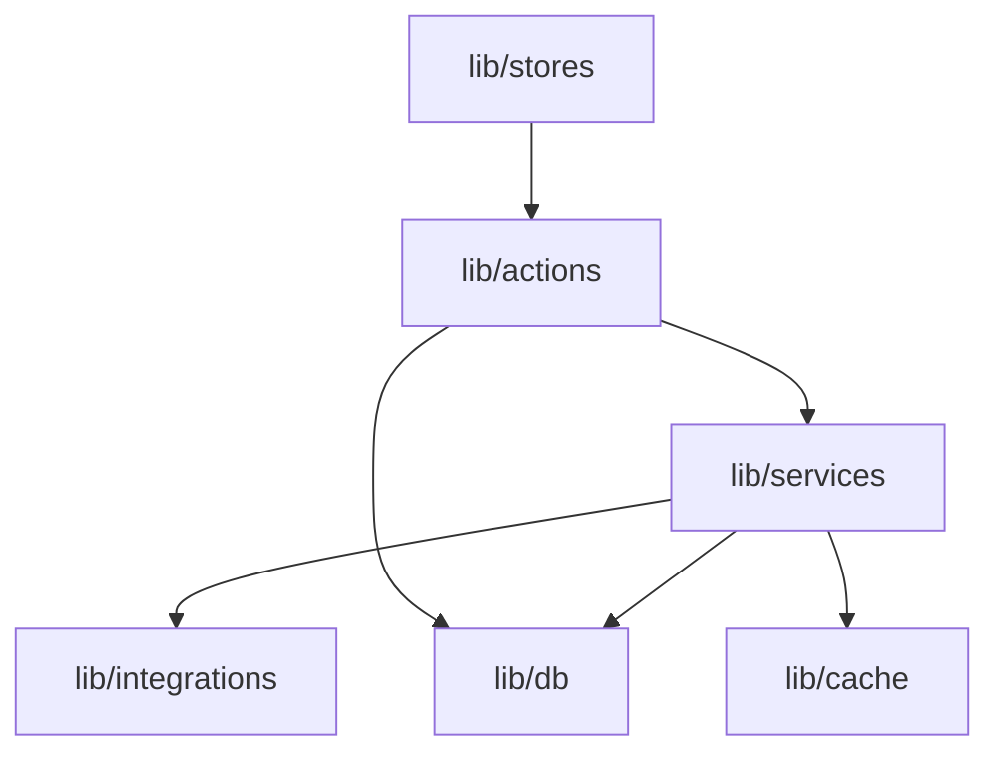

# Project Structure

This guide explains the folder organization and file conventions used in the Alertsify codebase.

---

## Overview

Alertsify follows a **feature-organized structure** with clear separation between UI, business logic, and data layers.

```
alertsify/
├── 📁 app/                    # Next.js App Router (pages & API)
├── 📁 components/             # React components
├── 📁 hooks/                  # Custom React hooks
├── 📁 lib/                    # Core business logic
├── 📁 types/                  # TypeScript type definitions
├── 📁 public/                 # Static assets
└── 📄 Configuration files
```

---

## Directory Breakdown

### `/app` — Next.js App Router

The App Router directory contains all routes, layouts, and API handlers.

```
app/
├── (auth)/                    # Auth route group (login, signup)
│   ├── login/
│   │   └── page.tsx
│   ├── signup/
│   │   └── page.tsx
│   └── layout.tsx            # Auth-specific layout (no sidebar)
│
├── (dashboard)/               # Dashboard route group
│   ├── dashboard/
│   │   └── page.tsx          # Main dashboard
│   ├── positions/
│   │   └── page.tsx          # Open positions
│   ├── history/
│   │   └── page.tsx          # Trade history
│   ├── traders/
│   │   ├── page.tsx          # Trader directory
│   │   └── [traderId]/
│   │       └── page.tsx      # Individual trader profile
│   ├── settings/
│   │   └── page.tsx          # User settings
│   └── layout.tsx            # Dashboard layout (with sidebar)
│
├── api/                       # API Route Handlers
│   ├── brokers/              # Broker connection endpoints
│   ├── trading/              # Trade execution endpoints
│   ├── copy-trading/         # Copy trading management
│   ├── feeds/                # Activity feed endpoints
│   ├── webhooks/             # External webhook receivers
│   └── cron/                 # Scheduled job triggers
│
├── layout.tsx                # Root layout
├── page.tsx                  # Landing page
└── globals.css               # Global styles
```

:::info Route Groups
Folders wrapped in parentheses like `(auth)` and `(dashboard)` are **route groups**. They organize code without affecting the URL structure.
:::

---

### `/components` — React Components

Components are organized by feature area and complexity.

```
components/
├── ui/                        # Shadcn/UI primitives
│   ├── button.tsx
│   ├── card.tsx
│   ├── dialog.tsx
│   ├── input.tsx
│   └── ...
│
├── dashboard/                 # Dashboard-specific components
│   ├── sidebar.tsx
│   ├── header.tsx
│   ├── positions-table.tsx
│   └── order-form.tsx
│
├── trading/                   # Trading-specific components
│   ├── option-chain.tsx
│   ├── order-preview.tsx
│   └── position-card.tsx
│
├── charts/                    # Visualization components
│   ├── pnl-chart.tsx
│   └── performance-chart.tsx
│
└── shared/                    # Reusable across features
    ├── loading-spinner.tsx
    ├── error-boundary.tsx
    └── empty-state.tsx
```

#### Component Conventions

| Convention | Example |
|------------|---------|
| **File naming** | `kebab-case.tsx` |
| **Component naming** | `PascalCase` |
| **Client components** | Add `'use client'` at top |
| **Exports** | Named exports preferred |

---

### `/hooks` — Custom React Hooks

Hooks encapsulate reusable logic and side effects.

```
hooks/
├── use-trading.ts             # Trade placement logic
├── use-positions.ts           # Position fetching & updates
├── use-orders.ts              # Order management
├── use-copy-trading.ts        # Copy trading subscriptions
├── use-notifications.ts       # Push notification handling
├── use-debounce.ts            # Utility hook
└── use-media-query.ts         # Responsive design hook
```

#### Hook Naming Convention

All hooks follow the `use-` prefix pattern:

```typescript
// ✅ Good
export function useTrading() { ... }
export function usePositions() { ... }

// ❌ Bad
export function tradingHook() { ... }
export function getPositions() { ... }
```

---

### `/lib` — Core Business Logic

The heart of the application — all business logic, services, and data access.

```
lib/
├── actions/                   # Server Actions
│   ├── trading.actions.ts     # Trade execution
│   ├── account.actions.ts     # Account management
│   ├── copy-trading.actions.ts
│   └── notification.actions.ts
│
├── services/                  # Business logic services
│   ├── trading.service.ts
│   ├── copy-trading.service.ts
│   ├── sync.service.ts
│   └── notification.service.ts
│
├── integrations/              # External API clients
│   ├── snaptrade.service.ts   # SnapTrade API wrapper
│   ├── getstream.service.ts   # GetStream API wrapper
│   └── discord.service.ts     # Discord webhooks
│
├── db/                        # Database layer
│   ├── index.ts               # Drizzle client
│   ├── schema.ts              # Table definitions
│   ├── schema/                # Split schema files
│   │   ├── users.ts
│   │   ├── trades.ts
│   │   └── ...
│   └── queries/               # Reusable queries
│       ├── positions.ts
│       ├── trades.ts
│       └── accounts.ts
│
├── stores/                    # Zustand stores
│   ├── orders-store.ts
│   ├── positions-store.ts
│   ├── notifications-store.ts
│   └── ui-store.ts
│
├── cache/                     # Redis caching utilities
│   ├── index.ts
│   ├── keys.ts                # Cache key generators
│   └── invalidation.ts
│
├── validations/               # Zod schemas
│   ├── trading.ts
│   ├── account.ts
│   └── copy-trading.ts
│
├── utils/                     # Utility functions
│   ├── options.ts             # Option symbol builders
│   ├── formatting.ts          # Date/number formatters
│   └── errors.ts              # Error handling utilities
│
└── auth.ts                    # NextAuth configuration
```

#### Layer Dependencies



---

### `/types` — TypeScript Definitions

Centralized type definitions for the entire application.

```
types/
├── index.ts                   # Re-exports all types
├── trading.ts                 # Trading-related types
├── user.ts                    # User & account types
├── api.ts                     # API request/response types
├── database.ts                # Database table types
└── external/                  # External API types
    ├── snaptrade.ts
    └── getstream.ts
```

#### Type Conventions

```typescript
// Use interfaces for object shapes
interface Trade {
  id: string;
  symbol: string;
  quantity: number;
}

// Use type for unions and intersections
type TradeStatus = 'pending' | 'filled' | 'cancelled';
type TradeWithUser = Trade & { user: User };

// Prefix database types with Db
type DbTrade = typeof trades.$inferSelect;
type DbTradeInsert = typeof trades.$inferInsert;
```

---

### `/public` — Static Assets

Static files served directly by Next.js.

```
public/
├── images/
│   ├── logo.svg
│   ├── brokers/               # Broker logos
│   └── icons/
├── fonts/
└── favicon.ico
```

---

## Configuration Files

| File | Purpose |
|------|---------|
| `next.config.js` | Next.js configuration |
| `tailwind.config.ts` | Tailwind CSS configuration |
| `tsconfig.json` | TypeScript configuration |
| `drizzle.config.ts` | Drizzle ORM configuration |
| `.env.local` | Environment variables (not committed) |
| `.env.example` | Environment variable template |

---

## Import Aliases

We use TypeScript path aliases for cleaner imports:

```typescript
// tsconfig.json
{
  "compilerOptions": {
    "paths": {
      "@/*": ["./*"]
    }
  }
}
```

This allows:

```typescript
// ✅ Good - using alias
import { Button } from '@/components/ui/button';
import { useTrading } from '@/hooks/use-trading';
import { tradingService } from '@/lib/services/trading.service';

// ❌ Bad - relative paths
import { Button } from '../../../components/ui/button';
```

---

## File Naming Conventions

| Type | Convention | Example |
|------|------------|---------|
| **React Components** | `kebab-case.tsx` | `order-form.tsx` |
| **Hooks** | `use-name.ts` | `use-trading.ts` |
| **Server Actions** | `name.actions.ts` | `trading.actions.ts` |
| **Services** | `name.service.ts` | `trading.service.ts` |
| **Types** | `name.ts` | `trading.ts` |
| **Stores** | `name-store.ts` | `orders-store.ts` |

---

## Next Steps

- [Tech Stack](./tech-stack) — Understand the technologies used
- [Architecture Overview](/architecture/overview) — Learn the system design
