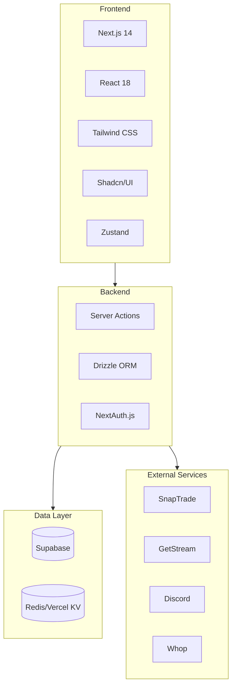
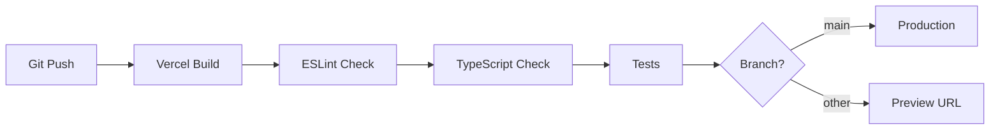

# Technology Stack

This document provides an overview of all technologies, frameworks, and services used in the Alertsify platform.

---

## Stack Overview



---

## Core Framework

### Next.js 14

| Aspect | Details |
|--------|---------|
| **Version** | 14.x with App Router |
| **Runtime** | Node.js + Edge Runtime |
| **Rendering** | RSC + Client Components |
| **API** | Server Actions + Route Handlers |

**Why Next.js?**
- Server Components reduce client-side JavaScript
- Server Actions provide type-safe mutations
- Built-in optimizations (images, fonts, bundling)
- Excellent Vercel deployment integration

<details>
<summary>📝 Key Configuration</summary>

```javascript
// next.config.js
/** @type {import('next').NextConfig} */
const nextConfig = {
  experimental: {
    serverActions: true,
  },
  images: {
    remotePatterns: [
      { hostname: 'avatars.githubusercontent.com' },
      { hostname: '*.supabase.co' },
    ],
  },
};

module.exports = nextConfig;
```

</details>

---

## Frontend Stack

### React 18

Modern React with concurrent features:

| Feature | Usage |
|---------|-------|
| **Server Components** | Data fetching, layouts |
| **Client Components** | Interactivity, state |
| **Suspense** | Loading states |
| **Transitions** | Non-blocking updates |

### Tailwind CSS

Utility-first CSS framework for rapid styling.

```tsx
// Example usage
<button className="bg-blue-600 hover:bg-blue-700 text-white px-4 py-2 rounded-lg transition-colors">
  Place Order
</button>
```

### Shadcn/UI

Pre-built, accessible component library built on Radix UI primitives.

| Component | Purpose |
|-----------|---------|
| `Button` | All button variants |
| `Dialog` | Modal dialogs |
| `Select` | Dropdown selects |
| `Table` | Data tables |
| `Toast` | Notifications |

:::info Not a Dependency
Shadcn/UI components are copied into your codebase, not installed as a package. This gives full control over customization.
:::

### Zustand

Lightweight state management for client-side state.

**Why Zustand over Redux?**
- Minimal boilerplate
- No providers needed
- TypeScript-first
- Excellent performance

<details>
<summary>📝 Example Store</summary>

```typescript
// lib/stores/orders-store.ts
import { create } from 'zustand';

interface OrdersState {
  orders: Order[];
  addOrder: (order: Order) => void;
  updateOrder: (id: string, updates: Partial<Order>) => void;
  removeOrder: (id: string) => void;
}

export const useOrdersStore = create<OrdersState>((set) => ({
  orders: [],
  addOrder: (order) => 
    set((state) => ({ orders: [...state.orders, order] })),
  updateOrder: (id, updates) =>
    set((state) => ({
      orders: state.orders.map((o) => 
        o.id === id ? { ...o, ...updates } : o
      ),
    })),
  removeOrder: (id) =>
    set((state) => ({
      orders: state.orders.filter((o) => o.id !== id),
    })),
}));
```

</details>

---

## Backend Stack

### Server Actions

Next.js Server Actions for type-safe mutations.

```typescript
// lib/actions/trading.actions.ts
'use server';

export async function placeOrder(data: OrderInput) {
  // Runs on server, called like a function
  const result = await tradingService.placeOrder(data);
  return result;
}
```

### Drizzle ORM

Type-safe SQL ORM with excellent TypeScript integration.

**Why Drizzle over Prisma?**
- Lighter weight, faster cold starts
- SQL-like API (closer to raw SQL)
- Better performance for serverless
- Smaller bundle size

<details>
<summary>📝 Schema Definition</summary>

```typescript
// lib/db/schema/trades.ts
import { pgTable, uuid, text, timestamp, integer, numeric } from 'drizzle-orm/pg-core';

export const trades = pgTable('trades', {
  id: uuid('id').defaultRandom().primaryKey(),
  userId: uuid('user_id').notNull(),
  parentTradeId: uuid('parent_trade_id'),
  symbol: text('symbol').notNull(),
  action: text('action').notNull(), // buy | sell
  quantity: integer('quantity').notNull(),
  filledQuantity: integer('filled_quantity').default(0),
  limitPrice: numeric('limit_price'),
  filledPrice: numeric('filled_price'),
  status: text('status').default('pending'),
  createdAt: timestamp('created_at').defaultNow(),
});
```

</details>

### NextAuth.js

Authentication with multiple providers.

| Provider | Purpose |
|----------|---------|
| **Google** | Social login |
| **Discord** | Social login |
| **Credentials** | Email/password |

---

## Data Layer

### Supabase (PostgreSQL)

Managed PostgreSQL with additional features:

| Feature | Usage |
|---------|-------|
| **Database** | Primary data store |
| **Auth** | Alternative to NextAuth |
| **Storage** | File uploads |
| **Realtime** | Live subscriptions |
| **Edge Functions** | Serverless functions |

### Redis (Vercel KV)

In-memory caching for performance:

| Use Case | TTL |
|----------|-----|
| **User sessions** | 24 hours |
| **API rate limiting** | 1 minute |
| **SnapTrade tokens** | 1 hour |
| **Leaderboard data** | 5 minutes |

<details>
<summary>📝 Caching Example</summary>

```typescript
// lib/cache/index.ts
import { kv } from '@vercel/kv';

export const cache = {
  async get<T>(key: string): Promise<T | null> {
    return kv.get<T>(key);
  },

  async set<T>(key: string, value: T, ttlSeconds?: number): Promise<void> {
    if (ttlSeconds) {
      await kv.set(key, value, { ex: ttlSeconds });
    } else {
      await kv.set(key, value);
    }
  },

  async delete(key: string): Promise<void> {
    await kv.del(key);
  },
};
```

</details>

---

## External Integrations

### SnapTrade — Brokerage API

Aggregated brokerage API supporting multiple brokers.

| Feature | Endpoint |
|---------|----------|
| **User Registration** | `POST /snapTrade/registerUser` |
| **Broker Connection** | `GET /snapTrade/partners` |
| **Account Details** | `GET /accounts/{accountId}` |
| **Place Order** | `POST /trade/placeForceOrder` |
| **Get Holdings** | `GET /holdings` |

**Supported Brokers:** TD Ameritrade, Robinhood, Interactive Brokers, Tradier, Alpaca, and more.

### GetStream — Activity Feeds

Scalable activity feed infrastructure.

| Feed Type | Purpose |
|-----------|---------|
| `trade` | User's trade activities |
| `timeline` | Personal timeline |
| `global` | Platform-wide feed |
| `notification` | User notifications |

### Discord — Webhooks

Notification delivery via Discord webhooks.

| Webhook | Purpose |
|---------|---------|
| **Alerts** | BTO/STC trade alerts |
| **System** | Platform notifications |
| **Admin** | Error alerts |

### Whop — Subscriptions

Subscription and payment management.

| Feature | Usage |
|---------|-------|
| **Plans** | Subscription tiers |
| **Webhooks** | Payment events |
| **Access** | Feature gating |

---

## Development Tools

### TypeScript

Strict TypeScript configuration for type safety:

```json
{
  "compilerOptions": {
    "strict": true,
    "noUncheckedIndexedAccess": true,
    "noImplicitReturns": true
  }
}
```

### ESLint & Prettier

Code quality and formatting:

```bash
# Lint code
pnpm lint

# Format code
pnpm format
```

### Husky & lint-staged

Pre-commit hooks for code quality:

```bash
# Runs before every commit
- ESLint
- Prettier
- TypeScript check
```

---

## Deployment

### Vercel

Production deployment platform:

| Feature | Configuration |
|---------|---------------|
| **Framework** | Next.js (auto-detected) |
| **Build** | `pnpm build` |
| **Environment** | Production, Preview, Development |
| **Domains** | Custom domain support |
| **Functions** | Serverless + Edge |

### CI/CD Pipeline



---

## Performance Optimizations

| Optimization | Implementation |
|--------------|----------------|
| **Image Optimization** | Next.js Image component |
| **Code Splitting** | Automatic per-route |
| **Edge Caching** | Vercel Edge Network |
| **Database Caching** | Redis/Vercel KV |
| **Bundle Analysis** | `@next/bundle-analyzer` |

---

## Security Measures

| Measure | Implementation |
|---------|----------------|
| **Authentication** | NextAuth.js with session management |
| **Authorization** | Middleware + Server Action checks |
| **SQL Injection** | Drizzle ORM parameterized queries |
| **XSS Prevention** | React auto-escaping |
| **CSRF Protection** | NextAuth built-in |
| **Rate Limiting** | Redis-based limits |
| **Environment Variables** | Vercel encrypted secrets |

---

## Next Steps

- [Architecture Overview](/architecture/overview) — Learn how these pieces fit together
- [Project Structure](./project-structure) — Understand the codebase layout
